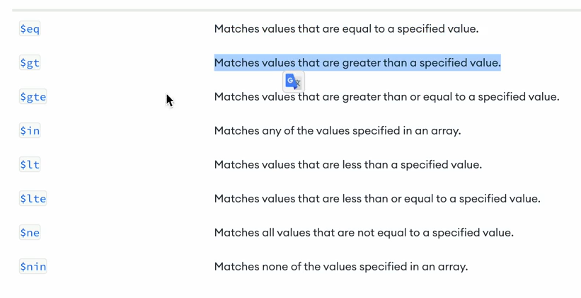
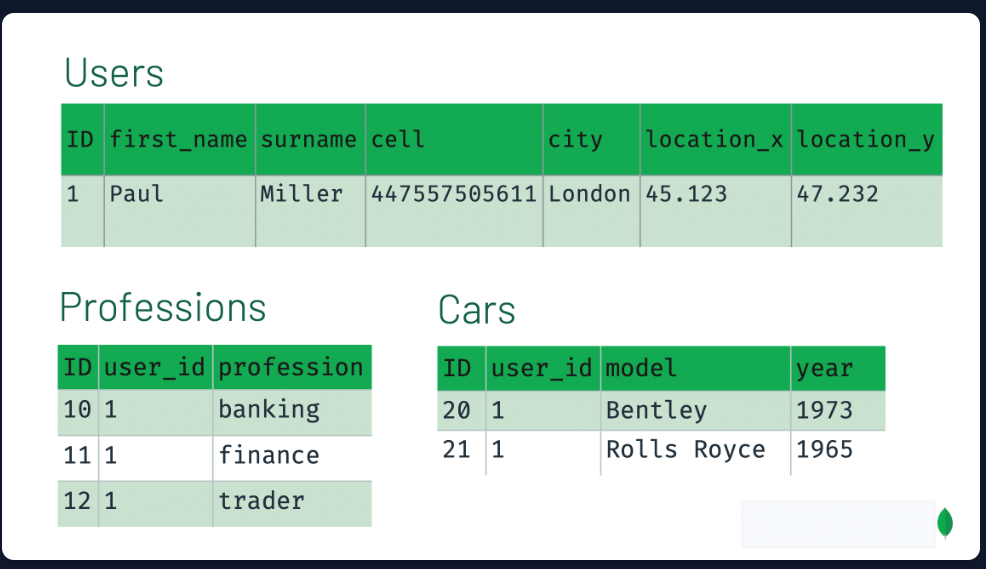
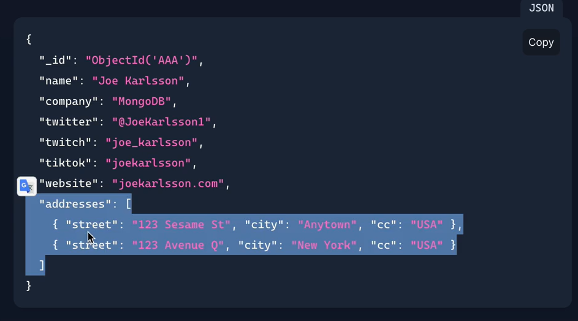
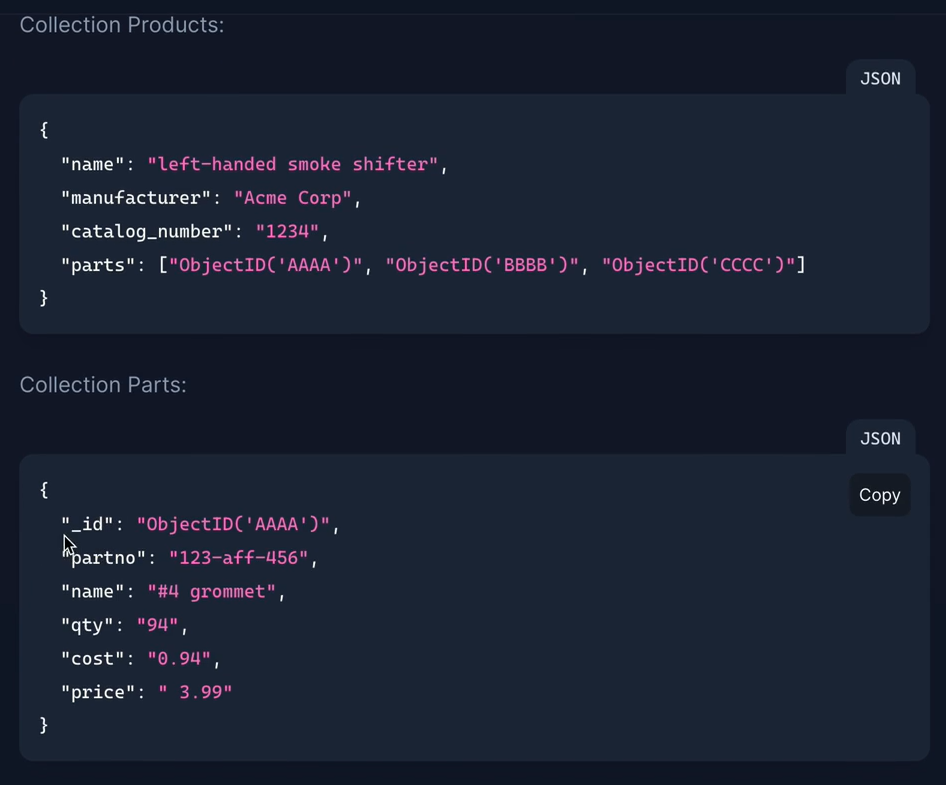
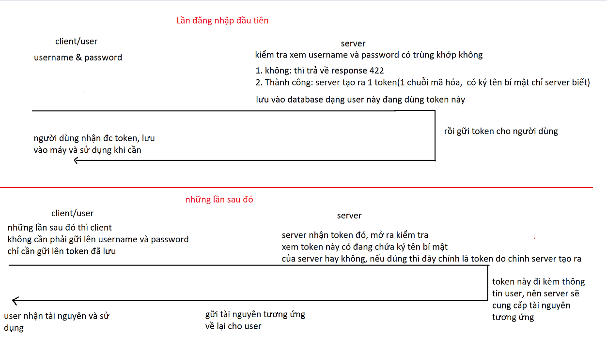
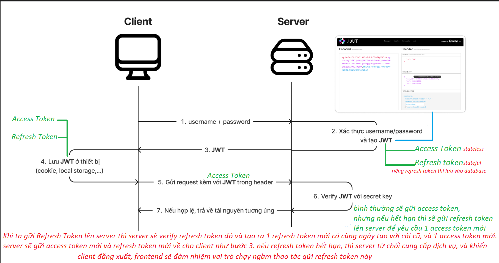

# Cơ sở dữ liệu cơ bản

## Cơ sở dữ liệu là gì?

CSDL là nơi lưu trữ dữ liệu ví dụ: Google sheet, MySql, MongoDB, file json,...

## Tại sao phải cần nó?

Tại sao không lưu vào json cho dễ?

Đó là bởi vì 1 khi cơ sở dữ liệu lớn lên, nếu dùng 1 file json thì rất khó để quản lý. Cơ sở dữ liệu có thể lên đến hàng chục GB, mở 1 file json nặng chục GB sao mà nổi?

Vậy nên cần một hệ quản trị cơ sở dữ liệu (DBMS - Database Management System) để giúp chúng ta quản lý việc đọc và ghi thuận tiện hơn.

## Một số hệ quản trị CSDL

- **SQL**: MySQL, PostgeSQL(khỏe, mạnh hơn mySQL), Oracle, MariaDB,...
- **NoSQL**: MongoDB, DynamoDB (thằng này của amazon thì phải), Cassandra,...
- **No-Code & Other**: Google Sheets, Notion,...
  tham khảo thống kế tại đây https://2022.stateofdb.com/sql

# SQL vs NoSQL

Đọc bài gốc tại đây: [SQL vs NoSQL: How to Choose](https://www.sitepoint.com/sql-vs-nosql-choose/)

## SQL

- Học 1 ngôn ngữ nhưng dùng được ở nhiều cơ sở dữ liệu khác nhau
- Schema(cấu trúc - table) chặt chẽ
- Khuyến khích các tiêu chuẩn chuẩn hóa để giảm thiểu sự dư thừa dữ liệu
- Có thể mở rộng nhưng sẽ hơi tốn công

## NoSQL

- Dữ liệu được lưu dưới dạng JSON với các cặp key-value
- Không cần Schema, lưu được hầu như bất cứ thứ gì
- Hiệu năng tuyệt vời, mở rộng theo chiều ngang dễ dàng

## Ví dụ về sự ưu việt của NoSQL

### Dùng SQL

Chúng ta cần xây dựng hệ thống dữ liệu cho danh bạ. Vậy nên sao khi khảo sát chúng ta có được bảng `contacts` như sau

- id
- title
- firstname
- lastname
- gender
- telephone
- email
- address1
- address2
- address3
- city
- region
- zipcode
- country

**Vấn đề 1**: Sau khi code được 1 thời gian chúng ta nhận ra rất ít người có 1 số điện thoại, thường họ sẽ có SDT nơi làm việc, ở nhà, cá nhân,... Vậy nên chúng ta không thể thêm `telephone1`, `telephone2`,... vào bảng `contacts` được. Chúng ta sẽ tạo thêm 1 bảng riêng là `telephones`

- id
- contact_id (liên kết id của table constact FK)
- number(số điện thoại)
- telphone_type (kiểu enum lưu kiểu số điện thoại ở nhà, cty,...)

**Vấn đề 2**: Chúng ta lại gặp vấn đề tương tự với email, họ có thể có nhiều email. Vậy nên chúng ta tạo thêm bảng `emails`

- id
- contact_id
- address
- email_type ( có thể lưu dạng text hoặc để enum cho email nhà, email công ty v.v...)

**Vấn đề 3**: Người dùng có thể có nhiều địa chỉ nhà, nên chúng ta tạo thêm bảng `addresses`

- id
- contact_id
- address_type
- address
- city
- region
- zipcode
- country

Và cuối cùng bảng `contacts` chúng ta còn

- id
- title
- firstname
- lastname
- gender

Cuối cùng chúng ta đã chuẩn hóa được dữ liệu, phòng ngừa được rủi ro khi dữ liệu to lên.

Nhưng **không**

Chúng ta chưa xem xét hết trong tương lai 1 vài tuần nữa, yêu cầu được cho vào là thêm các trường như `date_of_birth`, `company` vào bảng `contacts`. Và cho do chúng ta thêm bao nhiêu trường đi chăng nữa thì cũng không thể cảm thấy đủ, vì yêu cầu sẽ được thêm vào làm chúng ta thêm `social_network_account`, `hobby`,...

Vậy mỗi lần thêm 1 trường vào bảng là chúng ta đều phải suy nghĩ tạo thêm 1 bảng là `otherdata` hay sao?

> Điều này làm cho CSDL chúng ta bị chia nhỏ ra hàng chục, hàng trăm bảng => Chúng bị phân mảnh

Việc phân mảnh database sẽ làm cho dev khó có thể quan sát được logic của database, vì càng phân mảnh sẽ càng làm tăng độ phức tạp => **thời gian phát triển ứng dụng bị chậm đi**

Khi chúng ta muốn query để lấy data đầy đủ của một contact, chúng ta phải dùng JOIN kết hợp với hàng chục bảng liên quan

Áp dụng full-text search (tìm kiếm giống google) cũng khó hơn. Ví dụ ai đó nhập một chuỗi bất kỳ để tìm kiếm trong danh bạ, chúng ta phải kiểm tra tất cả trong các bảng `contacts`, `telephones`, `addresses`, `emails`... và sắp xếp thứ tự các kết quả tương ứng.

> SQL quá cứng nhắc

### Dùng NoSQL (MongoDB) thay thế

Dữ liệu của bảng `contacts` liên quan đến con người. Chúng ta không thể đoán trước được, và yêu cầu từng thời điểm sẽ khác nhau. Vậy nên lúc này NoSQL sẽ phát huy ưu điểm của mình, chúng ta có thể lưu tất cả data liên quan `contacts` trong một document của một collection(1 bảng) duy nhất:

```js
{
  name: [
    "Billy", "Bob", "Jones"
  ],
  company: "Fake Goods Corp",
  jobtitle: "Vice President of Data Management",
  telephone: {
    home: "0123456789",
    mobile: "9876543210",
    work: "2244668800"
  },
  email: {
    personal: "bob@myhomeemail.net",
    work: "bob@myworkemail.com"
  },
  address: {
    home: {
      line1: "10 Non-Existent Street",
      city: "Nowhere",
      country: "Australia"
    }
  },
  birthdate: ISODate("1980-01-01T00:00:00.000Z"),
  twitter: '@bobsfakeaccount',
  note: "Don't trust this guy",
  weight: "200lb",
  photo: "52e86ad749e0b817d25c8892.jpg"
}
```

Ở data trên, chúng ta chưa lưu `date_of_birth` hay `social_network_account`, nhưng không sao, vì NoSQL rất linh hoạt trong trường hợp này, có thể thêm sửa xóa thoải mái.

Vì chúng ta lưu hết trong 1 document(hàng), chúng ta có thể dễ dàng biết được cấu trúc tổng quát của data, cũng như dễ dàng thực hiện full text search tất cả các trường trong `contacts`

Đầu tiên chúng ta định nghĩa index cho tất cả các trường trong collection `contacts`

```js
db.contacts.createIndex({ "$**": "text" }); //đánh index như identity
```

và thực hiện full text search

```js
db.contact.find({
  $text: { $search: "something" },
});
```

## Khi nào nên dùng MongoDB

MongoDB là CSDL đa năng được dùng theo nhiều cách khác nhau, có thể dùng được trong nhiều ngành nghề (Viễn thông, game, sức khỏe, bán lẻ)

- Khi muốn tích hợp lượng data lớn
- Data có cấu trúc phức tạp
- Khi cần một CSDL có khả năng mở rộng nhanh, rẻ
- Khi cần một CSDL giúp tốc độ phát triển phần mềm nhanh

## Khi nào nên dùng SQL

- Cần một CSDL chặt chẽ về cấu trúc
- Bạn quen thuộc với ngôn ngữ SQL

## Đọc thêm

- [The Top 4 Reasons Why You Should Use MongoDB](https://www.mongodb.com/developer/products/mongodb/top-4-reasons-to-use-mongodb)
- [Why Use MongoDB and When to Use It?](https://www.mongodb.com/why-use-mongodb)

# Mongo DB cơ bản

# MongoDB cơ bản

## MongoDB là gì

- NoSQL
- Ra đời 2007
- Thay vì lưu trong từng hàng hay cột như SQL, MongoDB dùng document theo dạng BJSON. Ứng dụng có thể lấy data ra theo dạng JSON

```json
{
  "_id": 1,
  "name": {
    "first": "Ada",
    "last": "Lovelace"
  },
  "title": "The First Programmer",
  "interests": ["mathematics", "programming"]
}
```

- Tính linh hoạt cao, cho phép lưu nhiều loại cấu trúc dữ liệu
- Khả năng scale(mở rộng) dễ dàng

## Cài đặt MongoDB

- Tải về máy và cài trên local(này tùy mạng, hơi lag)
- **Dùng Cloud**: Mongo Atlas (này thì mình sẽ dùng trong khóa này)

- đăng nhập https://account.mongodb.com/account/login

## Một số thuật ngữ trong MongoDB

Mình sẽ lấy Mongo Atlas làm ví dụ

- Cấp độ cao nhất là Organizations
- 1 Organizations có thể có nhiều project
- 1 project có thể có nhiều cluster (server vpn)
- 1 cluster có thể có nhiều database
- Trong mỗi database chúng ta lại có các collection
- Mỗi collection lại có nhiều document

Cluster có thể hiểu như là một server vps, dùng để cài đặt mongodb. Từ đó chúng ta có thể tạo thêm nhiều database trên cái server đó

Collection tương đương với bảng bên SQL
Document tương đương hàng bên SQL

## Tạo một database bằng Mongo

- vào organizations
- tạo project
- tạo cluster (cluster name là tên dự án của mình)
- set ip access là cho mọi người đều truy cập được 0.0.0.0/0 any

## Kết nối với server MongoDB vừa tạo

có nhiều cách

- Dùng Mongo Compass (phần mềm chính chủ)
- Dùng MongoSH (terminal)
- Dùng mongo driver (SDK tích hợp vào code - phù hợp với nodejs - custom sâu hơn)
- Dùng Extension MongoDB (cộng đồng phát triễn) cho VS Code ()

mình sẽ demo kết nối trên mongo compass(cài đặt) và mongoDB for vscode(extensions)

### I. kết nối atlas với mongoDB compass

- ở atlas ta bấm connect > compass > copy uri > chép vào compass
- compass có sẳn 2 database là admin và local, ta sẽ k can thiệp vào đó
- ta sẽ tạo 1 databse mẫu "demoMongo-dev" và thêm collections(table) "users" > create database
  **_ cú pháp của collections là underscore_**

### II. kết nối atlas với mongoDB for vscode

- vào task mongoDB for vscode > add connection > connect > paste uri vào

# thao tác CRUD với mongoDBCompass

## tạo document(insert data vào table-collections)

- vào collection(table) users > add data > insert document > thêm thông tin như sau
- nó sẽ tự cho mình id sẵn, nhưng giả sử mình không thích, nên mình xóa luôn

```json
/**
 * Paste one or more documents here
 */
[
  {
    "name": "Điệp",
    "age": 20,
    "gender": "male"
  },
  {
    "name": "Hương",
    "age": 19,
    "gender": "Female"
  }
]
```

- update: chọn icon edit và thay đổi theo ý mình
- delete: chọn icon remove của thằng document nào mình thích
- search: có 1 ô type a query
  ví dụ như ta muốn tìm thằng có tên là "Điệp"
  ta sẽ gõ là {name : "Điệp"} > chọn find
  - ngoài ra ta còn có more option:
    project: {age: 0} nghĩa là k muốn hiển thị kết quả có age
    skip: bỏ qua các doc
    limit: giới hạn doc trả về

**bonus {age : {$gt: 19}} : lớn hơn 20 tuổi**


# thao tác CRUD với mongoShell(mongoSh)

dưới mongoCompass sẽ có 1 task mongoSH sẵn

- show databases : xem database
- use demoMongo-dev: truy cập vào database demoMongo-dev
- tạo thêm 1 colection nữa tên comments
- db.comments.insertOne({content: "hello mongoSH"}) : thêm 1 doc
- db.comments.insertMany([{content: "Anh Điệp đẹp trai quá"},{content: "Anh Điệp quá đẹp trai luôn ó"}]) : thêm nhiều doc
- các lệnh thêm đều sẽ trả ra id của obj vừa thêm

- **search**:
  db.comments.findOne({content:"Anh Điệp đẹp trai quá"}) : tìm kiếm
- **update**: updateOne(find, set, mode)
  db.comments.updateOne(
  {\_id: ObjectId("64ae5425fbcd0dfe6d63fb2a")},
  {$set: {content: "hiii mongoSH"}},
  {upsert: true})
- **delete**:
  db.comments.deleteOne({\_id: ObjectId("64ae54a3fbcd0dfe6d63fb2c")})

# Thiết kế CSDL chuẩn Schema

ta sẽ đề ra các tiêu chí sau trước khi bắt tay vào làm

- Ứng dụng có tính chất đọc hay ghi nhiều?
- Dữ liệu nào thường được truy cập cùng nhau?
- Các yếu tố về hiệu suất của bạn như thế nào?
- Dữ liệu của bạn sẽ tăng và mở rộng như thế nào?

## 1 - so sánh SQL và NoSQL



ở đây ta có thể thấy rằng paul ở hữu rất nhiều tiền tệ, xe
nên cần phải tách ra thành các table như vậy,
việc này làm ta phải join để có full thông tin

nếu ta dùng nosql thì nó sẽ như thế này

```json
{
  "first_name": "Paul",
  "surname": "Miller",
  "cell": "447557505611",
  "city": "London",
  "location": [45.123, 47.232],
  "profession": ["banking", "finance", "trader"],
  "cars": [
    {
      "model": "Bentley",
      "year": 1973
    },
    {
      "model": "Rolls Royce",
      "year": 1965
    }
  ]
}
```

lúc này ta k cần liên kết, hay tìm kiếm, nó nằm gọn trong 1 object

## 2 - Embedding(nhúng) hay Referencing(tham chiếu)

- Embedding(nhúng): đưa hết data vào 1 doc như ví dụ trên
- Referencing(tham chiếu): lưu data trong doc thuộc collection riêng biệt, và tham chiếu thông qua sử dụng $lookup(giống join bên SQL)

- **Embedding(nhúng)** :
  - ưu : query, update, tránh lookup(join)
  - nhược: document quá nhiều data, mà nhu cầu đọc ít, cuối cùng dẫn đến việc hao phí, giới hạn của doc là 16MB(ít)
- **Referencing(tham chiếu)** :

  - ưu : chia nhỏ doc, ít chạm giới hạn 16mb, các dữ liệu k cần thiết sẽ k bị đính kèm như embedding, giảm trùng lập dữ liệu
    **_đôi khi hi sinh trùng lập để hiệu năng tốt hơn_**
  - nhược: truy xuất hết data thì ít nhất phải có 2 query hoặc , $lookup(join)

  ## Quan hệ

  trong này vẫn có các quan hệ 1-1, 1-few(ít), 1-n(mảng rất nhiều)
  ta ví dụ với 1 doc
  

- id, name, company, twitter, ... **là 1 - 1**
- addresses là **1 - few(ít)**

_\_ Quy Tắc thiết kế schema là ưu tiên nhúng trừ khi 1 - ít_

Mối **quan hệ 1 - n**, giống bên SQL
nên dùng khi nó có quá nhiều chi tiết cho đối tượng part


# tiến hành thiết kế mongo schema cho dự án clone shopingcard

- Collection nên có tên là số nhiều, vd: `users` hay `refresh_tokens`
- Field trong Collection phải theo chuẩn snake_case vd: `email_of_student`
- id trong mongo mặt định là `_id` k nên thay đổi, vì nó làm giảm hiệu suất truy vấn của mongo
- Field `createAt` và `updateAt` nên có kiểu dữ liệu là `Date` để dể dàng sắp xếp, lọc, tìm
- `createAt` luôn nên có khi tạo document
- `updateAt` thì là 1 optional(tùy chỉnh, muốn hay k cũng đc)
- trường id thì nên là `ObjectID`
- Để biết kiểu dữ liệu mà mongo hỗ trợ thì xem tại [đây](https://docs.mongodb.com/manual/reference/bson-types/)

## Phân tích chức năng

## users

giờ ta vào lấy chức năng đăng ký tài khoản của facebook làm mẫu và xem cách để đăng ký 1 tài khoản cần gì

- Người dùng muốn đăng ký thì phải nhập `name`, `email`, `day_of_birth`, `password` là được. Vậy ta sẽ tạo user gồm `name`, `email`, `day_of_birth`, `password` và `_id` do mongo cung cấp, ta sẽ k lưu `repassword` vì nó chỉ dùng để kiểm tra xem người dùng nhập có bị sai hay không mà thôi

- Sau khi đăng ký xong thì sẽ có mail đính kèm `email_verify_token` để xác thực email (`piedteam.com/verify-email?email_verify_token=123321123`). Mỗi user chỉ có 1 `email_verify_token` duy nhất (quan hệ 1-1)
  vì nếu user nhấn re-send email thì sẽ tạo ra `email_verify_token` mới thay thế cái cũ. Vậy nên ta lưu thêm trường `email_verify_token` vào schema `users`(vì mối quan hệ 1-1).
  Trường này có kiểu `string`, nếu user xác thực email thì ta sẽ set `''`.

- giờ ta xem thử chức năng quên mật khẩu, ta phải gửi mail đến người dùng để reset mật khẩu, ta cũng dùng `forgot_password_token` để xác thực (`piedteam.com/forgot-password?forgot_password_token=123321123`). Vậy ta cũng lưu thêm trường `forgot_password_token` vào schema `users`. Trường này có kiểu `string`, nếu user reset mật khẩu thì ta sẽ set `''`.

- Nên có một trường là `verify` để biết trạng thái tài khoản của user. Ví dụ chưa xác thực email, đã xác thực, bị khóa, lên tích xanh ✅. Vậy giá trị của nó nên là enum(tìm hiểu enum)

- Người dùng có thể update các thông tin sau vào profile: `bio`, `location`, `website`, `username`, `avatar`, `cover_photo`. Vậy ta cũng lưu các trường này vào schema `users` với kiểu là `string`. `avatar`, `cover_photo` đơn giản chi là string url thôi. Đây là những giá trị optional, tức người dùng không nhập vào thì vẫn dùng bình thường. Nhưng cũng nên lưu set `''` khi người dùng không nhập gì để tiện quản lý.

- Cuối cùng là trường `created_at`, `updated_at` để biết thời gian tạo và cập nhật user. Vậy ta lưu thêm 2 trường này vào schema User với kiểu `Date`. 2 trường này luôn luôn có giá trị.

```ts
enum UserVerifyStatus {
  Unverified, // chưa xác thực email, mặc định = 0
  Verified, // đã xác thực email
  Banned, // bị khóa
}
//đặt interface vì theo chuẩn ts thôi, chứ làm thực tế thì khác
interface User {
  _id: ObjectId;
  name: string;
  email: string;
  date_of_birth: Date;
  password: string;
  created_at: Date;
  updated_at: Date; //lúc mới tạo chưa có gì thì nên cho bằng create_at
  email_verify_token: string; // jwt hoặc '' nếu đã xác thực email
  forgot_password_token: string; // jwt hoặc '' nếu đã xác thực email
  verify: UserVerifyStatus;

  bio: string; // optional
  location: string; // optional
  website: string; // optional
  username: string; // optional
  avatar: string; // optional
  cover_photo: string; // optional
  role: USER_ROLE; //đây là dạng Enum
}
```

Enum dùng để thay thế các số 0 1 2 3 vô nghĩa trong quá trình code, nhưng kết quả trả về vẫn là 0 1 2 3
, vd:

```ts
enum USER_ROLE {
  Admin, //0
  Staff, //1
  User, //2
}
```

vậy thì

```ts
role: USER_ROLE.Admin
thì người ta sẽ nhận được
role: 0
```

## Authorization và Authentication

- Authorization là quá trình xác định người dùng có quyền truy cập vào tài nguyên nào
- Authentication là quá trình xác thực người dùng
- Authorization là cấp độ cao hơn của Authentication. Phải xác thực người dùng trước, rồi mới xác định được người dùng có quyền truy cập vào tài nguyên nào.

### 1. luồn hoạt động của Authentication

- Bước 1: Client sẽ gửi một request lên server chứa thông tin định danh client là ai, cái này có thể là username/password, một đoạn mã nào đấy, hoặc là token, hoặc là một số thông tin khác.

- Bước 2: Server sẽ kiểm tra thông tin định danh của client với thông tin trong database. Nếu thông tin định danh đúng, server sẽ trả về một dấu hiệu gì đó để cho client biết là đăng nhập thành công.

- Bước 3: Client sẽ lưu lại dấu hiệu này, và gửi dấu hiệu này lên server mỗi khi client muốn truy cập vào các tài nguyên của server.

- Bước 4: Server sẽ kiểm tra dấu hiệu, nếu hợp lệ, server sẽ trả về tài nguyên cần thiết.
  

### 2. Authentication với basic Authentication

- Khi bạn truy cập website sử dụng cơ chế Basic Authentication, server sẽ kiểm tra Authorization trong HTTP header. Nếu Authorization không hợp lệ, server sẽ trả về một response với WWW-Authenticate nằm trong header. Cái này nó sẽ làm website bạn hiển thị popup yêu cầu bạn nhập username/password.
- Bạn nhập username/password, bạn nhấn OK thì trình duyệt sẽ tiến hành mã hóa (encode) username/password thành một chuỗi base64 theo quy tắc username:password, và gửi lên server thông qua HTTP header Authorization.
- Server sẽ kiểm tra và giải mã Authorization trong HTTP header. Nếu hợp lệ, server sẽ trả về thông tin website, nếu không hợp lệ, server sẽ trả về một popup yêu cầu bạn nhập lại username/password.

**ưu điểm:**

- đơn giản, cài đặt nhanh dể triễn khai

**nhược điểm:**

- Không an toàn, vì username/password được mã hóa bằng Base64. Kẻ gian có thể đánh cắp đoạn mã base64 này thông qua việc bắt request (Tấn công Man-in-the-middle). Vậy nên cần phải sử dụng HTTPS để mã hóa giao tiếp giữa client và server.

- Thiếu tính linh hoạt: Basic Authentication không hỗ trợ nhiều cấp độ xác thực, quản lý quyền truy cập, hay gia hạn/ thu hồi quyền truy cập. Điều này giới hạn khả năng mở rộng và kiểm soát truy cập trong các ứng dụng phức tạp.

- Không thể logout khỏi website. Vì Basic Authentication chỉ yêu cầu người dùng nhập username/password khi truy cập vào website, nên khi bạn tắt trình duyệt, bạn mới logout ra.

- Không thể sử dụng được cho các ứng dụng mobile. Vì Basic Authentication yêu cầu người dùng nhập username/password, nhưng trên các ứng dụng mobile thì không có giao diện để người dùng nhập username/password.

## refresh_tokens

Hệ thống sẽ dùng JWT(json web token) để xác thực người dùng. Vậy mỗi lần người dùng đăng nhập thành công thì sẽ tạo ra 1 JWT access token và 1 refresh token.

- JWT access token thì không cần lưu vào database, vì chúng ta sẽ cho nó stateless(k có trạng thái)
- Còn refresh token thì cần lưu vào database để tăng tính bảo mật.

Một user thì có thể có nhiều refresh token (không giới hạn)(vì 1 người xài rất nhiều thiết bị), nên không thể lưu hết vào trong collection `users` được => Quan hệ 1 - rất nhiều

Và đôi lúc chúng ta chỉ quan tâm đến refresh token mà không cần biết user là ai. Vậy nên ta tạo ra một collection riêng để lưu refresh token.
refresh token đã bao gồm thông tin của user rồi

```ts
interface RefreshToken {
  _id: ObjectId;
  token: string;
  created_at: Date;
  user_id: ObjectId;
}
```



## followers

Một người dùng có thể follow rất nhiều user khác, nếu dùng 1 mảng `followings` chứa ObjectId trong collection `users` thì sẽ không tối ưu. Vì dễ chạm đến giới hạn 16MB/document của MongoDB.

Chưa hết, nếu dùng mảng `followings` thì khi muốn tìm kiếm user A đang follow ai rất dễ nhưng ngược lại, tìm kiếm ai đang follow user A thì lại rất khó.

Vậy nên ta tạo ra một collection riêng để lưu các mối quan hệ follow giữa các user là hợp lý hơn cả.

1 user có rất nhiều follower, và 1 follower cũng có rất nhiều user khác follow lại => Quan hệ rất nhiều - rất nhiều

ta sẽ tạo Collection trung gian

```ts
interface Follower {
  _id: ObjectId;
  user_id: ObjectId;
  followed_user_id: ObjectId;
  created_at: Date;
}
```

ta sẽ dùng toán tử lookup() -- **_như join của mongo_** để tạo ra mối liên kết giữa các id(giống khóa ngoại)

## Tính năng admin cập nhật product

- chỉ có admin mới có thể sử dụng tính năng này, nên khi dùng tính năng này thì user phải gữi accessToken cho server
- accessToken của user gữi lên sau khi đã verify phải có thông tin rằng user này là admin hoặc staff
- nếu đúng vậy thì ta sẽ thu thập các thông tin sau để tiến hành cập nhật product mới
- ta sẽ định nghĩ colection cho product

```ts
interface Product {
  _id: ObjectId;
  name: string;
  quatity: number;
  rating_number: number;
  brand_id: ObjectId;
  origin: string; //xuất xứ
  volume: number; // dung tích
  weight: number; // khối lượng
  sold: number; //số lượng đã bán
  status: PRODUCT_STATUS; //còn hàng hay hết rồi
  category_id: ObjectId; //mã chủng loại
  ship_category_id: string; //chủng loại để đặt đơn bên ghn
  ❌comments: string[];//lưu comment của các user
  ❌medias: string[];//ta chỉ lưu url của hình/video
}

interface Brand{
  _id: ObjectId;
  name: string;
  hotline: string;
  address: string;
}

interface category_id{
  _id: ObjectId;
  name: string;
  desc: string;
}

enum PRODUCT_STATUS {
  Active,
  Stock,
}
```

- **Product và comment là mối quan hệ 1 - rất nhiều**
- 1 product được rất nhiều comment nên chắc chắn nếu lưu theo kiểu 'nhúng' thì 1 doc khi query về sẽ nặng hơn 16mb
- ta nên tách ra
- nestedComment: chưa nói đến việc người khác có thể rep đc comment của mình nên phải biết comment này rep cho comment nào
  nên ta sẽ thêm parent_id, null nếu nó là comment gốc, và ObjectId nếu nó là reply

```ts
interface Comment {
  _id: ObjectId;
  user_id: string;
  product_id: string;
  parent_id: null | ObjectId;
  content: sting;
  created_at: Date;
  updated_at: Date;
}
```

tương tự như vậy với medias

```ts
interface Media {
  _id: ObjectId;
  product_id: null | ObjectId; //null nếu mình dùng hình để hiển thị thông tin gì đó, ví dụ như quảng cáo
  url: string;
  type: MediaType; // video, image
}
enum MediaType {
  Image,
  Video,
}
```
