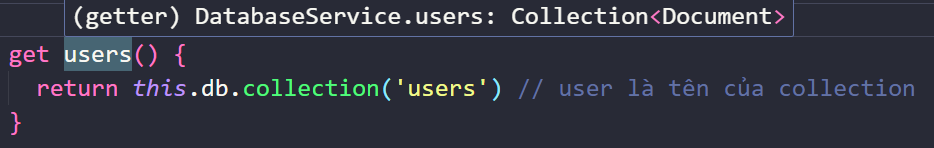
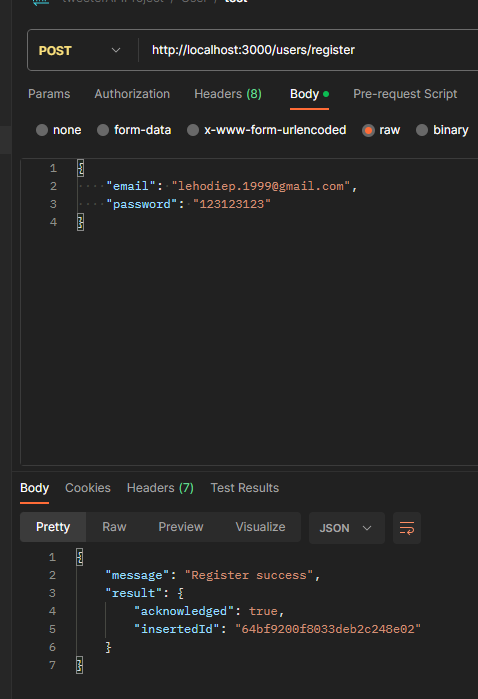
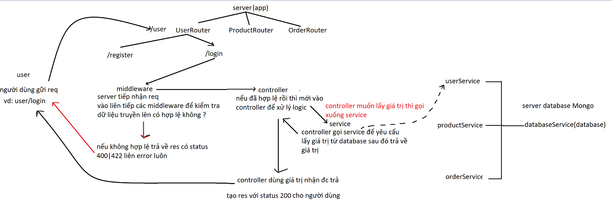

# tạo User Schema

- schemas là nơi chứa các định nghĩa của dữ liệu, nó giống như 1 bảng thiết kế của database
  - ví dụ như database sẽ trả về cho mình thông tin rất nhiều user
  - nhưng mỗi user sẽ có các thuộc tính gì
  - nếu mình muốn tạo ra một user thì phải tạo như thế nào, có được để trống không
  - vậy nên ta sẽ tạo ra 1 schema để định nghĩa rõ ràng rằng user như thế nào
- bây giờ ta thao tác tạo schema nên ta sẽ tạo trong folder `models` 1 folder `schemas` và tạo file `User.schema.ts`
- trong file `User.schema.ts` ta có thể dùng class hay interface để tạo schema
  nhưng ở đây anh sẽ dùng class vì interface trong ts thì:
  - interface nó chỉ là đang định dạng 1 kiểu dữ liệu mà thôi,
  - class là đại diện cho 1 kiểu và và dùng class để tạo object cũng rất là nhanh
- ta đã thiết kế schema User ở lần trước rồi, nên giờ ta sẽ lấy lại để sử dụng

  ```ts
  enum UserVerifyStatus {
    Unverified, // chưa xác thực email, mặc định = 0
    Verified, // đã xác thực email
    Banned, // bị khóa
  }
  enum USER_ROLE {
    Admin, //0
    Staff, //1
    User, //2
  }

  interface User {
    _id: ObjectId;
    name: string;
    email: string;
    date_of_birth: Date;
    password: string;
    created_at: Date;
    updated_at: Date; //lúc mới tạo chưa có gì thì nên cho bằng create_at
    email_verify_token: string; // jwt hoặc '' nếu đã xác thực email
    forgot_password_token: string; // jwt hoặc '' nếu đã xác thực email
    verify: UserVerifyStatus;

    bio: string; // optional
    location: string; // optional
    website: string; // optional
    username: string; // optional
    avatar: string; // optional
    cover_photo: string; // optional
    role: USER_ROLE; //đây là dạng Enum
  }
  ```

  - trong file `User.schema.ts` ta fix lại nội dung trên, chỉnh lại tên interface để rỏ nghĩa rằng nó chỉ là 1 type, tạo class User sử dụng inteface trên, và constructor

  ```ts
  import { ObjectId } from "mongodb";

  enum UserVerifyStatus {
    Unverified, // chưa xác thực email, mặc định = 0
    Verified, // đã xác thực email
    Banned, // bị khóa
  }
  enum USER_ROLE {
    Admin, //0
    Staff, //1
    User, //2
  }
  //interface dùng để định nghĩa 1 user cần những gì khi tạo ra
  interface UserType {
    _id?: ObjectId; //optional là ?
    name?: string;
    email: string;
    date_of_birth?: Date;
    password: string;
    created_at?: Date;
    updated_at?: Date; //lúc mới tạo chưa có gì thì nên cho bằng create_at
    email_verify_token?: string; // jwt hoặc '' nếu đã xác thực email
    forgot_password_token?: string; // jwt hoặc '' nếu đã xác thực email
    verify?: UserVerifyStatus;

    bio?: string; // optional
    location?: string; // optional
    website?: string; // optional
    username?: string; // optional
    avatar?: string; // optional
    cover_photo?: string; // optional
    role?: USER_ROLE; //đây là dạng Enum
  }

  //class sẽ sử dụng các định nghĩa của interface để tạo user đầy đủ
  //thông tin thì mới gữi lên database
  export default class User {
    _id?: ObjectId;
    name: string;
    email: string;
    date_of_birth: Date;
    password: string;
    created_at: Date;
    updated_at: Date;
    email_verify_token: string;
    forgot_password_token: string;
    verify: UserVerifyStatus;

    bio: string;
    location: string;
    website: string;
    username: string;
    avatar: string;
    cover_photo: string;
    constructor(user: UserType) {
      const date = new Date(); //tạo này cho ngày created_at updated_at bằng nhau
      this._id = user._id || new ObjectId(); // tự tạo id
      this.name = user.name || ""; // nếu người dùng tạo mà k truyền ta sẽ để rỗng
      this.email = user.email;
      this.date_of_birth = user.date_of_birth || new Date();
      this.password = user.password;
      this.created_at = user.created_at || date;
      this.updated_at = user.updated_at || date;
      this.email_verify_token = user.email_verify_token || "";
      this.forgot_password_token = user.forgot_password_token || "";
      this.verify = user.verify || UserVerifyStatus.Unverified;

      this.bio = user.bio || "";
      this.location = user.location || "";
      this.website = user.website || "";
      this.username = user.username || "";
      this.avatar = user.avatar || "";
      this.cover_photo = user.cover_photo || "";
      this.role = user.role || USER_ROLE.User;
    }
  }
  ```

- trong đoạn code trên ta lấy ví dụ

  - interface user cho phép bạn định nghĩa user thiếu date_of_birth
  - và khi tạo object từ interface user, thì class user sẽ tự new Date() cho date_of_birth
  - vì khi lưu vào database thì date_of_birth không thể để trống

- giờ ta sẽ kết nối với database để lưu user vào database

  - liên quan đến database thì mình vào `database.services.ts`
  - quan sát đoạn code này

  ```ts
  await this.client.db("admin").command({ ping: 1 });
  console.log("Pinged your deployment. You successfully connected to MongoDB!");
  ```

  `this.client.db('admin')` là tạo ra 1 bản thể(instance) của db để nơi khác sử dụng
  cụ thể là nó tạo 1 bản thể của admin cho mình sử dụng
  nhưng mình không cần bản thể `admin` này mà mình cần `piedShopingBE`
  nên giờ mình vào file `.env` thêm biến `DB_NAME = 'piedShopingBE'`
  chỉnh lại đoạn code lúc nãy trong `database.services.ts` thành

  ```ts
  const db = this.client.db(process.env.DB_NAME);
  await db.command({ ping: 1 });
  console.log("Pinged your deployment. You successfully connected to MongoDB!");
  ```

  - nếu ta có vậy thì biến db chỉ xài đc trong method connect mà thôi, nên ta chuyển biến db đó thành thuộc tính của class `DatabaseService`

    - vậy class `DatabaseService` sẽ fix thành

    ```ts
    class DatabaseService {
      private client: MongoClient;
      private db: Db; //tạo thành thuộc tình db
      constructor() {
        this.client = new MongoClient(uri);
        // nạp giá trị cho thuộc tình db thông qua constructor
        this.db = this.client.db(process.env.DB_NAME);
      }
      async connect() {
        try {
          await this.db.command({ ping: 1 }); //đổi cách xài
          console.log(
            "Pinged your deployment. You successfully connected to MongoDB!"
          );
        } catch (error) {
          console.log(error);
          throw error;
        }
      }
    }
    ```

  - tạo method get users để lấy instance của collection users (table users)

    - vào `.env` tạo biến `DB_USERS_COLLECTION = 'users'`
    - thêm get users cho class DatabaseService

    ```ts
    class DatabaseService {
        private client: MongoClient
        private db: Db
        constructor() {...}
        async connect() {...}

        get users() {//accessor property
            return this.db.collection(process.env.DB_USERS_COLLECTION as string)
            //vào db lấy ra collection users, và vì chuỗi truyền vào có thể là undefined nên mình phải rằng buộc nó là string 'thử xóa as string để thấy lỗi'
        }
    }
    ```

    - khi ta đưa chuột vào method get `users` ta sẽ thấy rằng
      nó thuộc kiểu `Collection<Document>`
      như vậy cũng đc nhưng mà mình đã tạo schema để định dạng rỏ ràng 1 document user phải trông như thế nào rồi, nên giờ ta sẽ nói với hệ thống rằng
      Collection này đang chứa User(và mình định nghĩa rồi)
    - ta fix lại chỗ get users như sau
      ```ts
      get users(): Collection<User> {
          return this.db.collection(process.env.DB_USERS_COLLECTION as string)
      }
      ```

- vào `users.routes.ts` thêm route mới để test thử, ta thêm

  ```ts
  import {
    loginController,
    registerController,
  } from "~/controllers/users.controllers";
  usersRouter.post("/register", registerController);
  ```

- vào `users.controllers` để
  thêm `registerController` bằng cách copy 1 `loginController`
  thay vì return ra giá trị giả, thì mình sẽ dùng databaseService để `get Users`

  ```ts
  //route này nhận vào email, password và tạo tài khoản cho mình
  //nhưng trong lúc tạo tài khoản ta dùng insertOne(là 1 promise)
  //nên ta sẽ dùng async await để xử lý bất đồng bộ
  //và rất có thể trong quá trình get data từ database mình sẽ gặp lỗi, nên phải try catch
  export const registerController = async (req: Request, res: Response) => {
    const { email, password } = req.body;
    try {
      const result = await databaseService.users.insertOne(
        new User({
          email, //tạo user chỉ cần email, password
          password,
        })
      );
      console.log(result);
      return res.status(200).json({
        message: "Register success", //chỉnh lại thông báo
        result: result,
      });
    } catch (err) {
      return res.status(400).json({
        message: "Register failed", //chỉnh lại thông báo
        err: err,
      });
    }
  };
  ```

- test api /register bằng postman
  

- ở phần trên , trong file `users.controllers.ts`
  đoạn code

  ```ts
  const result = await databaseService.users.insertOne(
    new User({
      email, //tạo user chỉ cần email, password
      password,
    })
  );
  ```

  - là 1 đoạn xử lý truy cập đến databaseServer để insert 1 doc mới(vì mình register), những gì liên quan đến database thì không nên truy xuất trực tiếp ở
    controller mà nên tạo 1 service để xử lý, đây là mô hình toàn cảnh
    

  - mình sẽ cất các đoạn code liên quan đến database vào các service, và controller chỉ gọi service để xử lý, có kết quả thì controller sẽ lấy và trả về cho client
    trong folder `service` tạo file `users.services.ts` để lưu class chứa các method giúp truy xuất database liên quan đến user

    liên quan đến việc thao tác dữ liệu database với collection users

  - file `users.services.ts` sẽ thành

    ```ts
    import User from "~/models/schemas/User.schema";
    import databaseService from "./database.services";

    class UsersService {
      async register(payload: { email: string; password: string }) {
        const { email, password } = payload;
        const result = await databaseService.users.insertOne(
          new User({
            email, //tạo user chỉ cần email, password
            password,
          })
        );
        return result;
      }
    }

    const usersService = new UsersService();
    export default usersService;
    ```

  - vậy thì file `users.controllers.ts` sẽ thành

    ```ts
    export const registerController = async (req: Request, res: Response) => {
      ...
      try {
        //đoạn bị thay thế
        const result = await usersService.register({ email, password })
        console.log(result)
        return res.status(200).json({
          message: 'Register success',
          result: result
        })
      ...
    }
    ```

  - cuối cùng là test lại 1 lần nữa với postman
