# cài đặt express validator cho dự án

## cài đặt express validator

```bash
npm i express-validator
```

- trước đây để validator người ta dùng validation chain

```js
query("person")
  .notEmpty()
  .withMessage("Person query không được bỏ trống nha")
  .escape();
```

- nhưng gần đây thì ngta đã thay thế nó bằng checkSchema validation rồi, nhìn nó sẽ trực quan và dể viết hơn

## chỉnh sửa lại route đăng ký (register) hoàn chỉnh

- mô tả route Register

```
    Description: Register a new user
    Path: /register
    Method: POST
    Body: {
        email: string,
        password: string,
        confirm_password: string
        date_of_birth: ISO8601

    }
```

- trong `user.middleware.ts` ta tạo middleware cho việc register của user

  - tạo middleware `registerValidator` trong `user.middleware.ts`, nhưng thay vì viết như thế này

  ```ts
    export const registerValidator = (req: Request, res: Response, next: NextFunction) => {....
  ```

  ta sẽ dùng checkShema của thằng express-validator để nó tiện vào trực quan
  checkShema được tạo ra từ [validatorjs](https://github.com/validatorjs/validator.js), nên ta có thể sử dụng các method trong này

  ```ts
    //khai báo
    import { checkSchema } from 'express-validator'

    export const registerValidator = export const registerValidator = checkSchema({
        name: {

        }
    })
  ```

  ta có thể tìm kiếm ở mục tìm kiếm các hàm như islength để valid thuộc tính
  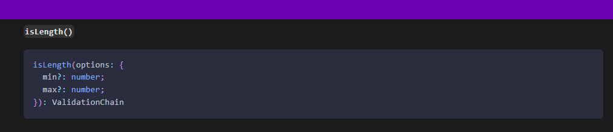
  trong đó có cả hàm isStrongPassword 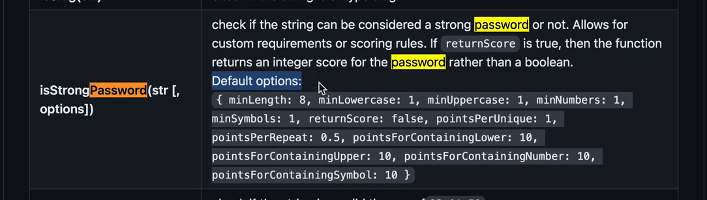

  ta sẽ có registerValidator middleware như sau

  ```ts
  export const registerValidator = checkSchema({
    name: {
      notEmpty: true,
      isString: true,
      trim: true,
      isLength: {
        options: {
          min: 1,
          max: 100,
        },
      },
    },
    email: {
      notEmpty: true,
      isEmail: true,
      trim: true,
    },
    password: {
      notEmpty: true,
      isString: true,
      isLength: {
        options: {
          min: 8,
          max: 50,
        },
      },
      isStrongPassword: {
        options: {
          minLength: 8,
          minLowercase: 1,
          minUppercase: 1,
          minNumbers: 1,
          minSymbols: 1,
          // returnScore: false
          // false : chỉ return true nếu password mạnh, false nếu k
          // true : return về chất lượng password(trên thang điểm 10)
        },
      },
      errorMessage:
        "password mus be at least 8 characters long and contain at least 1 lowercase letter, 1 uppercase letter, 1 number, and 1 symbol",
    },
    confirm_password: {
      notEmpty: true,
      isString: true,
      isLength: {
        options: {
          min: 8,
          max: 50,
        },
      },
      isStrongPassword: {
        options: {
          minLength: 8,
          minLowercase: 1,
          minUppercase: 1,
          minNumbers: 1,
          minSymbols: 1,
        },
      },
      errorMessage:
        "password mus be at least 8 characters long and contain at least 1 lowercase letter, 1 uppercase letter, 1 number, and 1 symbol",
    },
    date_of_birth: {
      isISO8601: {
        options: {
          strict: true,
          strictSeparator: true,
        },
      },
    },
  });
  ```

  - ta vào file `users.routes.ts` thêm middleware cho route `/register`

  ```ts
  //khai báo
  import {
    loginValidator,
    registerValidator,
  } from "~/middlewares/users.middlewares";

  /*
  des: đăng ký tài khoản
  path: /users/register
  method: POST
  body: {name, email, password, confirm_password, date_of_birth}
  */
  //cập nhật route thêm middleware
  usersRouter.post("/register", registerValidator, registerController);
  ```

  - test thử api register bằng postman, ta cố tình truyền sai data
    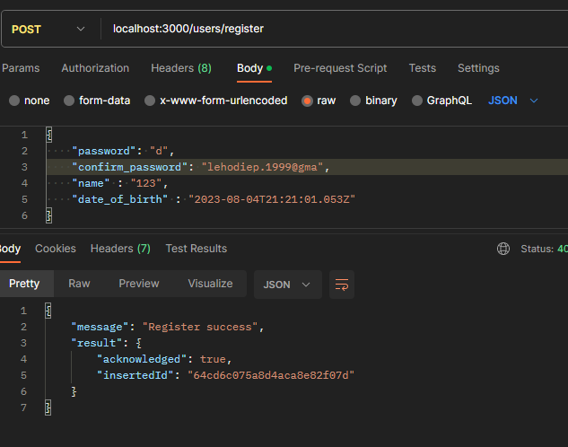
  - như hình thì ta đã tạo thành công user mới dù đã truyền sai giá t trị của các `trường dữ liệu`, điều đó đồng nghĩa rằng registerController vẫn chạy bình thường, vì checkSchema có check lỗi, nhưng chưa tạo object lỗi cho chúng ta

- ta phải cấu hình chạy xác thự thủ công bằng cách viết một hàm nhận vào object được tạo ra từ `CheckSchema` và hàm đó sẽ dùng đến `validation runner` của `express-validator` để chạy xác thực
  và tạo ra object lỗi gữi cho người dùng

  - ta có thể xem qua document ở đây [doc validator](https://express-validator.github.io/docs/guides/manually-running)
  - trong `utils` tạo file `validation.ts` và copy đoạn code đầu tiên(chuyển sang ts) trên doc bỏ vào
  - vì đoạn code dưới là demo của js nên ta phải chỉnh nó lại ở các kiểu dữ liệu để phù hợp với ts
    ta fix đoạn code trong file `validation.ts` thành thế này

    ```ts
    import express from "express";
    import { body, validationResult, ValidationChain } from "express-validator";
    import { RunnableValidationChains } from "express-validator/lib/middlewares/schema";

    // export ở ngoài xài đc hàm validate
    //đổi thành RunnableValidationChains<ValidationChain>
    //vì tý nữa validate sẽ đc xài thế này validate(checkShema({...}))
    //mà checkShema() nó là(return) ra RunnableValidationChains<ValidationChain>
    export const validate = (
      validation: RunnableValidationChains<ValidationChain>
    ) => {
      return async (
        req: express.Request,
        res: express.Response,
        next: express.NextFunction
      ) => {
        await validation.run(req); //hàm tìm lỗi của middleware schema và đưa vào req

        const errors = validationResult(req); //funct này giúp ta lấy lỗi ra từ biến req
        if (errors.isEmpty()) {
          return next();
        }

        res.status(400).json({ errors: errors.array() });
      };
    };
    ```

  - ta sẽ sử dụng funct `validate` vừa tạo cho file `users.routes.ts`
    ở middleware `registerValidate`

    ```ts
    import { validate } from '~/utils/validation'

    export const registerValidator = validate(checkSchema({..}))
    ```

  - ta test lại qua postman
    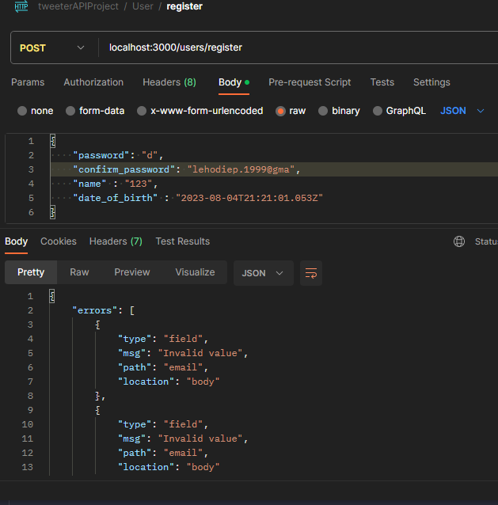
    trong kết quả trên ta thấy lỗi được thông báo dạng mảng, và sẽ rất khó để xử lý, ta sẽ đổi dùng `.mapped` để biến object lỗi thành object chứa các thuộc tính lỗi
    `validation.ts`
    ```ts
    //res.status(400).json({ errors: errors.array() })
    res.status(400).json({ errors: errors.mapped() });
    //giúp gộp res về thành 1 object báo lỗi thôi, thay vì mảng
    ```
    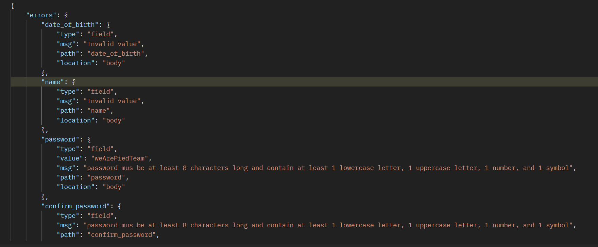
  - ta test lại với giá trị hợp lệ nhưng sai confirm password
    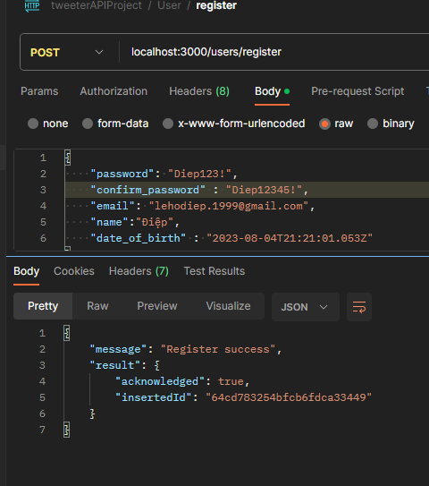
    nhưng vẫn đăng ký đc, bởi vì ta chưa check password == confirm_password

  - ta vào `middleware` registerValidation fix lại chỗ confirm_password thêm như sau theo ví dụ của trang doc, vì điều kiện `password == confirm_password` là một đạng logic mà ta tự đặt ra nên không có hàm kiểm tra sẵn
    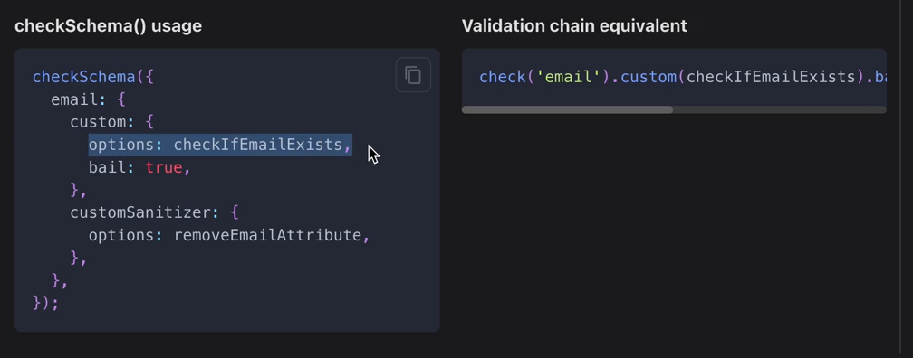

    ```ts
    ...
        confirm_password: {
            notEmpty: true,
            isString: true,
            isLength: {
                options: {
                min: 8,
                max: 50
                }
            },
            isStrongPassword: {
                options: {
                minLength: 8,
                minLowercase: 1,
                minUppercase: 1,
                minNumbers: 1,
                minSymbols: 1
                },
                //dời error vào đây để nó chỉ báo lỗi
                //khi password k mạnh
                errorMessage:
                'password mus be at least 8 characters long and contain at least 1 lowercase letter, 1 uppercase letter, 1 number, and 1 symbol',
            },
            //thêm custom để kiểm tra password == confirm_password
            custom: {
                options: (value, { req }) => {
                if (value !== req.body.password) {
                    throw new Error('Password confirmation does not match password')
                }
                return true
            }
        }
        },
            ...
    ```

  - test lại
    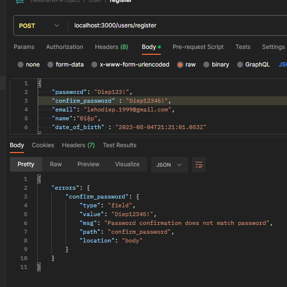
  - password khớp nhau
    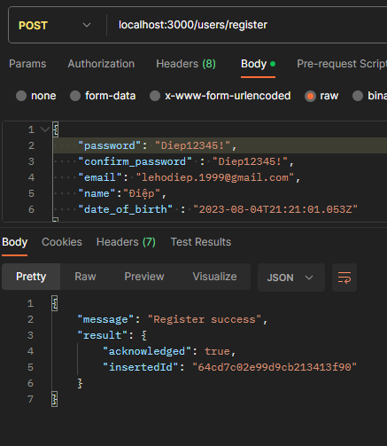

- custom lại checkShema cho email, để kiểm tra email đã tồn tại hay chưa

  - ta cần phải truy cập vào database và xem thử có email đăng ký đã có ai dùng chưa, nên nó liên quan đến userService(đụng data là dính service)
  - nên ta vào `user.services.ts` tạo 1 method `checkEmailExist`
    ```ts
    class UsersService {
        ...
        async checkEmailExist(email: string) {
            //vào database tìm xem có hông
            const user = await databaseService.users.findOne({ email })
            return Boolean(user) //có true, k false
        }
    }
    ```
  - ta có thể vào ` checkShema của email`, thêm hàm kiểm tra email có tồn tại không, bằng cách check qua `userService` như thế này
    ```ts
    email: {
      notEmpty: true,
      isEmail: true,
      trim: true,
      custom: {//thêm hàm xử lý kiểm tra email có tồn tại không
        options: async (value) => {
          const isExistEmail = await usersService.checkEmailExist(value)
          if (isExistEmail) {
            throw new Error('Email already exists')
          }
          return true
        }
      }
    }
    ```
  - nhưng việc gọi service ở tầng middleware là một việc làm không tốt vì:

    ```
    Việc kiểm tra email có tồn tại trong database nên được thực hiện ở controller. Đây là một số lý do tại sao:

    Phân tách rõ ràng vai trò: Middleware thường được sử dụng để xử lý các tác vụ trước khi yêu cầu được chuyển tới controller, như xác thực, phân quyền, hoặc log request. Trong khi đó, controller chịu trách nhiệm xử lý logic chính của ứng dụng, bao gồm việc kiểm tra dữ liệu và tương tác với cơ sở dữ liệu.

    Dễ quản lý và bảo trì: Khi kiểm tra email được thực hiện trong controller, logic kiểm tra này nằm gần với các phần khác của logic nghiệp vụ. Điều này giúp cho việc quản lý và bảo trì dễ dàng hơn.

    Tính đặc thù của nghiệp vụ: Kiểm tra sự tồn tại của email có thể là một phần của logic nghiệp vụ cụ thể liên quan đến đăng ký hoặc đăng nhập. Việc đặt kiểm tra này trong controller cho phép bạn dễ dàng thay đổi hoặc mở rộng logic nghiệp vụ mà không ảnh hưởng đến các phần khác của hệ thống.

    Tối ưu hóa hiệu suất: Việc thực hiện kiểm tra trong controller giúp tránh việc kiểm tra không cần thiết đối với tất cả các request mà chỉ giới hạn cho các request liên quan đến logic nghiệp vụ đó.
    ```

  - vậy nên ta sẽ call service ở controller như thế này

    ```ts
    export const registerController = async (req: Request, res: Response) => {
      const { email, password } = req.body;
      try {
        //kiểm tra thêm email ở đây
        const isEmailExist = await usersService.checkEmailExist(email);
        if (isEmailExist) {
          throw new Error("Email already exists");
        }
        const result = await usersService.register({ email, password });
        console.log(result);
        return res.status(200).json({
          message: "Register success",
          result: result,
        });
      } catch (err) {
        return res.status(400).json({
          message: "Register failed",
          err: err,
        });
      }
    };
    ```

    kết quả thu được nếu ta nhập sai confirm_password
    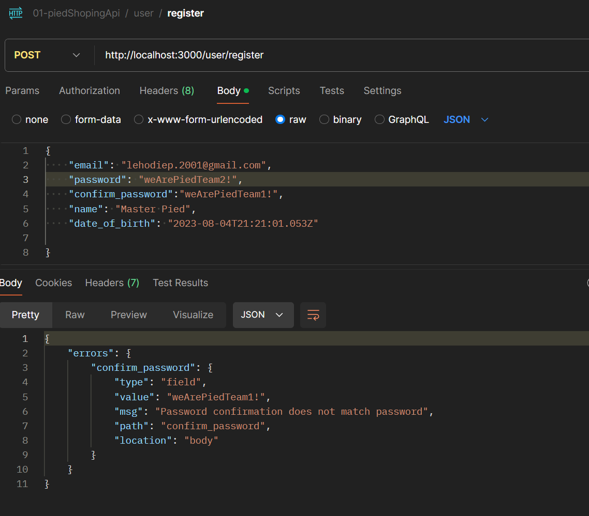
    và đây là kết quả nếu ta nhập email đã tồn tại
    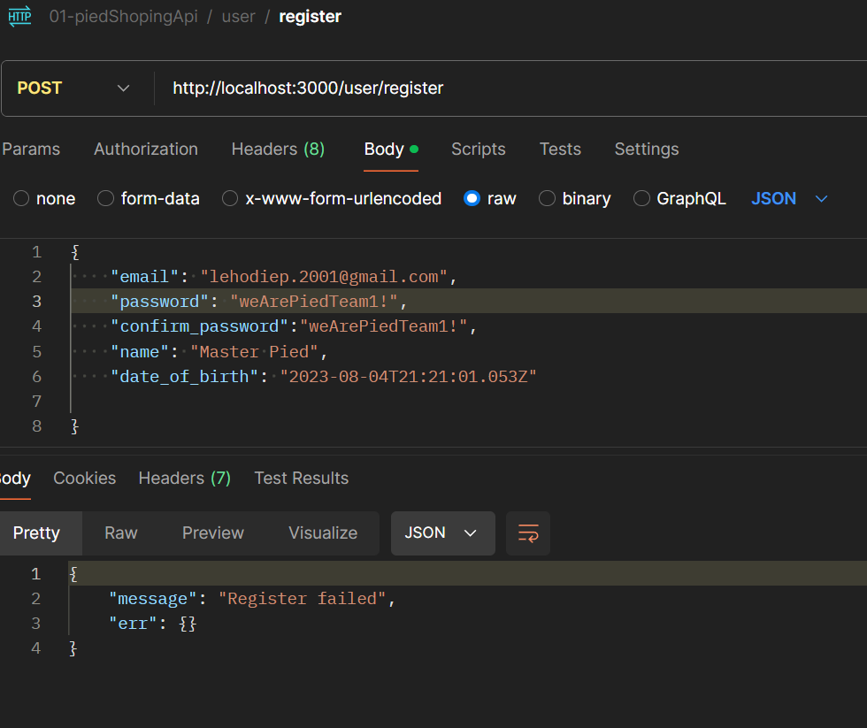
    nếu để ý bạn sẽ thấy rằng error trả về là object rỗng, đó là vì object error rất đặc biệc. thuộc tính message của nó có enumerable là false, tức là k thể duyệt và hiển thị (bài cũ từ lúc học js)

  - ta vần phải sữa lại đoạn code trên

    ```ts
    export const registerController = async (req: Request, res: Response) => {
      const { email, password } = req.body;
      try {
        const isEmailExist = await usersService.checkEmailExist(email);
        if (isEmailExist) {
          //sẽ không hiện được message vì Error có message là enumerable: false
          const errorCustom = new Error("Email already exists"); //ta phải set lại enumerable: true
          Object.defineProperty(errorCustom, "message", {
            enumerable: true,
          });
          throw errorCustom;
        }
        const result = await usersService.register({ email, password });
        console.log(result);
        return res.status(200).json({
          message: "Register success",
          result: result,
        });
      } catch (err) {
        return res.status(400).json({
          message: "Register failed",
          err: err,
        });
      }
    };
    ```

  - giờ mình test thử nhé
    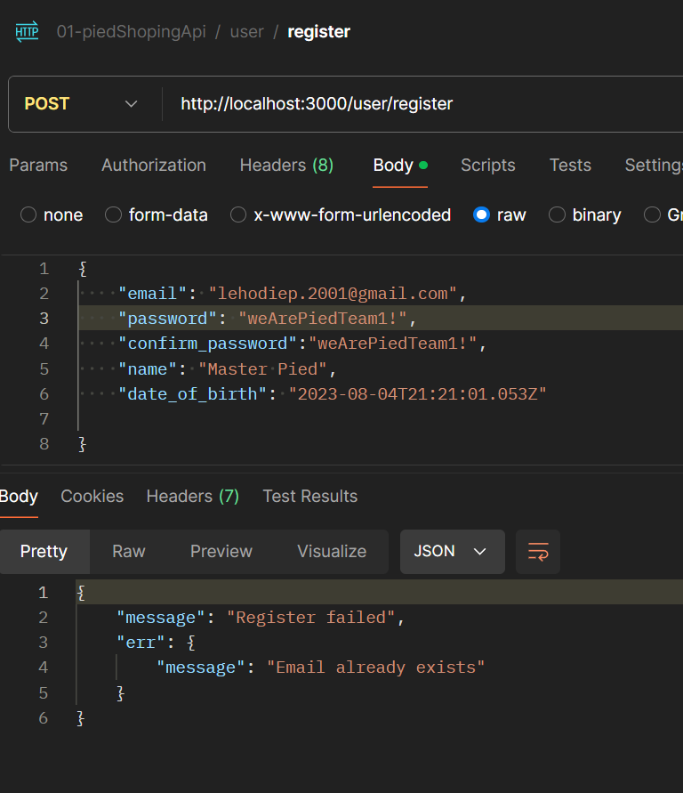

- vậy từ đây là rút ra được điều gì
  - khi ta throw error trong checkShema thì nó đã được xử ký bởi express-validator, nên ta không cần phải xử lý nó nữa
  - nhưng khi ta throw error trong controller thì nó sẽ không được xử lý bởi express-validator, nên ta phải xử lý nó bằng cách set enumerable của message là true
  - những tác vụ liên quan đến service nên được gọi ở middleware, đó là lí do ta phải xử lý lỗi rất phức tạp
  - từ đây ta cũng thấy rằng việc xử lý lỗi, và phải viết cấu trúc try catch mỗi lần call service(vì nó bất đồng bộ, có thể trả về error) rất phiền phức, và sẽ bị lập đi lập lại ở rất nhiều các controller khác nhau, còn checkSchema thì k cần trycatch, nó tự xử lý lỗi.
    **vậy ta sẽ cần làm một hệ thống xử lý lỗi, giúp giảm thiểu việc lập lại try catch ở các hàm controller
    ta sẽ làm ở các bài sau**
