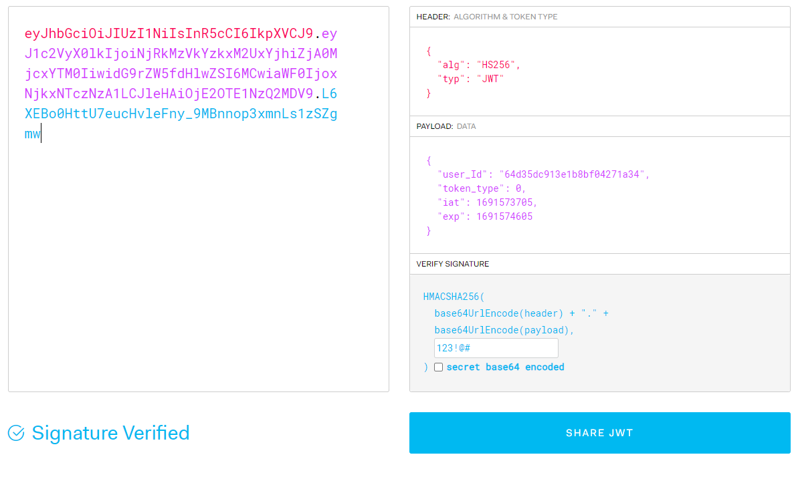

# Tạo Access Token(AT) và Refresh Token(RT)

## fix lại kiểu dữ liệu cho `RegisterController` để code chuẩn định nghĩa rỏ ràng

- trong router Register có (middleware, controller-handler)
  controller của Register là `RegisterController` đang có nhiệm vụ là kiểm tra xem email đã tồn tại chưa, nếu chưa thì đẩy lên server email và password để tạo tài khoản

  ```ts
  export const registerController = async (req: Request, res: Response) => {
  const { email, password } = req.body //thằng body này có kiểu là any
  ...
  ```

  - trong đoạn code trên vì `body` là `any`, nên khi ta `.` thì sẽ không có gợi ý, nếu ta muốn gợi ý thì ta phải định nghĩa kiểu dữ liệu cho `req`, vì trong `req` sẽ có `params` và `body`

- nếu ta đưa chuột vào req ta sẽ thấy req được định nghĩa kiểu dữ liệu như sau
  

  - từ đây suy ra 1 req gồm ParamsDictionary, resBody, reqBody
  - ta thay thế đoạn request bằng phần đó luôn để định dạng lại

  ```ts
  import {ParamsDictionary} from 'express-serve-static-core'

  export const registerController = async (req: Request<ParamsDictionary, any, any>, res: Response) => {
  const { email, password } = req.body
  ...
  ```

  - giờ ta ta thấy rằng mình có 2 `any`, `any` đầu tiên dùng để định nghĩa cho resBody
    `any` thứ 2 mình định nghĩa cho reqBody(những gì client truyền lên req thông qua body)

- và giờ ta sẽ tạo 1 interface để định nghĩa lại `reqBody` của `register` `thay vì để any`

  - ta vào thư mục `models` (nơi chứa các định nghĩa dữ liệu)
  - tạo folder `requests`(chứa các định interface định nghĩa kiểu dữ liệu cho các request)
  - tạo file `User.requests.ts` chứa các interface định nghĩa các reqBody của các controller, và trong này ta sẽ định nghĩa là `reqBody` của `registerController`
  - thêm vào file `User.requests.ts` 1 định nghĩa interface

    ```ts
    export interface RegisterReqBody {
      name: string;
      email: string;
      password: string;
      confirm_password: string;
      date_of_birth: string;
    }
    ```

  - vào file `registerController` thay any thứ 2 lại thành `RegisterReqBody`

    ```ts
    export const registerController = async (req: Request<ParamsDictionary, any, RegisterReqBody>, res: Response) => {
    const { email, password } = req.body
    //giờ thì ta đã thấy body là RegisterReqBody
    //việc này sẽ giúp code nhắc ta là trong body có gì
    //và ta biết đã biết chắc body là RegisterReqBody
    //nên ta cũng k cần lấy lẽ từng cái email,pasword làm gì
        ...
    ```

  - giờ thì ta đã thấy `body` là `RegisterReqBody`
    - việc này sẽ giúp code nhắc ta là trong body có gì
    - và ta biết đã biết chắc `body` là `RegisterReqBody`
    - nên ta cũng k cần lấy lẽ từng cái `email,pasword` làm gì

- ta thay fix đoạn `registerController` như sau

  ```ts
  export const registerController = async (req: Request<ParamsDictionary, any, RegisterReqBody>, res: Response) => {
    try {
      const isEmailExist = await usersService.checkEmailExist(req.body.email)
      ...
      }
      const result = await usersService.register(req.body) //{ email, password } = req.body(nhiếu thông tin hơn)
      ...
  }
  ```

- ta vào `usersService.register(req.body)` tức `users.services.ts` và chỉnh lại parameter về thành `RegisterReqBody` thay vì chỉ là email, password

  ```ts
  import { RegisterReqBody } from '~/models/requests/User.requests'

    class UsersService {
        async register(payload: RegisterReqBody) {//payload là những gì người dùng gửi lên
            //const { email, password } = payload
            const result = await databaseService.users.insertOne(
            new User({
                ...payload,
                date_of_birth: new Date(payload.date_of_birth)
                //vì User.schema.ts có date_of_birth là Date
                //nhưng mà người dùng gửi lên payload là string
        })
        ...
    )
  ```

- ta muốn `name`,`date_of_birth` cũng `required` như `email`, password nên fix nhẹ lại required cho các trường dữ liệu trong `User.schema.ts`
  
- vậy thì lúc :

  - `người dùng muốn tạo tài khoản` thì truyền lên `server` như `RegisterReqBody`
  - `lập trình viên muốn tạo object User lưu lên database` thì cần định nghĩa như `UserType`
  - `kết quả cuối cùng được lưu ở database` sẽ giống object tạo từ `class User` trong `User.schema.ts`

- ta sẽ tiến hành tách `enum UserVerifyStatus và USER_ROLE` ra file riêng để tiện quản lý sau này

  ```ts
  enum UserVerifyStatus {
    Unverified, // chưa xác thực email, mặc định = 0
    Verified, // đã xác thực email
    Banned, // bị khóa
  }
  enum USER_ROLE {
    Admin, //0
    Staff, //1
    User, //2
  }
  ```

  - trong folder `containts`, tạo file `enums.ts`
  - đem đoạn `enum UserVerifyStatus` bỏ vào `enums.ts`

    ```ts
    export enum UserVerifyStatus {
      Unverified, // chưa xác thực email, mặc định = 0
      Verified, // đã xác thực email
      Banned, // bị khóa
    }
    export enum USER_ROLE {
      Admin, //0
      Staff, //1
      User, //2
    }
    ```

- file `User.schema.ts` thì import `UserVerifyStatus`

  ```ts
  import { ObjectId } from "mongodb";
  import { USER_ROLE, UserVerifyStatus } from "~/constants/enums";
  ```

- giờ ta bật postman và test thử lại thôi
  
  email đã tồn tại
  
  trong mongo
  

- nếu để ý là `server` không nhận cái `confirm_password` của người dùng truyền lên ? **(tại sao vậy ?)**

- ta có thể thấy rằng password của mình bị lưu trực tiếp (password thô) và nếu server bị tấn công
  thì chắc chắn hacker dể dàng có được thông tin này, ta phải mã hóa chúng trước khi lưu lên server

- ta sẽ dùng [`SHA-256`](https://futurestud.io/tutorials/node-js-calculate-a-sha256-hash) là một thuật toán mã hóa, để giúp mình mã hóa password trước khi lưu lên server, đây là có sẵn, thông qua package `crypto`
- bây giờ ta tiến hành mã hóa `password` trước khi gữi lên server

  - trong file `.env` ta tạo `PASSWORD_SECRET='diepdeptrai'`
  - trong thư mục `utils` (src/utils: Chứa các file chứa các hàm tiện ích, như mã hóa, gửi email, ...) ta tạo `crypto.ts`

    ```ts
    import { createHash } from "crypto";

    //đoạn code này lấy từ trang chủ của SHA256
    function sha256(content: string) {
      return createHash("sha256").update(content).digest("hex");
    }

    //hàm mã hóa password kèm 1 mật khẩu bí mật do mình tạo ra
    export function hashPassword(password: string) {
      return sha256(password + process.env.PASSWORD_SECRET);
    }
    ```

  - trong `users.services.ts` ta sẽ override lại password bằng password đã được mã hóa trước khi truyền lên

    ```ts
    import { hashPassword } from '~/utils/crypto'

    class UsersService {
    async register(payload: RegisterReqBody) {
        ...
        new User({
            ...payload,
            date_of_birth: new Date(payload.date_of_birth),
            //vì User.schema.ts có date_of_birth là Date
            //nhưng mà người dùng gửi lên payload là string
            password: hashPassword(payload.password)
        })
        ...
    }
    ```

- xóa hết user trong mongo và test lại việc tạo tài khoản xem `password` đã được mã hóa hay chưa

## tạo access token và refresh token

- để tạo at hay rt thì ta đều phải có [jwt](https://www.npmjs.com/package/jsonwebtoken) (json web token)

- ta sẽ cài đặt `jsonwebtoken` và `@types/jsonwebtoken -D` bản biên dịch ts của nó
  ```bash
  npm install jsonwebtoken @types/jsonwebtoken -D
  ```
- có rất nhiều cách để tạo ra `chữ ký định danh trong token`(`sign token`), nhưng ở đây `mình sẽ chọn tạo 1 chữ ký không đồng bộ`, `vì mình muốn nó tạo chữ ký trước rồi mới thực hiện hành động`
  

- đây cũng là một tiện ích sẽ dùng ở nhiều dự án khác nên mình tạo file `jwt.ts` trong folder `utils` và tạo một hàm `signToken` để tạo ra chuỗi jwt
- hàm sẽ nhận vào :

  - `payload` : dữ liệu mà mình muốn người dùng giữ(ai cũng có thể xem đc, nên đừng bỏ thông tin nhạy cảm vào đây nhé)
  - `privateKey` : password mà server tạo ra, để sau này xác thực jwt là của chính mình tạo ra và đưa cho người dùng
  - `options` : là các tùy chọn khác, như thời gian hết hạn, thuật toán mã hóa, ...

  ```ts
  import jwt from "jsonwebtoken";
  //privateKey là password để được quyền tạo chữ ký jwt
  export const signToken = (
    payload: any,
    privateKey: string,
    options: jwt.SignOptions
  ) => {
    return new Promise<string>((resolve, reject) => {
      jwt.sign(payload, privateKey, options, (error, token) => {
        if (error) throw reject(error);
        resolve(token as string);
      });
    });
  };
  ```

- khi mà mình tạo ra `access-token` hay `refresh-token` thì mình cũng cần phải có 1 `private key` để xác nhận mình(server) là `người đã từng tạo ra jwt này`, nếu không thì có thể xảy ra trường hợp 1 hacker nào đó muốn tấn công vào server của mình và tự tạo 1 `access-token` bằng cách truyền vào 1 `private key` mà họ tự nghĩ ra

  - nên là giờ mình sẽ vào `.env` tạo 1 `private key` cho server

    ```ts
        JWT_SECRET = '123!@#' và thêm thời gian hết hạn
        `#nếu expire_in là số thì nó sẽ tính theo giây, nếu là string thì nó sẽ tính theo phút, giờ, ngày, tháng, năm
        ACCESS_TOKEN_EXPIRE_IN = '15m'
        REFRESH_TOKEN_EXPIRE_IN = '100d'
    ```

    - khi thay đổi thông tin trong server nhớ tắt app và chạy lại nhá

  - trong `jwt.ts` ta gán default parameter cho `privateKey` là `JWT_SECRET`

    ```ts
    import jwt from "jsonwebtoken";
    import { config } from "dotenv"; //để đọc file .env
    config();

    //privateKey là password để được quyền tạo chữ ký jwt
    export const signToken = (
      payload: any,
      privateKey = process.env.JWT_SECRET as string,
      options: jwt.SignOptions
    ) => {
      return new Promise<string>((resolve, reject) => {
        jwt.sign(payload, privateKey, options, (error, token) => {
          if (error) throw reject(error);
          resolve(token as string);
        });
      });
    };
    ```

  - nếu ta viết paramter như thế này thì khi mỗi lần gọi `signToken` sẽ phải truyền vào 3 giá trị theo thứ tự, vậy thì cái default parameter sẽ rất ngớ ngẫn, ta có thể đổi thứ tự và đưa privatekey ra sau cùng
  - thay vào đó ta sẽ thay chúng bằng object thì nếu truyền thiếu, hay sai thứ tự đều không sao cả

    ```ts
    export const signToken = ({
    payload,
    privateKey = process.env.JWT_SECRET as string,
    options = { algorithm: 'HS256' }
    }: {
    payload: string | object | Buffer
    privateKey?: string
    options?: jwt.SignOptions
    }) => {
    return new Promise<string>((resolve, reject) => {
        ...
    ```

    và ta sẽ xài hàm này trông như thế này, thiếu options cũng đc
    
    thay vì thế này
    

- giờ ta sẽ dùng `signToken` ở `users.services.ts` để tạo `access-token` và `refresh-token` gữi cho `client`
  `users.services.ts`

  - tạo enum để phân loại các dạng token, vào `enums.ts`, ta thêm

  ```ts
  export enum TokenType {
    AccessToken, //0
    RefreshToken, //1
    ForgotPasswordToken, //2
    EmailVerificationToken, //3
  }
  ```

  - ở `users.services.ts` ta tạo hàm `signAccessToken` và `signRefreshToken` sử dụng `signToken` dùng để tạo ra access token cho 1 `user_id` nào đó

  ```ts
  import { signToken } from '~/utils/jwt'
  import { TokenType } from '~/constants/enums'

  ...

  class UsersService {
    //nên thêm ở trên cùng, trước register
    private  signAccessToken(user_id: string) {
        return  signToken({
            payload: { user_id, token_type: TokenType.AccessToken },
            options: { expiresIn: process.env.ACCESS_TOKEN_EXPIRE_IN }
        })
    }
    private  signRefreshToken(user_id: string) {
        return  signToken({
            payload: { user_id, token_type: TokenType.RefreshToken },
            options: { expiresIn: process.env.REFRESH_TOKEN_EXPIRE_IN }
        })
    }

    async register(payload: RegisterReqBody) {
    ...
  ```

- trong `method register` ta sẽ code thêm hành động tạo `at` và `rt` và gữi cho client
  - khi `register` chạy thì `insertOne` chạy và gữi về `res` có dạng như sau
    
    trong đó `insertedId` là `user_id` của user vừa được thêm vào, khi
    khách hàng vừa tạo `account` thành công thì ta tạo `rf` và `at`,
    dùng chính `user_id` đó để tìm và update `rf` vào user, sau đó chỉ gữi
    `at` cho client, để lần sau họ dùng `at` để xác thự mà k cần đăng nhập lại.
  - nên ta sẽ code trong `register` như sau
    ```ts
    async register(payload: RegisterReqBody) {
      //đoạn này là lúc tạo tài khoản
        const result = await databaseService.users.insertOne(
            new User({
                ...payload,
                date_of_birth: new Date(payload.date_of_birth),
                password: hashPassword(payload.password)
            })
        )
        //insertOne sẽ trả về 1 object, trong đó có thuộc tính insertedId là user_id của user vừa tạo
        //vì vậy ta sẽ lấy user_id đó ra để tạo token
        const user_id = result.insertedId.toString()
        // const access_token = await this.signAccessToken(user_id)
        // const refresh_token = await this.signRefreshToken(user_id)
        //nên viết là thì sẽ giảm thời gian chờ 2 cái này tạo ra
        const [access_token, refresh_token] = await Promise.all([
          this.signAccessToken(user_id),
          this.signRefreshToken(user_id)
        ]) //đây cũng chính là lý do mình chọn xử lý bất đồng bộ, thay vì chọn xử lý đồng bộ
        //Promise.all giúp nó chạy bất đồng bộ, chạy song song nhau, giảm thời gian
        return { access_token, refresh_token }
        //ta sẽ return 2 cái này về cho client
        //thay vì return user_id về cho client
    }
    ```
  - trong đoạn code trên ta đã chưa lưu rf vào account vừa tạo
- test kết quả
  
  ta có thể test thử xem at và rt đó mã hóa ra gì bằng trang jwt.io
  
- dùng thử `at` và `rf` vào trong trang jwt xem thử ngày hết hạn có hợp lệ không
  `iat` là thời gian tạo
  `exp` là thời gian hết hạn
- vào mongo tìm xem có account đó không

- đôi điều về `rf`:
  - `rf` là bức tường thành kiểm tra cuối cùng ở bước xác thực định danh người dùng
  - mỗi khi hết hiệu lực của `at` thì người ta sẽ gữi `rf` lên để xin server cấp `at` mới và tiếp tục truy cập. server sẽ xác thực `rf` và cấp lại `at` và `rf mới`(cùng hết hạn với rf cũ)
  - nếu `rf` bị lộ thì hacker có thể xin cấp `at` mới và tiếp tục truy cập
  - ta sẽ lưu `rf` vào `database`, để nếu có tình trạng xấu trên thì khi người dùng thông báo bị mất account, ta sẽ xóa `rf` khỏi hệ thống, khiến hacker không thể dùng nó để xin `at` truy cập trái phép đc nữa
  - nhưng việc lưu `rf` sẽ vi phạm vào quy tắt stateless của server, nhưng ta xin chấp nhận việc này để bảo vệ người dùng
  - **ta sẽ tìm hiểu kỹ hơn về vấn đề này ở bài sau**
