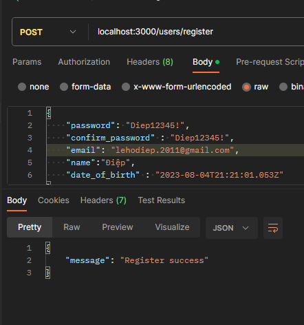
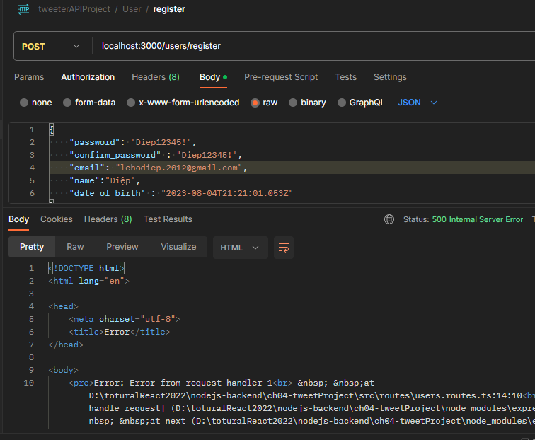
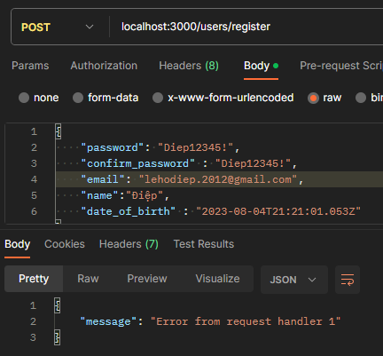
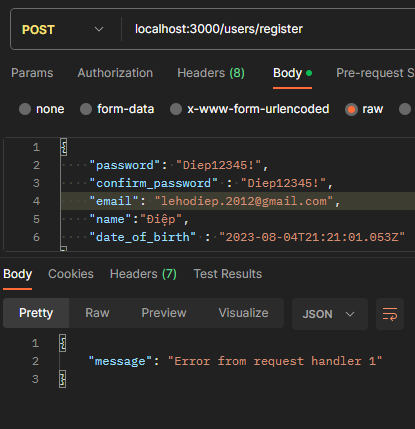
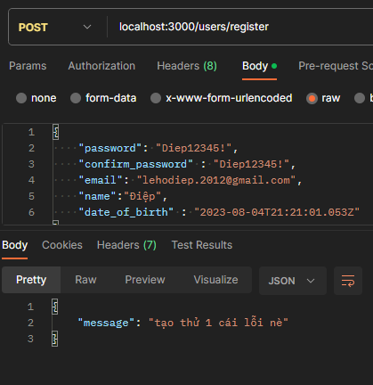
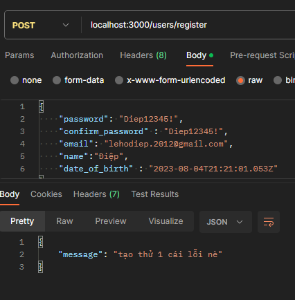
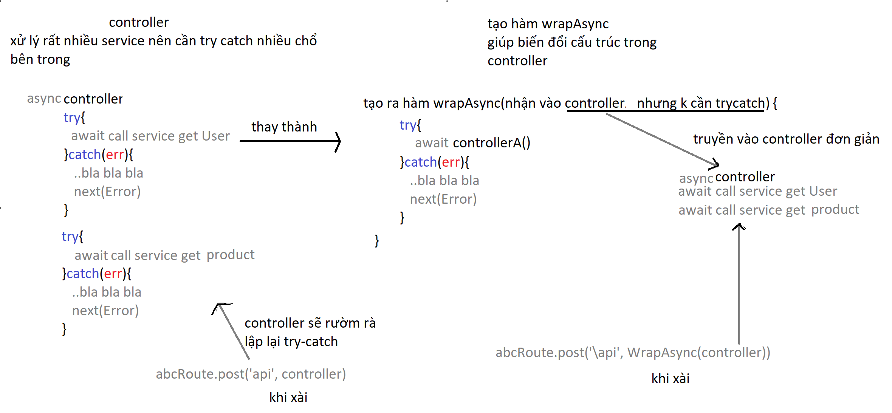

# Error Handling trong express js

- xử lý lỗi thông qua [Error Handling](https://expressjs.com/en/guide/error-handling.html)

trong Expressjs có 2 loại handler

## Request handler

- Nhận request từ client và trả về response
- với mỗi request handler thì chúng ta sẽ có 3 tham số là `req`, `res`, `next `
- nếu không dùng `next ` thì k cần khai báo cũng được

```ts
app.get('/users', (req, res, next) => {
  //do something
  res.send('hellow world')
})
```

- Gọi `next()` để chuyển request sang request handler tiếp theo

  - ta sẽ code mẫu nay trên chính route register của mình luôn
  - vào file `users.routes.ts` tìm đến route `/register` và fix thử như sau

  ```ts
  usersRouter.post(
    '/register',
    registerValidator,
    (req, res, next) => {
      console.log('request handler 1')
      next()
      //nếu có next thì nó sẽ chạy xuống request handler bên dưới
      //nếu k có next thì khi request handler đến đây nó sẽ k xuống được
      //next thì nó sẽ bị treo ở đây
    },
    (req, res, next) => {
      console.log('request handler 2')
      next() //gặp next nên sẽ chạy xuống request handler bên dưới
    },
    (req, res, next) => {
      console.log('request handler 3')
      res.json({ message: 'Register success' })
      //cuối cùng là res, gữi kết quả cho client
    }
  )
  ```

  - test thử qua postman
    
    

  - vậy là ta đã bỏ controller và thay vào đó 3 request handler, bản chất middleware, controller đều là request handler

- gọi `next(err)` để chuyển request sang error handler tiếp theo

  - nếu ta fix đoạn code trên thành

  ```ts
  usersRouter.post(
  '/register',
  registerValidator,
  (req, res, next) => {
    console.log('request handler 1')
    next(new Error('Error from request handler 1'))//dùng next(err)
  },
  ...
  ```

  - thì nó sẽ tìm cái `err handler` tiếp theo, nhưng code của ta k có nên nó
    sẽ chạy vào `err handler` có sẵn của `expressjs` và trả ra `stt 500`
    

## Error handler

- nhận `Error` từ `request handler` và trả về `response`

- với mỗi `error handler` thì chúng ta **phải có đủ 4 tham số** là
  `err`, `req`, `res`, `next`
- nếu **chỉ khai báo 3 thì** cũng sẽ bị hiểu là `request handler`
- ta thử thêm `err handler` vào `route '/register'` để xem khi `next(err)` thì có chạy vào đó không

  ```ts
  usersRouter.post(
  '/register',
  registerValidator,
  .....
  (err, req, res, next) => {
      console.log('lỗi nè ' + err.message)
      res.status(400).json({ message: err.message })
  }
  )
  ```

  - chỗ này bị lỗi 1 tý vì TypeScript sẽ báo là `req, res, next` k xác định đc kiểu
  - ta chỉ cần vào `nodemon.json` fix đoạn này

    ```json
    {
      //...
      "exec": "npx ts-node -T ./src/index.ts"
    }
    ```

    thêm `-T` để tắt chức năng check lỗi (--transpile-only nó chỉ biên dịch ts thành js thôi, k check nữa), và chạy lại server

  - vậy là `err handler` của ta đã có thể dùng được, và ta test qua postman
    
    
  - ở đây ta thấy rằng nó đã bỏ qua request handler 2,3 mà nhảy xuống `err handler` như lý thuyết của mình

- khi xảy ra lỗi trong một hàm synchronous(đồng bộ) thì tự động sẽ đc chuyển sang error handler

  - ví dụ

    ```ts
    usersRouter.post(
    '/register',
    registerValidator,
    (req, res, next) => {
        console.log('request handler 1')
        //next(new Error('Error from request handler 1'))//dùng next(err)
        throw new Error('Error from request handler 1') // ta tạo ra lỗi luôn
    },
    ...
    ```

  - vì đây là đồng bộ (synchronous) nên
    `next(err)` hay `throw new Error` đều sẽ giống nhau

- nhưng nếu xảy ra lỗi trong một hàm asynchronous thì phải gọi `next(err)` mới đc chuyển sang error handler

  - ví dụ thêm `async` cho `request handler 1`

    ```ts
    usersRouter.post(
    '/register',
    registerValidator,
    //vì async nên throw sẽ k có xuống đc err handler
    async (req, res, next) => {
        console.log('request handler 1')
        throw new Error('Error from request handler 1') // ta tạo ra lỗi luôn
    },
    ...
    ```

  - lúc này nếu test postman ta sẽ bị lỗi luôn, vì lúc này throw trong async giống như là `promise` mà `reject` vậy, nếu muốn chạy bth, ta phải làm sao `promise.catch`, hoặc `try catch` và `next(err)` cho bằng được, nên đoạn code phải thế này

    ```ts
    usersRouter.post(
    '/register',
    registerValidator,
    //vì async nên throw sẽ k có xuống đc err handler
    async (req, res, next) => {
        console.log('request handler 1')
        try {
            //throw đại diện cho đoạn code bị lỗi
            throw new Error('Error from request handler 1')
        } catch (error) {
            next(error)
        },
    ...
    ```

    hoặc thay `throw + try catch` bằng `Promise.reject + .catch` thế này

    ```ts
    usersRouter.post(
    '/register',
    registerValidator,
    //vì async nên throw sẽ k có xuống đc err handler
    async (req, res, next) => {
        console.log('request handler 1')
        //Promise.reject(new Error('Error from request handler 1')).catch((err) => next(err))
        //hoặc
        Promise.reject(new Error('Error from request handler 1')).catch(next)
    ...
    ```

  - và test lại sẽ đc
    

## tạo WrapRequestHandler để xử lý lỗi

- nếu mà cứ mỗi `request handler` phát sinh lỗi thì ta lại `res về lỗi` thì nó không hay vì
  - làm các lỗi phát sinh rời rạc, lỗi chỗ này chỗ kia
  - server có nhiều res lỗi ở nhiều nơi khác nhau
  - khó khăn trong việc kiểm soát
- thay vì như thế ta nên `next(err) để dồn về 1 error handler`
  - giúp các lỗi tập trung về 1 chỗ "tập kết" để xử lý
- ta sẽ ví dụ mẫu bằng chính route `/register`, trước đó ta đã xóa `RegisterController` khỏi route `/register` để demo các `request handler`, `error handler`, nên giờ ta sẽ khôi phục lại như ban đầu, và chừa lại 1 error handler cuối cùng làm điểm tập kết lỗi
  route `/register`

  ```ts
  usersRouter.post('/register', registerValidator, registerController, (err, req, res, next) => {
    console.log('lỗi nè ' + err.message)
    res.status(400).json({ message: err.message })
  })
  ```

- vì vậy bây giờ ta sẻ fix lại `RegisterController`(cũng chỉ là 1 request handler) thay vì `res lỗi` luôn, ta sẽ chỉ `next(err)` để đẫy lỗi về `error handler` cuối route `/register` để nó xử lý 1 lần

  ```ts
  export const registerController = async (
    req: Request<ParamsDictionary, any, RegisterReqBody>,
    res: Response,
    next: NextFunction //định nghỉa thêm next
  ) => {
    try {
      throw new Error('tạo thử 1 cái lỗi nè')
      const isEmailExist = await usersService.checkEmailExist(req.body.email)
      if (isEmailExist) {
        const errorCustom = new Error('Email already exists')
        Object.defineProperty(errorCustom, 'message', {
          enumerable: true
        })
        throw errorCustom
      }
      const result = await usersService.register(req.body)
      console.log(result)
      return res.status(200).json({
        message: 'Register success',
        result: result
      })
    } catch (err) {
      // return res.status(400).json({
      //   message: 'Register failed', //chỉnh lại thông báo
      //   err: err
      // })
      next(err)
    }
  }
  ```

  - test thử postman
    
    đây là kết quả của error handler đã trả ra

- tuy nhiên `error handler` ở cuối route `/register` chỉ tập kết lỗi trong phạm vi route `/register` mà thôi
- ta muốn tạo ra `error handler` có thể là điểm tập kết lỗi cho cả 1 app luôn thì `app handler` nên có 1 `error handler`(như `middleware`) để khi app có route nào lỗi, thì nó sẽ nhãy về cái `error handler` của `app`

  - trong file `index.ts` ta tạo 1 `error handler - như middlewere` cho `app handler`

    ```ts
    import express from 'express'
    import usersRouter from './routes/users.routes'
    import databaseService from './services/database.services'

    const app = express()
    const port = 3000
    app.use(express.json()) //app handler
    app.use('/users', usersRouter) //route handler
    databaseService.connect()
    app.get('/', (req, res) => {
      res.send('hello world')
    })
    //trở thành error handler cho cả app nên nó nằm cuối app để là điểm tập kết cuối cùng
    //các route trên bị lỗi sẽ next(err) và xuống đây
    app.use((err, req, res, next) => {
      console.log('lỗi nè ' + err.message)
      res.status(400).json({ message: err.message })
    })

    app.listen(port, () => {
      console.log(`Project twitter này đang chạy trên post ${port}`)
    })
    ```

  - giờ thì ta không cần error handler trên các route nữa, nên ta xóa error handler
    ở cuối của route `/register`, thành quả là ta có
    ```ts
    usersRouter.post('/register', registerValidator, registerController)
    ```
  - ta test lại postman, và mọi thứ vẫn hoạt động tốt
    

- trong các `controller` ta sẽ xử lý logic lấy data thông qua `service` và nhiều hơn thế nữa, việc phát sinh ra lỗi là rất thường xuyên xảy ra
- nếu mỗi `controller` phải dùng đến `service` sẽ có rất nhiều `try catch` ở rải rác các `controller` trong app, dẫn đến việc có rất nhiều đoạn trycatch ở khắp nơi
- ta sẽ tạo 1 hàm: nhận vào `request handler`, và bọc nó vào một cấu trúc `try-catch`, và từ đó mỗi lần viết
  `controller` ta chỉ cần gọi hàm này, nó sẽ tự động bọc `controller` vào `try-catch` giúp ta

  - hình ảnh minh họa như thế này
    
  - trong thư mục `utils` tạo file `handlers.ts` , tạo hàm wrapAsync,nhận vào 1 `request handler` và bọc nó vào `try-catch` như hình mô tả trên

  - nếu hàm là `sync` thì dùng hàm này chỉ cần .catch(error) là đủ

    ```ts
    export const wrapAsync = (func: any) => (req: any, res: any, next: any) => {
      func(req, res, next).catch(next)
    }
    ```

    hoặc nếu ta thích nó `async` (bất đồng bộ), và thì ta nên dùng `try catch` ta có thể đổi thế này
    và thường ta sẽ dùng cách này, vì nếu asyn thì throw hay catch, next đều đc
    còn async thì k thể throw đc, nên phải dùng try catch rồi next

    ```ts
    export const wrapAsync = (func: any) => async (req: any, res: any, next: any) => {
      try {
        await func(req, res, next)
      } catch (error) {
        next(error)
      }
    }
    ```

    hàm `wrapAsync` nhận vào 1 function(là `request handler - controller của chúng ta`) và sẽ catch nếu hàm đó chạy và có lỗi thì nó tự catch mà mình k cần try catch

  - giờ ta dùng `wrapAsync` để bao bọc cái `controller` mà ta muốn k dùng trycatch nữa

    ```ts
    usersRouter.post('/register', registerValidator, wrapAsync(registerController))
    ```

  - **vào `registerController` và xóa try-catch đi thì code vẫn chạy, vì wrapAsync đã bọ cả registerController vào try-catch cho mình rồi**

  ```ts
  export const registerController = async (
    req: Request<ParamsDictionary, any, RegisterReqBody>,
    res: Response,
    next: NextFunction
  ) => {
    throw new Error('tạo thử 1 cái lỗi nè')
    const isEmailExist = await usersService.checkEmailExist(req.body.email)
    if (isEmailExist) {
      const errorCustom = new Error('Email already exists')
      //sẽ không hiện được message vì Error có message là enumerable: false
      //ta phải set lại enumerable: true
      Object.defineProperty(errorCustom, 'message', {
        enumerable: true
      })
      throw errorCustom
    }
    const result = await usersService.register(req.body) //{ email, password } = req.body(nhiếu thông tin hơn)
    console.log(result)
    return res.status(200).json({
      message: 'Register success', //chỉnh lại thông báo
      result: result
    })
  }
  ```

- giải thích ý nghĩa wrapAsync
  khi mà 
  wrapAsync(registerController) chạy thì nó sẽ return ra 1 `request handler`
  
  và cái route `/register` của mình sẽ chạy cái `request handler` giả đó
  và `request handler` giả đó đó sẽ chạy `registerController` mình đã truyền vào và bắt lỗi giúp mình
  nếu có lỗi thì nó sẽ vào `default error handler trên app handler mình đã code trước đó`
- vào nodemon tắt tắt `-T` của `npx ts-node -T ./src/index.ts` cho code liền mạch

  fix lại để tường minh hơn
  file `index.ts`

  ```ts
  app.use((err: any, req: Request, res: Response, next: NextFunction) => {
    console.log('lỗi nè ' + err.message)
    res.status(400).json({ message: err.message })
  })
  ```

  file `handlers.ts` mình sẽ fix lại cho tường mình
  và bình thường mình cũng không thích dùng try catch + async await vì nó dài dòng
  nên mình sẽ đổi luôn thành thế này

  ```ts
  import { NextFunction, Request, RequestHandler, Response } from 'express'

  export const wrapAsync = (func: RequestHandler) => async (req: Request, res: Response, next: NextFunction) => {
    //cách này dùng hàm nào cũng đc
    try {
      await func(req, res, next)
    } catch (error) {
      next(error)
    }

    // cách dưới chỉ dùng với hàm async đc thôi
    //Promise.resolve(func(req, res, next)).catch(next)
    //*lưu nhớ rằng *Promise resolve là 1 hàm trả về 1 promise
    //khi ta dùng hàm func trong promise.resolve
    //thì nó sẽ trả về 1 promise
    //nên ta có thể dùng catch để bắt lỗi nếu promise đó bị lỗi
  }
  ```

  ta test xong thì tắt throw bên controller đi để code k bị lỗi gì cả

  ```ts
  export const registerController = async (
    req: Request<ParamsDictionary, any, RegisterReqBody>,
    res: Response,
    next: NextFunction
  ) => {
    //throw new Error('tạo thử 1 cái lỗi nè')
    const isEmailExist = await usersService.checkEmailExist(req.body.email)
    if (isEmailExist) {
      const errorCustom = new Error('Email already exists')
      //sẽ không hiện được message vì Error có message là enumerable: false
      //ta phải set lại enumerable: true
      Object.defineProperty(errorCustom, 'message', {
        enumerable: true
      })
      throw errorCustom
    }
    const result = await usersService.register(req.body) //{ email, password } = req.body(nhiếu thông tin hơn)
    console.log(result)
    return res.status(200).json({
      message: 'Register success', //chỉnh lại thông báo
      result: result
    })
  }
  ```
