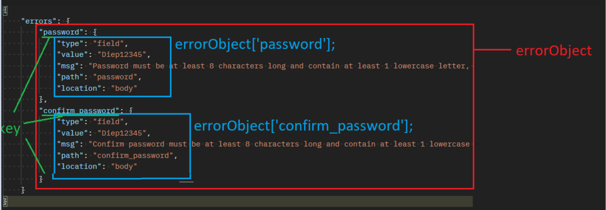
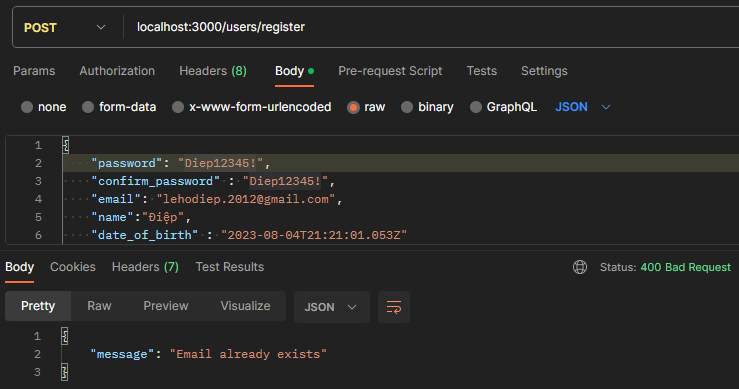
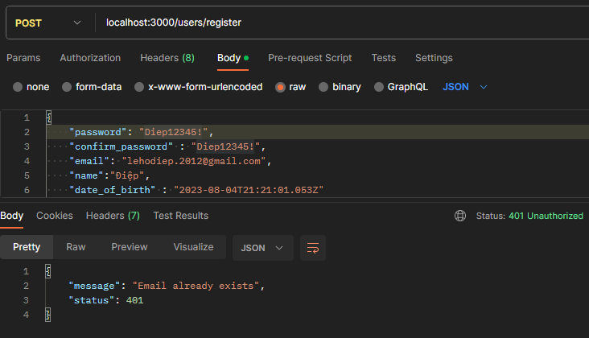
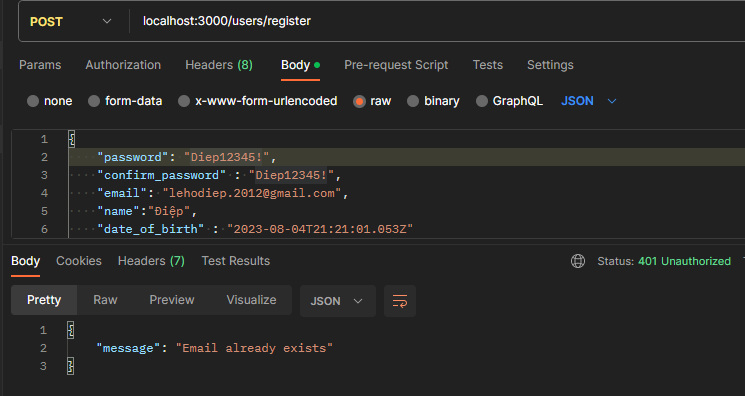
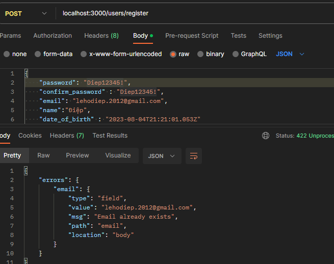
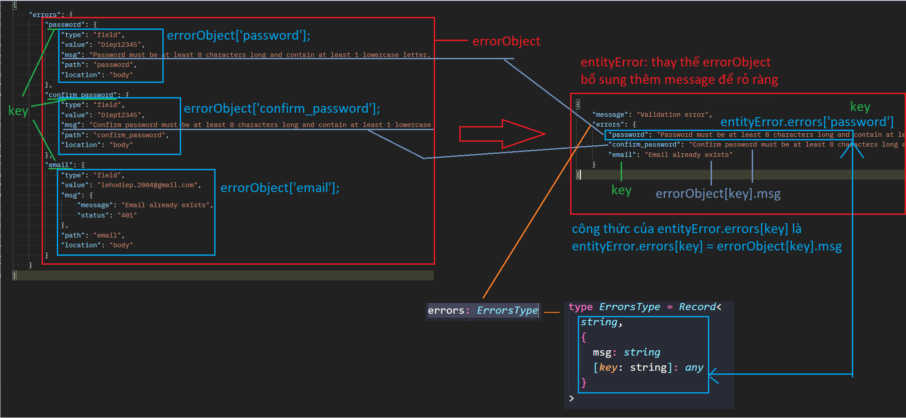
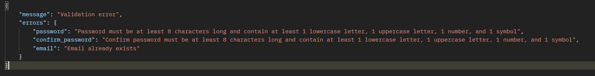

# Chuẩn hóa xử lý lỗi

ta sẽ chuẩn hóa quy trình xử lý lỗi giúp cho code của mình sẽ tường minh và rõ ràng hơn

- ở `middleware` thường là nơi check `validate` của `req.body` để kiểm tra xem người dùng có truyền dữ liệu đúng với schema mà mình đã thiết kế hay không, lỗi này thường `status là 422`.
- nhưng nếu lúc gữi request lên mà ngta k gữi `accessToken` thì mình nên gữi về lỗi `status là 401`
- vậy thì **làm sao để phân biệt được khi nào thì nên trả ra status gì**
- làm sao để để khi sai validate thì trả về 422, khi nào chủ động trả ra 401

# cách chuẩn hóa lỗi

- chúng ta nên thống nhất format lỗi trả về cho người dùng

  - lỗi thường: message là đủ , thêm error_infor nếu muốn

    ```ts
    {
        message: string
        error_infor?: any
    }
    ```

  - lỗi validation (422): thiếu trường dữ liệu, sai chuẩn quy định của middleware schema

    ```ts
    {
        message: string
        error: {
            msg: string
            [key: string] : any //có thể có nhiêu key khác nữa thoải mái
        }
    }
    ```

- với các mã status khác nhau, nó đại diện cho các lỗi khác nhau

  - trong folder `constants` ta tạo `httpStatus.ts`, code như sau

    ```ts
    const HTTP_STATUS = {
      OK: 200,
      CREATED: 201,
      ACCEPTED: 202,
      NO_CONTENT: 204,
      UNPROCESSABLE_ENTITY: 422,
      UNAUTHORIZED: 401,
      NOT_FOUND: 404,
      INTERNAL_SERVER_ERROR: 500,
    };

    export default HTTP_STATUS;
    ```

- giờ ta sẽ tạo ra 1 kiểu dữ liệu Errors để lưu trữ các cấu trúc lỗi trả về, vào folder `models` tạo file `Errors.ts`

  - trong file `Errors.ts`

    ```ts
    //ở đây thường mình sẽ extend Error để nhận đc báo lỗi ở dòng nào

    export class ErrorWithStatus {
      message: string;
      status: number;
      constructor({ message, status }: { message: string; status: number }) {
        this.message = message;
        this.status = status;
      }
    }
    ```

  - giờ mình vào `users.controller.ts > hàm registerController` đoạn `kiểm tra email có tồn tại không` để tạo ra lỗi bằng class `ErrorWithStatus` của mình
    ```ts
    export const registerController = async (
      req: Request<ParamsDictionary, any, RegisterReqBody>,
      res: Response,
      next: NextFunction
    ) => {
      // throw new Error('tạo thử 1 cái lỗi nè')
      const isEmailExist = await usersService.checkEmailExist(req.body.email);
      if (isEmailExist) {
        throw new ErrorWithStatus({
          message: "Email is already exist",
          status: HTTP_STATUS.UNAUTHORIZED, //401
        });
      }
      const result = await usersService.register(req.body); //{ email, password } = req.body(nhiếu thông tin hơn)
      console.log(result);
      return res.status(200).json({
        message: "Register success", //chỉnh lại thông báo
        result: result,
      });
    };
    ```
  - chỉnh lại `validator.ts` để mặc định lỗi là `status 422` khi có `lỗi khác thì` sẽ dùng `status của lỗi` đó

    ```ts
    export const validate = (
      validation: RunnableValidationChains<ValidationChain>
    ) => {
      return async (
        req: express.Request,
        res: express.Response,
        next: express.NextFunction
      ) => {
        await validation.run(req); //hàm tìm lỗi của middleware schema và đưa vào req

        const errors = validationResult(req); //funct này giúp ta lấy lỗi ra từ biến req

        if (errors.isEmpty()) {
          return next();
        }
        const errorObject = errors.mapped(); //hàm này giúp ta lấy lỗi ra dưới dạng object
        return res
          .status(HTTP_STATUS.UNPROCESSABLE_ENTITY)
          .json({ errors: errorObject }); //in errorObject
      };
    };
    ```

    **trong đó `errorObject` có dạng như sau, ví dụ ta sai password**
    

    nên ta xử lý như sau

    ```ts
    export const validate = (
      validation: RunnableValidationChains<ValidationChain>
    ) => {
      return async (
        req: express.Request,
        res: express.Response,
        next: express.NextFunction
      ) => {
        await validation.run(req);
        const errors = validationResult(req);
        if (errors.isEmpty()) {
          return next();
        }
        const errorObject = errors.mapped();
        //duyệt từng lỗi
        for (const key in errorObject) {
          const { msg } = errorObject[key]; //phân rã msg của mỗi lỗi
          //nếu msg nào có dạng như ErrorWithStatus và có status khác 422 thì ném lỗi cho default error handler xử lý
          if (
            msg instanceof ErrorWithStatus &&
            msg.status !== HTTP_STATUS.UNPROCESSABLE_ENTITY
          ) {
            return next(msg);
          }
        }

        return res
          .status(HTTP_STATUS.UNPROCESSABLE_ENTITY)
          .json({ errors: errorObject });
      };
    };
    ```

    kết quả lỗi thu được gọn gàng nhưng **status bị sai, nó đang là 400**
    

  - `sai status` là do `default error handler` của chúng ta `luôn đang res status 400`, ta sẽ cần xử lý lại

    ```ts
    app.use((err: any, req: Request, res: Response, next: NextFunction) => {
      console.log("lỗi nè " + err.message);
      res.status(400).json({ message: err.message });
    });
    ```

    - thế nên ta sẽ tách `error handler này` thành 1 `middleware` riêng, vậy nên trong folder `middleware` tạo file `error.middlewares.ts` và code

      ```ts
      import { NextFunction, Request, Response } from "express";
      import HTTP_STATUS from "~/constants/httpStatus";

      export const defaultErrorHandler = (
        err: any,
        req: Request,
        res: Response,
        next: NextFunction
      ) => {
        //err là lỗi từ các nơi khác truyền xuống,
        //và ta đã quy ước lỗi phải là 1 object có 2 thuộc tính: status và message
        return res
          .status(err.status || HTTP_STATUS.INTERNAL_SERVER_ERROR)
          .json(err);
      };
      ```

    - fix lại `index.ts` đoạn nãy thành

      ```ts
      app.use(defaultErrorHandler);
      ```

    - kết quả thu về, đã đầy đủ
      
    - vì ta `.json(err)` error mà error lại chứa status và message nên bị thừa status
    - ta có thể khắc phục bằng cách `.json(err.message)` nhưng như vậy k ổn, vì đây chỗ của tập trung các lỗi từ mọi nơi đỗ về, nhỡ đâu có `1 lỗi không có message` thì vô tình tra sẽ gữi `client` `undefined`

  - ta có thể trả ra object k có status bằng cách `delete err.status` nhưng như vậy thì rất kỳ
  - ta sẽ dùng `lodash` để xử vấn đề thừa status trên

    cài đặt [`lodash`](https://lodash.com/docs): một thư viện chứa các hàm tiện ích cho js

    ```bash
    npm i lodash @types/lodash -D
    ```

    file `error.middlewares.ts` và code

    ```ts
    import { NextFunction, Request, Response } from "express";
    import HTTP_STATUS from "~/constants/httpStatus";

    export const defaultErrorHandler = (
      err: any,
      req: Request,
      res: Response,
      next: NextFunction
    ) => {
      return res
        .status(err.status || HTTP_STATUS.INTERNAL_SERVER_ERROR)
        .json(omit(err, ["status"])); //fix chỗ này
    };
    ```

    [omit](https://lodash.com/docs/4.17.15#omit) là 1 function trong lodash giúp trả ra object giống err nhưng đã loại bỏ status

    thành quả
    

- **ban đầu ta dùng lỗi của email để làm ví dụ demo nếu có 1 lỗi khác 422**, nhưng thực tế thì lỗi `email tồn lại rồi` là lỗi 422. nên ta sẽ viết lại cho đúng logic
  ```ts
  export const registerController = async (
    ...
    if (isEmailExist) {
      throw new ErrorWithStatus({
        message: "Email is already exist",
        status: HTTP_STATUS.UNPROCESSABLE_ENTITY, //422
      });
    }
    ...
  };
  ```
- **khi phát sinh lỗi bình thường trong checkSchema thì nó sẽ luôn là 422**
- sau khi test lại ta thấy rằng lỗi mặc định của validator quá nhiều thông tin và quá xấu như này
  
- không biết lỗi do phần nào, quá nhiều thông tin thừa
- nên ta sẽ tạo ra 1 object lỗi có cấu trúc gần giống như `errorObject` nhưng có message thông báo là lỗi `Validation error` và chỉ chứa `field: msg` để dễ dàng xử lý hơn thay vì `type, value, msg, path, location`
- sơ đồ biến đổi từ `errorObject` sang `entityError`
  
- tạo ra các `message` để gữi cho người dùng, trong folder `constants` tạo file `messages.ts`viết như sau

  ```ts
  export const USERS_MESSAGES = {
    VALIDATION_ERROR: "Validation error",
  } as const; //để k ai chỉnh đc
  ```

- **vào file `Errors.ts` tạo thêm class `EntityError` dùng để thay thế `errorObject` khai báo lổi 422, với message mặc định là `Validation error` và có thêm thuộc tính `errors` để lưu trữ các lỗi của từng `field`**

  ```ts
  //đầu file
  //tạo kiểu lỗi giống thiết kế ban đâu
  type ErrorsType = Record<
    string,
    {
      msg: string
      [key: string]: any //này nghĩa ra ngoài ra muốn thêm vào gì thì thêm
    }
  >
  // { [key: string]:  {
  //     [field: string]:{
  //         msg: string
  //     }
  // }
  //}
  export class ErrorWithStatus {
      ....
  }

  export class EntityError extends ErrorWithStatus {
    errors: ErrorsType
    //truyển message mặt định
    constructor({
      message = USERS_MESSAGES.VALIDATION_ERROR,
      errors
    }: {
      message?: string
      errors: ErrorsType
    }) {
      super({ message, status: HTTP_STATUS.UNPROCESSABLE_ENTITY }) //tạo lỗi có status 422
      this.errors = errors
    }
  }

  ```

- xử lý lại đoạn `validation.ts`

  ```ts
  export const validate = (
    validation: RunnableValidationChains<ValidationChain>
  ) => {
    return async (
      req: express.Request,
      res: express.Response,
      next: express.NextFunction
    ) => {
      await validation.run(req);

      const errors = validationResult(req);

      if (errors.isEmpty()) {
        return next();
      }
      const errorObject = errors.mapped();
      const entityError = new EntityError({ errors: {} }); //entityError dùng để thay thế errorObject

      for (const key in errorObject) {
        const { msg } = errorObject[key];
        if (
          msg instanceof ErrorWithStatus &&
          msg.status !== HTTP_STATUS.UNPROCESSABLE_ENTITY
        ) {
          return next(msg);
        }
        // nếu lỗi phát sinh không dạng ErrorWithStatus và có status 422 thì thêm vào entityError với công thức đã nói trước đó
        entityError.errors[key] = msg;
      }
      //sau khi tổng hợp xong thì ném ra cho defaultErrorHandler xử lý
      next(entityError);
    };
  };
  ```

kết quả thu được đã đẹp, nhưng nếu ta để `name: ""` thì lỗi k rỏ ràng, thường là `msg: invalid value` vì ta chưa báo lỗi cụ thể


# Khai báo message validation

- cập nhật thêm nhiều `messages error` cho validator của user schema, ta sẽ thêm cho `messages.ts` như sau :

  ```ts
  export const USERS_MESSAGES = {
    VALIDATION_ERROR: "Validation error",
    //name
    NAME_IS_REQUIRED: "Name is required",
    NAME_MUST_BE_A_STRING: "Name must be a string",
    NAME_LENGTH_MUST_BE_FROM_1_TO_100: "Name length must be from 1 to 100",
    //email
    EMAIL_ALREADY_EXISTS: "Email already exists",
    EMAIL_IS_REQUIRED: "Email is required",
    EMAIL_IS_INVALID: "Email is invalid",
    //password
    PASSWORD_IS_REQUIRED: "Password is required",
    PASSWORD_MUST_BE_A_STRING: "Password must be a string",
    PASSWORD_LENGTH_MUST_BE_FROM_8_TO_50:
      "Password length must be from 8 to 50",
    PASSWORD_MUST_BE_STRONG:
      "Password must be at least 8 characters long and contain at least 1 lowercase letter, 1 uppercase letter, 1 number, and 1 symbol",
    //confirmPassword
    CONFIRM_PASSWORD_IS_REQUIRED: "Confirm password is required",
    CONFIRM_PASSWORD_MUST_BE_A_STRING: "Confirm password must be a string",
    CONFIRM_PASSWORD_LENGTH_MUST_BE_FROM_8_TO_50:
      "Confirm length must be from 8 to 50",
    CONFIRM_PASSWORD_MUST_BE_STRONG:
      "Confirm password must be at least 8 characters long and contain at least 1 lowercase letter, 1 uppercase letter, 1 number, and 1 symbol",
    CONFIRM_PASSWORD_MUST_BE_THE_SAME_AS_PASSWORD:
      "Confirm password must be the same as password",
    //dateOfBirth
    DATE_OF_BIRTH_BE_ISO8601: "Date of birth must be ISO8601",
    //user
    EMAIL_OR_PASSWORD_IS_INCORRECT: "Email or password is incorrect",
  } as const;
  ```

- cài đặt các message này cho middleware `registerValidator` trong `users.middlewares.ts`

  ```ts
  export const registerValidator = validate(
    checkSchema(
      {
        name: {
          notEmpty: {
            errorMessage: USERS_MESSAGES.NAME_IS_REQUIRED,
          },
          isString: {
            errorMessage: USERS_MESSAGES.NAME_MUST_BE_A_STRING,
          },
          trim: true,
          isLength: {
            options: {
              min: 1,
              max: 100,
            },
            errorMessage: USERS_MESSAGES.NAME_LENGTH_MUST_BE_FROM_1_TO_100,
          },
        },
        email: {
          notEmpty: {
            errorMessage: USERS_MESSAGES.EMAIL_IS_REQUIRED,
          },
          isEmail: {
            errorMessage: USERS_MESSAGES.EMAIL_IS_INVALID,
          },
          trim: true,
        },
        password: {
          notEmpty: {
            errorMessage: USERS_MESSAGES.PASSWORD_IS_REQUIRED,
          },
          isString: {
            errorMessage: USERS_MESSAGES.PASSWORD_MUST_BE_A_STRING,
          },
          isLength: {
            options: {
              min: 8,
              max: 50,
            },
            errorMessage: USERS_MESSAGES.PASSWORD_LENGTH_MUST_BE_FROM_8_TO_50,
          },
          isStrongPassword: {
            options: {
              minLength: 8,
              minLowercase: 1,
              minUppercase: 1,
              minNumbers: 1,
              minSymbols: 1,
              // returnScore: false
              // false : chỉ return true nếu password mạnh, false nếu k
              // true : return về chất lượng password(trên thang điểm 10)
            },
            errorMessage: USERS_MESSAGES.PASSWORD_MUST_BE_STRONG,
          },
        },
        confirm_password: {
          notEmpty: {
            errorMessage: USERS_MESSAGES.CONFIRM_PASSWORD_IS_REQUIRED,
          },
          isString: {
            errorMessage: USERS_MESSAGES.CONFIRM_PASSWORD_MUST_BE_A_STRING,
          },
          isLength: {
            options: {
              min: 8,
              max: 50,
            },
            errorMessage:
              USERS_MESSAGES.CONFIRM_PASSWORD_LENGTH_MUST_BE_FROM_8_TO_50,
          },
          isStrongPassword: {
            options: {
              minLength: 8,
              minLowercase: 1,
              minUppercase: 1,
              minNumbers: 1,
              minSymbols: 1,
            },
            errorMessage: USERS_MESSAGES.CONFIRM_PASSWORD_MUST_BE_STRONG,
          },
          custom: {
            options: (value, { req }) => {
              if (value !== req.body.password) {
                throw new Error(
                  USERS_MESSAGES.CONFIRM_PASSWORD_MUST_BE_THE_SAME_AS_PASSWORD
                );
              }
              return true;
            },
          },
        },
        date_of_birth: {
          isISO8601: {
            options: {
              strict: true,
              strictSeparator: true,
            },
            errorMessage: USERS_MESSAGES.DATE_OF_BIRTH_BE_ISO8601,
          },
        },
      },
      ["body"]
    )
  );
  ```

- thành quả là các lỗi đã đc báo cụ thể và chính xác
