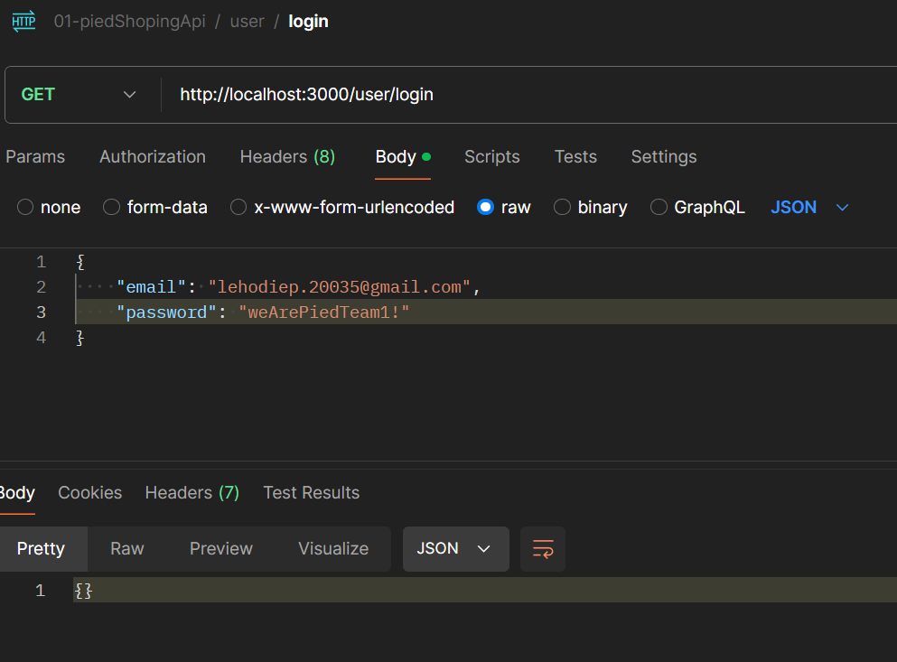
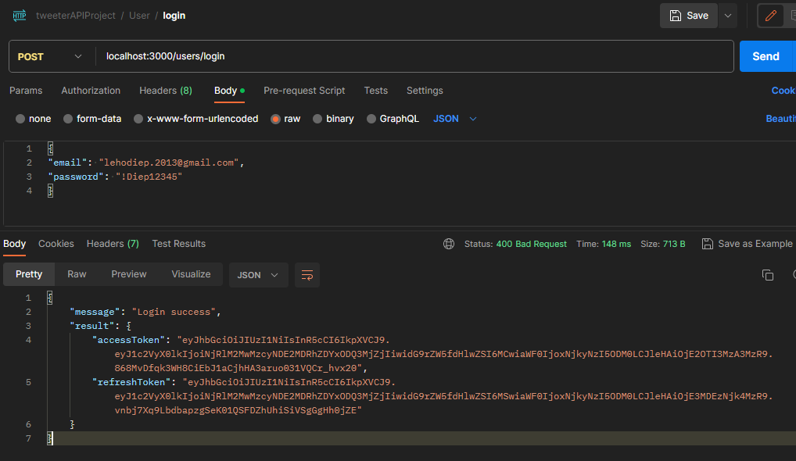

# xử lý chức năng login

- ta sẽ tiến hành tân trang lại cho route của login

```ts
/*
des: đăng nhập
path: /users/register
method: POST
body: {email, password}
*/
usersRouter.post("/login", loginValidator, loginController);
```

- bắt đầu với `loginValidator`, ta sẽ tạo check dữ liệu người dùng truyền lên gồm `email và password`, nên ta cũng sẽ dùng `validate` như `register`, ta có thể tái sử dụng lại cái `email` và `password` của `registerValidator`

```ts
export const loginValidator = validate(
  checkSchema(
    {
      email: {
        notEmpty: {
          errorMessage: USERS_MESSAGES.EMAIL_IS_REQUIRED,
        },
        isEmail: {
          errorMessage: USERS_MESSAGES.EMAIL_IS_INVALID,
        },
        trim: true,
      },
      password: {
        notEmpty: {
          errorMessage: USERS_MESSAGES.PASSWORD_IS_REQUIRED,
        },
        isString: {
          errorMessage: USERS_MESSAGES.PASSWORD_MUST_BE_A_STRING,
        },
        isLength: {
          options: {
            min: 8,
            max: 50,
          },
          errorMessage: USERS_MESSAGES.PASSWORD_LENGTH_MUST_BE_FROM_8_TO_50,
        },
        isStrongPassword: {
          options: {
            minLength: 8,
            minLowercase: 1,
            minUppercase: 1,
            minNumbers: 1,
            minSymbols: 1,
          },
          errorMessage: USERS_MESSAGES.PASSWORD_MUST_BE_STRONG,
        },
      },
    },
    ["body"]
  )
);
```

- quy trình đăng nhập:
  - khi đăng nhập thành công thì server phải tạo và phải gữi `access token` và `refresh token` về cho `client` để lần sau họ k cần đăng nhập nữa
  - trong `access token` và `refresh token` ta sẽ lưu `user_id của người đã đã đăng nhập`
  - khi họ gữi `access token` và `refresh token` lại cho mình thì mình verify xem nó có phải do mình tạo ra không và nếu đúng vậy thì mình sẽ tin người gữi lên là chủ của account có `user_id` đó
- khi mà ta `login`(ta chỉ nhập `email` và `password`) vậy thì `user_id` lấy từ đâu ?
  trong `table users trên mongo` vẫn sẽ có `_id` chính là `user_id` của `User object`

  - người dùng nhập `email, password`
  - `loginValidator` sẽ `kiểm tra email và password có đc gữi lên không`, sau đó truyền về `loginController` nó sẽ `email` này có tìm đc `user` nào không?
  - nếu có thì lấy `user_id` trong `user vừa tìm đc` phục vụ cho việc kiểm tra đăng nhập ở tầng `database`

- ta đã kiểm tra `email và password có đc truyền lên hay chưa` rồi, giờ ta sẽ kiểm tra `email và password` này có đúng không ở `loginController`, nếu đúng thì trả về `user_id` của `user` đó

- giờ ta vào `loginController` và dùng `email và password trong req` để tìm xem có `user` nào không? nếu có thì ta sẽ tạo `access token và refresh token` và trả về cho `client`

  - chỗ này thì ta sẽ phải truy cập vào database nên ta sẽ vào `userService` để viết method login
    nhận vào `email và password` : tìm user và tạo `access token và refresh token` rồi trả về cho `loginController`

  ```ts
  export const loginController = async (req: Request, res: Response) => {
    //thêm tý logic vào đây trước khi trả kết quả cho người dùng
    const { email, password } = req.body;
    //usersService.login là hàm nhận vào email và password, rồi vào database tìm user và tạo access token và refresh token trả ra ngoài
    const result = await usersService.login(email, password); //hàm login chưa code
    //result là access token và refresh token nếu tìm thành công
    return res.status(HTTP_STATUS.OK).json({
      //ok là 200
      message: USERS_MESSAGES.LOGIN_SUCCESS,
      result: result,
    });
  };
  ```

  ````ts
  - ở `users.routes.ts` bọc `loginController` vào `wrapAsync` vì `loginController` là async await nhưng k dùng `try catch`

  ```ts
  usersRouter.post("/login", loginValidator, wrapAsync(loginController));
  ````

- trong `users.services.ts`, ta sẽ chỉnh sữa và tối ưu như sau:

  - đoạn code tạo ra `ac` và `rf` này của `method register` sẽ xuất hiện rất nhiều lần(khi ta `đăng nhập`, khi ta `đăng ký`) nên ta sẽ tách nó ra method riêng để tái sử dụng

    ```ts
    //đoạn trong register cần bị tách
    const [access_token, refresh_token] = await Promise.all([this.signAccessToken(user_id), this.signRefreshToken(user_id)])

    //đem ra ngoài và viết thành method riêng
    private signAccessAndRefreshToken(user_id: string) {
      return Promise.all([
        this.signAccessToken(user_id),
        this.signRefreshToken(user_id)
      ])
    }

    //và cuối cùng register sẽ thành
    async register(payload: RegisterReqBody) {
      const result = await databaseService.users.insertOne(
        new User({
          ...payload,
          date_of_birth: new Date(payload.date_of_birth),
          password: hashPassword(payload.password)
        })
      )

      const user_id = result.insertedId.toString()
      //xài ở đây
      const [access_token, refresh_token] = await this.signAccessAndRefreshToken(user_id)
      return { access_token, refresh_token }
    }
    ```

  - giờ ta tạo `method login` nhận vào `email và password` để tìm `user` và tạo `access token và refresh token` từ `user_id` của `user mới tìm đc`

    ```ts
    class userService{
      async login(email: string, password: string) {
        const user = await databaseService.users.findOne({
          email,
          password: hashPassword(password)
        })
        if (!user) {
          throw new ErrorWithStatus({
            message: USERS_MESSAGES.EMAIL_OR_PASSWORD_IS_INCORRECT,
            status: HTTP_STATUS.UNPROCESSABLE_ENTITY
          })
        }
        //user là 1 object lấy từ mongodb nên nó chỉ có _id, không có user_id
        //và _id nó là 1 object có dạng ObjectID nên ta phải chuyển nó về string
        const user_id = user._id.toString() //thu thập thông tin user_id để tạo token
        const [access_token, access_token] = await this.signAccessAndRefreshToken(user_id)
        return { access_token, access_token } //trả at và rf cho ai gọi hàm login - cụ thể là loginController
      }
      ...
    ```

  - test code:
    - đăng ký tài khoản(hình sai status, 200 là đúng)
      
    - tạo request login : và nhập đúng password(hình sai status, 200 là đúng)
      
    - tạo request login : và nhập sai password (lỗi 422)
      

- có một điều thú vị là

  nếu tạo một lỗi đc tạo ra bằng `new Error`,tuy có `message` nhưng sẽ đc xem là `{}` (lỗi tự có từ hệ thống cũng có gốc là `Error`)
  vì trong bộ cờ của nó `enumerable` là `false` (tức là sẽ k đc hiển thị)
  
  điều này dẫn đến việc, nếu ta throw lỗi thì sẽ bị crashed app ngay

  ```ts
  export const loginController = async (req: Request, res: Response) => {
    const { email, password } = req.body
    const result = await usersService.login(email, password)
    throw new Error("lỗi test thử message")//tạo thử lỗi nhé(mô phổng lỗi tự phát sinh k phải mình tạo ra)
    return res.status(HTTP_STATUS.OK).json({
      message: USERS_MESSAGES.LOGIN_SUCCESS,
      result: result
    })
    ...
  }
  ```

  kết quả
  

  điều này chứng tỏ hệ thống xử lý lỗi của ta đã có vấn đề và vấn đề nằm ở `message` của dạng lỗi đó, nên ta sẽ đến nơi tập kết lỗi (`error.middlewares.ts`) và rào trước lỗi nhận vào như sau.

  ```ts
  export const defaultErrorHandler = (
    err: any,
    req: Request,
    res: Response,
    next: NextFunction
  ) => {
    //err là lỗi từ các nơi khác truyền xuống, và ta đã quy ước lỗi phải là 1 object có 2 thuộc tính: status và message
    if (err instanceof ErrorWithStatus) {
      //nếu err là 1 instance của ErrorWithStatus
      //thì ta sẽ trả về status và message của err đó
      return res.status(err.status).json(omit(err, ["status"]));
    }
    //Object.getOwnPropertyNames(err) trả về 1 mảng các key của err
    //forEach sẽ duyệt qua từng key
    Object.getOwnPropertyNames(err).forEach((key) => {
      //và ta sẽ cho các key của err về enumerable = true
      //để ta có thể lấy được các key đó
      Object.defineProperty(err, key, { enumerable: true });
    });
    return res.status(HTTP_STATUS.INTERNAL_SERVER_ERROR).json({
      message: err.message,
      // errorInfor: err //truyền vậy là truyền lên cả stack(full lỗi và đường dẫn của file lỗi)
      errorInfor: omit(err, ["stack"]), //truyền vậy là chỉ truyền lên message
    });
  };
  ```

  test lại code:
  

  **demo hoàn thành bỏ throw new Error trong `loginController`**

- trong đoạn của `loginController` có khúc req.body có dạng any khá khó chịu, ta sẽ định dạng lại nó
  

  - khi ta muốn định nghĩa trong req có gì, cụ thể là trong body của req của chức năng login có gì thì ta sẽ vào `User.request.ts` và định dạng lại như sau

  ```ts
  export interface LoginReqBody {
    email: string;
    password: string;
  }
  ```

  - quay lại `loginController` và định dạng lại req.body như sau

  ```ts
    export const loginController = async (req: Request<ParamsDictionary, any, LoginReqBody>, res: Response) => {
      ...//lúc này req.body khi '.' sẽ hiển thị rỏ ràng
    }
  ```

  test lại postman:
  

# chuẩn hóa luồng xử lý refresh token

- khi mà ta tạo tài khoản thì ta sẽ tạo ra 1 `rf token`
- ta phải lưu `rf token` vào trong `database`, để khi nào cần refresh thì ta sẽ so sánh `rf của người dùng` có và ta để cấp `at` cho họ, việc này là vi phạm stateless của `jwt` nhưng nó là cách để mình có quyền thu hồi truy cập của ai đó(trong trường hợp họ bị hack)

  - kẻ gian đánh cắp rf của bạn, dùng rf để xin at và đăng nhập
  - bạn và kẻ gian cùng dùng chung account thông qua các at mà rf đã tạo ra
  - bạn sẽ k nhận ra được điều khác thường
  - giả sữ bạn nhận ra, báo cho server, server nếu không lưu rf thì sẽ không thể thu hồi truy cập của kẻ gian, kẻ gian vẫn dùng rf để xin at và login bth cho đến khi rf hết hạn
  - server nên lưu rf để nếu cần thì xóa (hoặc bỏ vào blacklist) từ đó khi rf đó xin at thì mình không cho nữa

  - ta sẽ lưu rf vào 1 collection riêng thay vì là 1 thuộc tính của user
    vì có khi 1 user có rất nhiều rf, vì họ xài nhiều thiết bị (dt laptop, tivi)
  - trong `models/schemas` ta tạo `RefreshToken.schema.ts` và ta sẽ tạo schema theo thiết kế ban đầu của bài [csdlDOC](./../03-csdl-mongo/csdlDoc.md)

    ```ts
    //bản thiết kế nè
    interface RefreshToken {
      _id: ObjectId;
      token: string;
      created_at: Date;
      user_id: ObjectId;
    }
    ```

    `RefreshToken.schema.ts` nè

    ```ts
    import { ObjectId } from "mongodb";
    //interface dùng để định nghĩa kiểu dữ liệu
    //interface không có thể dùng để tạo ra đối tượng
    interface RefreshTokenType {
      _id?: ObjectId; //khi tạo cũng k cần
      token: string;
      created_at?: Date; // k có cũng đc, khi tạo object thì ta sẽ new Date() sau
      user_id: ObjectId;
    }
    //class dùng để tạo ra đối tượng
    //class sẽ thông qua interface
    //thứ tự dùng như sau
    //class này < databse < service < controller < route < app.ts < server.ts < index.ts

    export default class RefreshToken {
      _id?: ObjectId; //khi client gửi lên thì không cần truyền _id
      token: string;
      created_at: Date;
      user_id: ObjectId;
      constructor({ _id, token, created_at, user_id }: RefreshTokenType) {
        this._id = _id;
        this.token = token;
        this.created_at = created_at || new Date();
        this.user_id = user_id;
      }
    }
    ```

  - vào `.env` tạo tên cho `collection refresh_tokens`(giống đang tạo table trong sql), trong `.env` thêm
    ```
    DB_REFRESH_TOKENS_COLLECTION = 'refresh_tokens'
    ```
  - vào `database.services.ts` dùng `DB_REFRESH_TOKENS_COLLECTION` viết method tạo || lấy collection `refresh_tokens`
    ```ts
    class DatabaseService {
      ...
      //method này trả về 1 collection chứa các object RefreshToken
      //RefreshToken là class mà ta đã tạo trước đó
      get refreshTokens(): Collection<RefreshToken> {
        return this.db.collection(process.env.DB_REFRESH_TOKENS_COLLECTION as string) // users là tên của collection
      }
      ...
    }
    ```
  - vào `users.servives.ts` đoạn `class UsersService > register`, sao khi tạo ra `at` và `rft`, ta sẽ lưu rf vào trong collection mới tạo, rồi mới return

    ```ts
    class UsersService {
      ...
      async register(payload: RegisterReqBody) {
        ...
        //lưu lại refreshToken và collection refreshTokens mới tạo
        await databaseService.refreshTokens.insertOne(
          new RefreshToken({ user_id: new ObjectId(user_id), token: refresh_token })
        )
        //user_id ta có là string, mà trong database thì user_id là ObjectId
        //nên ta không truyền là user_id: user_id, mà là user_id: new ObjectId(user_id)
        return { access_token, refresh_token }
      }
      ...
      //tương tự với login
      async login(user_id: string) {
        ...
        //đổi lại tên cho chuẩn khi trả về
        const [access_token, refresh_token] = await this.signAccessAndRefreshToken(user_id)
        await databaseService.refreshTokens.insertOne(
          new RefreshToken({ user_id: new ObjectId(user_id), token: refresh_token })
        )
        return { access_token, refresh_token }
      }

    }
    ```

    test thử:
    
    

  - một lưu ý nhỏ là các chỗ ta xài biến môi trường `process.env`
    thì nên chạy lệnh `config()` để import, đó là ta k bị lỗi là vì ta may mắn đã xài các method khác có config sẵn trong lúc xài `process.env` nên ta thêm `config()`, ta có thể dùng công cụ tìm kiếm để tìm các file thiếu đó hoặc cụ thể là các file `jwt.ts , crypto.ts, user.services.ts, database.service.ts`(thường tự có) sau đó thêm
    ```ts
    import { config } from "dotenv";
    config();
    ```
