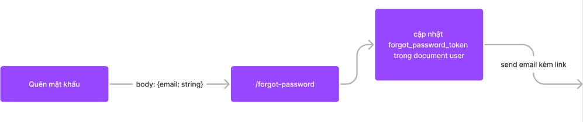
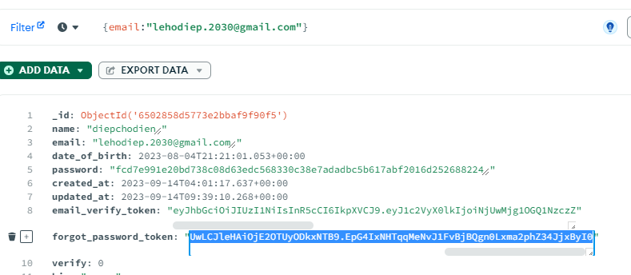

# các chức năng của user

## I - Verify email

- tham khảo luồng xử lý verify email ở đây
- khi mà người dùng đăng ký tài khoản thì mình sẽ gữi 1 link xác thực vào email của người ta
- khi họ click vào thì mình sẽ change status verify cho account của người ta
- nếu account đã verify thì sử dụng bth, chưa thì chỉ đăng nhập đc mà thôi

<iframe style="border: 1px solid rgba(0, 0, 0, 0.1);" width="800" height="450" src="https://www.figma.com/embed?embed_host=share&url=https%3A%2F%2Fwww.figma.com%2Ffile%2FBeECRO014VsTDbyiWkgUyy%2FUntitled%3Ftype%3Ddesign%26node-id%3D0%253A1%26mode%3Ddesign%26t%3DjFTd64xLgUqRUEYh-1" allowfullscreen></iframe>

- khi mà ta đăng ký tài khoản, ngoài việc server gữi lại ta `at` và `rf` thì còn phải gữi cho ta `email_verify_token` để ta sử dụng nó cho việc `verify` thông qua đường dẫn

  - nhưng trong `users.service.ts > register` ta chỉ mới tạo `at` và `rf` nên giờ trong `users.service.ts` ta sẽ viết hàm `signEmailVerifyToken`
  - trong `.env` thêm `EMAIL_VERIFY_TOKEN_EXPIRE_IN = '7d'`

  ```ts
  private signEmailVerifyToken(user_id: string) {
    return signToken({
      payload: { user_id, token_type: TokenType.EmailVerificationToken },
      options: { expiresIn: process.env.EMAIL_VERIFY_TOKEN_EXPIRE_IN },
      privateKey: process.env.JWT_SECRET_EMAIL_VERIFY_TOKEN as string //thêm
    })
  }
  ```

  - và xài nó ở `register` như sau

  ```ts
  async register(payload: RegisterReqBody) {
    const user_id = new ObjectId()
    const email_verify_token = await this.signEmailVerifyToken(user_id.toString())
    //ta đành phải tự tạo user_id thay vì để mongodb tự tạo
    //vì ta cần user_id để tạo email_verify_token
    const result = await databaseService.users.insertOne(
      new User({
        ...payload,
        _id: user_id,//tự tạo user_id và lưu vào _id trong mongo
        email_verify_token,//lưu email_verify_token vào user khi tạo mới
        date_of_birth: new Date(payload.date_of_birth),
        password: hashPassword(payload.password)
      })
    )
    //const user_id = result.insertedId.toString() bỏ dòng này
    const [access_token, refresh_token] = await this.signAccessAndRefreshToken(user_id.toString())//fix chỗ này
    await databaseService.refreshTokens.insertOne(
      new RefreshToken({ user_id: new ObjectId(user_id), token: refresh_token })
    )

    console.log(`gữi mail link xác thực đăng ký sau:
      http://localhost:3000/user/verify-email/?email_verify_token=${email_verify_token}`) //mô phỏng send email, test xong xóa

    return { access_token, refresh_token }
    //ta sẽ return 2 cái này về cho client
    //thay vì return user_id về cho client
  }
  ```

- test chức năng register lại xem có nhận đc `email verify token` không

  - trong mongo user mới tạo có `email verify token` không ?

## Verify email token

- vào `users.routes.ts` tạo trước route `verify-email` thiếu middleware validator, controller

  ```ts
  /*
  des: verify email khi người dùng nhấn vào cái link trong email, họ sẽ gữi lên server email_verify_token thông qua params
  để ta kiểm tra, tìm kiếm user đó và update account của họ thành verify, 
  đồng thời tạo và gữi at rf cho họ đăng nhập luôn, k cần login(options)
  path: /verify-email/?email_verify_token=string
  method: GET
  không cần Header vì chưa đăng nhập vẫn có thể verify-email
  
  */
  usersRouter.get(
    "/verify-email/",
    emailVerifyTokenValidator,
    wrapAsync(emailVerifyController)
  );
  //emailVerifyTokenValidator và emailVerifyController chưa có, giờ tạo
  ```

- giờ ta tạo `emailVerifyTokenValidator` trong `users.middlewares.ts`

  - trong `message.ts` thêm `EMAIL_VERIFY_TOKEN_IS_REQUIRED: 'Email verify token is required'`
  - `type.d.ts` thêm dịnh dạng cho decoded_email_verify_token

    ```ts
    interface Request {
      decoded_authorization?: TokenPayload;
      decoded_refresh_token?: TokenPayload;
      decoded_email_verify_token?: TokenPayload;
    }
    ```

  - `emailVerifyTokenValidator` cũng kha khá giống `refreshTokenValidator` nhưng ở đây ta sẽ kiểm tra `email_verify_token trong query`

    ```ts
    export const emailVerifyTokenValidator = validate(
      checkSchema(
        {
          email_verify_token: {
            trim: true,
            notEmpty: {
              errorMessage: USERS_MESSAGES.EMAIL_VERIFY_TOKEN_IS_REQUIRED,
            },

            custom: {
              options: async (value: string, { req }) => {
                if (!value) {
                  throw new ErrorWithStatus({
                    message: USERS_MESSAGES.EMAIL_VERIFY_TOKEN_IS_REQUIRED,
                    status: HTTP_STATUS.UNAUTHORIZED, //401
                  });
                }
                try {
                  //veirfy giá trị của refresh_token
                  const decoded_email_verify_token = (await verifyToken({
                    token: value,
                    secretOrPublicKey: process.env
                      .JWT_SECRET_EMAIL_VERIFY_TOKEN as string,
                  })) as TokenPayload;

                  (req as Request).decoded_email_verify_token =
                    decoded_email_verify_token;
                } catch (error) {
                  throw new ErrorWithStatus({
                    message: capitalize((error as JsonWebTokenError).message),
                    status: HTTP_STATUS.UNAUTHORIZED,
                  });
                }
                console.log(req.decoded_email_verify_token); //xem xong ,test xong tắt
                return true; //nếu không có lỗi thì trả về true
              },
            },
          },
        },
        ["query"]
      )
    );
    ```

  - trong `message.ts` thêm

    ```
    USER_NOT_FOUND: 'User not found' ,
    EMAIL_ALREADY_VERIFIED_BEFORE: 'Email already verified before',
    EMAIL_HAS_BEEN_VERIFIED: 'Email has been verified',
    EMAIL_VERIFY_SUCCESS: 'Email verify success',
    EMAIL_VERIFY_TOKEN_IS_VALID: 'Email verify token is valid',
    ```

  - tạo`emailVerifyController` trong `users.controllers.ts`

  ```ts
  export const emailVerifyController = async (
    req: Request<ParamsDictionary, any, any>,
    res: Response
  ) => {
    const { email_verify_token } = req.query; //để ý chỗ này nhé, query chưa đc định nghĩa, ta sẽ định nghĩa sau
    const { user_id } = req.decoded_email_verify_token as TokenPayload;
    //kiểm tra email_verify_token này còn tồn tại trong user tìm đc qua user_id không
    //nếu không còn thì nói rằng nó đã được verify từ trước rồi
    await usersService.checkEmailVerifyToken({ user_id, email_verify_token });
    //nếu còn thì tiến hành update status của user thành verified, và xóa email_verify_token đi
    //đồng thời tạo access_token và refresh_token cho user này
    const result = await usersService.verifyEmail(user_id);
    //trả về kết quả
    return res.status(HTTP_STATUS.OK).json({
      message: USERS_MESSAGES.EMAIL_VERIFY_SUCCESS,
      result: result,
    });
  };
  ```

  - việc `verify email` sẽ dẫn tới việc vào db và cập nhật lại thuộc tính `email_verify_token` của `user` thành `''`
    nên ta vào `users.service.ts` viết hàm `verifyEmail(user_id) `, hàm sẽ dùng `user_id` để tìm `user` và cập nhật `email_verify_token` thành `''`

    ```ts
    //hàm này sẽ kiểm tra xem user này đã verify email chưa
    async checkEmailVerifyToken({ user_id, email_verify_token }: { user_id: string; email_verify_token: string }) {
      const user = await databaseService.users.findOne({ email_verify_token, _id: new ObjectId(user_id) })
      if (!user) {
        throw new ErrorWithStatus({
          message: USERS_MESSAGES.EMAIL_VERIFY_TOKEN_IS_VALID,
          status: HTTP_STATUS.UNPROCESSABLE_ENTITY//422
        })
      }

      return user
    }

    //hàm tiến hành verify email cho user
    async verifyEmail(user_id: string) {
      //cập nhật lại user
      await databaseService.users.updateOne(
        {
          _id: new ObjectId(user_id)
        },
        [
          {
            $set: {
              verify: UserVerifyStatus.Verified, //1
              email_verify_token: '',
              updated_at: '$$NOW'
            }
          }
        ]
      )
      //tạo access_token và refresh_token
      const [access_token, refresh_token] = await this.signAccessAndRefreshToken(user_id)
      // lưu refresh_token vào database
      await databaseService.refreshTokens.insertOne(
        new RefreshToken({
          token: refresh_token,
          user_id: new ObjectId(user_id)
        })
      )
      return { access_token, refresh_token }
    }
    ```

- giờ ta sẽ test lại
  - đăng ký tài khoản mới
    
    
  - xác thực email thông qua link trong email(nghèo thì terminal)
    
  - nếu ta nhấn lại lần nữa thì nó k cho vì account lúc này đã verify email từ trước
    
  - truyền sai email_verify_token bằng cách làm giả token sẽ bị lỗi 401
    
  - truyền thiếu email_verify_token
    
  - kiểm tra mongo xem account vừa tạo đã verify chưa

## cập nhật thời gian với \$currentDate và $$NOW

ta có thể cập nhật thời gian `update_at: new Date()` trong mongoDB mà không dùng đến `new Date()`

- trong quá trình cập nhật verify thì có 2 bước như sau
  - request chạy: tạo ra giá trị cập nhật, validator
  - mongodb tiến hành cập nhật
- trong quá trình trên, cái new Date() của ta được tạo ra trong quá trình, request chạy, nên ta chỉ lưu được thời gian lúc đang xử lý request, còn thời gian thực sự cập nhật ta lại k lưu đc, tạo ra độ trễ
- vào `users.services.ts>emailverify` thêm và cập nhật như sau, vậy là xong, chênh lệch khoản 100ms(rất nhỏ)

  ```ts

  //cách 2 $currentDate
  {
    $set: { email_verify_token: '', verify: UserVerifyStatus.Verified },
    $currentDate: {
      updated_at: true
    }
  }

    //cách 1 $$NOW: nên xài cách này, nó ít lỗi
  [{
    $set: { email_verify_token: '', updated_at: "$$NOW", verify: UserVerifyStatus.Verified },
  }]

  ```

# cập nhật định nghĩa cho Query

- giờ ta muốn định nghĩa cho hệ thống biết rằng trong req.query của route `verify-email` ta sẽ có `email_verify_token`
  ```ts
  export const emailVerifyController = async (req: Request<ParamsDictionary, any, any>, res: Response) => {
    const { email_verify_token } = req.query //đoạn này k thể . đc vì chưa định nghĩa
    ...
  }
  ```
- định nghĩa `query` cho `route emailVerify` trong `User.requests.ts`
  

  - qua hình ta biết Query được định nghĩa là `qs.ParseQS`

    ```ts
    import { ParsedQs } from "qs";
    export interface EmailVerifyReqQuery extends ParsedQs {
      email_verify_token: string;
    }
    ```

    và ta sẽ sử dụng nó trong `emailVerifyController`

    ```ts
    export const emailVerifyController = async (
      req: Request<ParamsDictionary, any, any, EmailVerifyReqQuery>,
      res: Response
    ) => {
      ...
    };
    ```

- việc làm này sẽ làm cho hàm `wrapAsync` bị sai, vì nó chỉ nhận vào `RequestHandler<ParamsDictionary, any, any>` nên ta sẽ sửa lại `wrapAsync`

  ```ts
  import { NextFunction, Request, RequestHandler, Response } from "express";
  //ta dùng Generic P và T để định nghĩa cho req.query
  //tức là ta sẽ nhận vào 1 RequestHandler có params là P và query là T
  //và ta sẽ chạy 1 handler có định nghĩa tương tự chứ k phải any any
  export const wrapAsync =
    <P, T>(func: RequestHandler<P, any, any, T>) =>
    async (req: Request<P, any, any, T>, res: Response, next: NextFunction) => {
      //cách này dùng hàm nào cũng đc
      try {
        await func(req, res, next);
      } catch (error) {
        next(error);
      }
    };
  ```

  - trong bối cảnh trên thì P là `ParamsDictionary` và T là `EmailVerifyReqQuery`
    và kết quả ta có
    

- **sau này muốn định nghĩa param thì extend `ParamsDictionary` là xong**

# lỗ hổng bảo mật trong tính năng verify email

- ở luồng xử lý đăng ký và verify account, có một lỗ hổng bảo mật nếu ta có thêm chức năng `đổi email` + `đăng nhập bằng username`
  

- `hệ thống của mình` thì dùng email để đăng nhập, nên tức là không thể có chức năng đổi email được, nên hiện tượng bug này sẽ không xảy ra

# resend verify email

- khi client đăng ký tài khoản, thì mình sẽ gữi `1 link verify account` cho client thông qua email
- nhưng đôi khi mail có thể bị thất lạc, ta sẽ làm chức năng `gữi lại email`
- chức năng này đơn giản là gữi email-verify-token (mới|cũ tùy vào business của mình) cho email được client cung cấp lúc tạo account là đc

- trong file `users.routes.ts` tạo route `resend-verify-email`

  ```ts
  /*
  des:gữi lại verify email khi người dùng nhấn vào nút gữi lại email,
  path: /resend-verify-email
  method: POST
  Header:{Authorization: Bearer <access_token>} //đăng nhập mới cho resend email verify
  body: {}
  */
  usersRouter.post(
    "/resend-verify-email",
    accessTokenValidator,
    wrapAsync(resendEmailVerifyController)
  );

  //vì người dùng sẽ truyền lên accesstoken, nên ta sẽ dùng lại accessTokenValidator để kiểm tra
  //accesstoken đó

  //:
  //resendEmailVerifyController:
  //    0. kiểm tra xem token có khớp với user không
  //    1. kiểm tra xem account đã verify chưa, nếu nó verify rồi thì ta
  //      không cần tiến hành gữi email lại cho client
  //    2. nếu chưa verify thì controller ta sẽ tạo để xử lý việc resend email verify
  //    controller này ta chưa code , giờ ta tiến hành code
  ```

- nhờ vào accessTokenValidator, req của ta đã có `decoded_authorization` lưu thông tin account
  muốn verify email
  
- nên khi qua `resendEmailVerifyController` ta chỉ cần `req.decoded_authorization` là có thể
  biết `user_id` của account đang gữi yêu cầu, từ đó kiểm tra xem account đó verify hay chưa

  ```ts
  export const resendEmailVerifyController = async (
    req: Request,
    res: Response
  ) => {
    //vì trước đó kiểm tra access_token nên chắc chắn đã verify jwt đó nên có decoded_authorization
    const { user_id } = req.decoded_authorization as TokenPayload;
    //hàm findUserById: dùng user_id để tìm user | hàm chưa viết
    const user = await usersService.findUserById(user_id);
    //nếu đã verify rồi thì thông báo rồi
    if (user.verify === UserVerifyStatus.Verified) {
      return res.status(200).json({
        message: USERS_MESSAGES.EMAIL_HAS_BEEN_VERIFIED,
      });
    }
    //nếu chưa verify thì tiến hành gữi lại email verify
    if (user.verify === UserVerifyStatus.Unverified) {
      const result = await usersService.resendEmailVerify(user_id);
      return res.status(200).json(result);
    }

    //nếu user bị banned thì thông báo bị banned
    if (user.verify === UserVerifyStatus.Banned) {
      return res.status(200).json({
        message: USERS_MESSAGES.ACCOUNT_HAS_BEEN_BANNED,
      });
    }
  };
  ```

- ta viết hàm `findUserById`, `resendEmailVerify` cho `users.services.ts` vì hành động này là truy xuất `user` trong database

  ```ts
  async findUserById(user_id: string) {
    const user = await databaseService.users.findOne({ _id: new ObjectId(user_id) })
    if (!user) {
      throw new ErrorWithStatus({
        message: USERS_MESSAGES.USER_NOT_FOUND,
        status: HTTP_STATUS.NOT_FOUND
      })
    }
    return user
  }


  async resendEmailVerify(user_id: string) {
    //tạo ra email_verify_token mới
    const email_verify_token = await this.signEmailVerifyToken(user_id)
    //chưa làm chức năng gữi email, nên giả bộ ta đã gữi email cho client rồi, hiển thị bằng console.log
    console.log(`gữi mail link xác thực đăng ký sau:
      http://localhost:3000/user/verify-email/?email_verify_token=${email_verify_token}`) //mô phỏng send email, test xong xóa
    //vào database và cập nhật lại email_verify_token mới trong table user
    await databaseService.users.updateOne({ _id: new ObjectId(user_id) }, [
      {
        $set: { email_verify_token: email_verify_token, updated_at: '$$NOW' }
      }
    ])
    //trả về message cho ai có nhu cầu sử dụng
    return {
      message: USERS_MESSAGES.RESEND_VERIFY_EMAIL_SUCCESS
    }
  }
  ```

- vào `messages.ts` thêm

  ```
  ACCOUNT_HAS_BEEN_BANNED: 'Account has been banned',
  RESEND_VERIFY_EMAIL_SUCCESS: 'Resend verify email success'
  ```

- test code bằng postman

  - thêm script test cho register

  ```js
  pm.test("register thành công", function () {
    pm.response.to.have.status(200);
    let responseJson = pm.response.json();
    const { access_token, refresh_token } = responseJson.result;
    pm.environment.set("access_token", access_token);
    pm.environment.set("refresh_token", refresh_token);
  });
  ```

  - đăng ký 1 tài khoản mới có email "lehodiep.2030@gmail.com"
    
    từ đó ta có access token để dùng request resend email verify

  - tạo request mới như này
    
    và chạy thử ta được
    resend verify email token ...
  - vào mongoDB kiểm tra account có email "lehodiep.2030@gmail.com" có email verify token khớp với
    ta hay không
    
    

# Forgot password

- chức năng quên mật khẩu diễn ra như sau

  - 1.  ta quên mật khẩu, ta bấm vào chức năng `quên mật khẩu`
  - 2.  client sẽ được yêu cập nhập email
  - 3.  ta gữi link đổi mật khẩu cho email này
  - 3.  người dùng vào email > link và được dẫn đến trang đổi mật khẩu kèm theo forgot-password-token
    <iframe style="border: 1px solid rgba(0, 0, 0, 0.1);" width="1200" height="450" src="https://www.figma.com/embed?embed_host=share&url=https%3A%2F%2Fwww.figma.com%2Ffile%2FBeECRO014VsTDbyiWkgUyy%2FUntitled%3Ftype%3Ddesign%26node-id%3D0%253A1%26mode%3Ddesign%26t%3DjFTd64xLgUqRUEYh-1" allowfullscreen></iframe>
  - theo hình trên thì giờ ta sẽ làm trước đến đoạn send email
    

- vào `users.routes.ts` tạo route `/forgot-password`

```ts
/*
des: nhận email cần khôi phục tài khoản, và gữi mail kèm token để khôi phục vào email đó
path: /forgot-password
method: POST
Header: không cần, vì  ngta quên mật khẩu rồi, thì sao mà đăng nhập để có authen đc
body: {email: string}
forgotPasswordController: kiểm tra email này có tồn tại trong database không
nếu có thì tạo link kèm forgot_password_token và gữi email cho người dùng
*/
usersRouter.post(
  "/forgot-password",
  forgotPasswordValidator,
  wrapAsync(forgotPasswordController)
);
```

- trong mô ta khi dùng `/forgot-password` ta sẽ có body: {email: string} nên ta vào `User.requests.ts` thêm `ForgotPasswordReqBody`

  ```ts
  export interface ForgotPasswordReqBody {
    email: string;
  }
  ```

- ta cần kiểm tra xem email có valid(email này thuộc user nào) không ? trước khi send email

  nên ta sẽ vào `users.middlewares.ts` tạo middleware tên `forgotPasswordValidator`

  ```ts
  export const forgotPasswordValidator = validate(
    checkSchema(
      {
        email: {
          notEmpty: {
            errorMessage: USERS_MESSAGES.EMAIL_IS_REQUIRED,
          },
          isEmail: {
            errorMessage: USERS_MESSAGES.EMAIL_IS_INVALID,
          },
          trim: true,
        },
      },
      ["body"]
    )
  );
  ```

- tạo hàm `forgotPasswordController`

  ```ts
  export const forgotPasswordController = async (
    req: Request<ParamsDictionary, any, ForgotPasswordReqBody>,
    res: Response
  ) => {
    const { email } = req.body;
    const hasUser = await usersService.checkEmailExist(email);
    if (!hasUser) {
      //nếu không có user nào từ email này thì thông báo lỗi
      throw new ErrorWithStatus({
        message: USERS_MESSAGES.USER_NOT_FOUND,
        status: HTTP_STATUS.UNAUTHORIZED,
      });
    } else {
      //nếu có thì tạo forgot_password_token và gữi email cho người dùng
      const result = await usersService.forgotPassword(email);
      return res.status(HTTP_STATUS.OK).json(result);
    }
  };
  ```

- ta sẽ vào database tạo `forgot-password-token` ,lưu vào database và send email cho ta,
  giờ ta viết hàm `forgotPassword(email:string)` để thực hiện những việc đó
  vì hàm này sẽ vào database nên ta sẽ lưu nó vào trong `users.service.ts`

  ```ts
  //tạo hàm signForgotPasswordToken
  private signForgotPasswordToken(user_id: string) {
    return signToken({
      payload: { user_id, token_type: TokenType.ForgotPasswordToken },
      options: { expiresIn: process.env.FORGOT_PASSWORD_TOKEN_EXPIRE_IN },
      privateKey: process.env.JWT_SECRET_FORGOT_PASSWORD_TOKEN as string //thêm
    })
  }
  //vào .env thêm 2 biến môi trường FORGOT_PASSWORD_TOKEN_EXPIRE_IN, và JWT_SECRET_FORGOT_PASSWORD_TOKEN
  //JWT_SECRET_FORGOT_PASSWORD_TOKEN = '123!@#22'
  //FORGOT_PASSWORD_TOKEN_EXPIRE_IN = '7d'

  async forgotPassword(email: string) {
    //tìm user theo email
    const user = (await databaseService.users.findOne({ email })) as User
    const user_id = (user._id as ObjectId).toString() //lấy ra user_id
    //tạo ra forgot_password_token
    const forgot_password_token = await this.signForgotPasswordToken(user_id)
    //cập nhật vào forgot_password_token và user_id
    await databaseService.users.updateOne({ _id: new ObjectId(user_id) }, [
      {
        $set: { forgot_password_token: forgot_password_token, updated_at: '$$NOW' }
      }
    ])
    //gữi mail kèm token để khôi phục mật khẩu
    //http://localhost:8000 là route của server giao điện
    //họ vào trang này và nhập password mới và confirm password mới và gữi kèm token này lên be server
    console.log(`gữi mail link reset password:
      http://localhost:8000/reset-password/?forgot_password_token=${forgot_password_token}`) //mô phỏng send email, test xong xóa
    return {
      message: USERS_MESSAGES.CHECK_EMAIL_TO_RESET_PASSWORD
    }
  }
  ```

- test code

  - tạo request mới
    
    thành công nên api gữi ta message là hãy check lại email
  - trong email của ta sẽ nhận đc forgot-password-token như này

    

  - ta kiểm tra xem có khớp với database không
    
  - truyền sai email
    

- vậy là client sẽ nhận đc một đường link thông qua email để vào trang đổi mật khẩu (FE)
  nếu họ click vào thì FE sẽ nhận được `forgot_password_token` đồng thời truy cập vào giao điện đổi mật khẩu, nhập password và confirm_password mới và gữi kèm `forgot_password_token` đã lưu lên server
  `/verify-forgot-password` để kiểm tra và đổi mật khẩu của ta

đây là flow tổng của nó


# Verify forgot password token

- `/verify-forgot-password` thì dùng method POST hay GET đều được
  - nhưng nếu `GET` thì người dùng phải truyền data qua queryStringParam cũng đc
  - còn `POST` thì thông qua body, đỡ nhạy cảm hơn, nên `mình chọn` `POST`
- vào `users.routes.ts` tạo route `/verify-forgot-password`

  ```ts
  /*
  des: Verify link in email to reset password
  path: /verify-forgot-password
  method: POST
  Header: không cần, vì  ngta quên mật khẩu rồi, thì sao mà đăng nhập để có authen đc
  body: {forgot_password_token: string}
  */
  usersRouter.post(
    "/verify-forgot-password",
    verifyForgotPasswordTokenValidator,
    wrapAsync(verifyForgotPasswordTokenController)
  );
  ```

- vào `user.requests.ts` thêm định nghĩa request body cho `verify-forgot-password`

  ```ts
  export interface VerifyForgotPasswordTokenReqBody {
    forgot_password_token: string;
  }
  ```

- vào `type.d.ts` thêm định nghĩa cho `decoded_forgot_password_token`, vì ta sẽ verify `forgot_password_token`

  ```ts
  declare module "express" {
    interface Request {
      decoded_authorization?: TokenPayload;
      decoded_refresh_token?: TokenPayload;
      decoded_email_verify_token?: TokenPayload;
      decoded_forgot_password_token?: TokenPayload; //thêm định nghĩa
    }
  }
  ```

- thêm message cho `messages.ts`

  ```
    FORGOT_PASSWORD_TOKEN_IS_REQUIRED: 'Forgot password token is required',
    FORGOT_PASSWORD_TOKEN_NOT_MATCH: 'Forgot password token not match',
    VERIFY_FORGOT_PASSWORD_TOKEN_SUCCESS: 'Verify forgot password token success'
  ```

- trong `users.middlewares.ts` tạo middleware `verifyForgotPasswordTokenValidator` kiểm tra validator của `forgot_password_token` trong body

  ```ts
  export const verifyForgotPasswordTokenValidator = validate(
    checkSchema(
      {
        forgot_password_token: {
          trim: true,
          custom: {
            options: async (value, { req }) => {
              //nếu k truyền lên forgot_password_token thì báo lỗi
              if (!value) {
                throw new ErrorWithStatus({
                  message: USERS_MESSAGES.FORGOT_PASSWORD_TOKEN_IS_REQUIRED,
                  status: HTTP_STATUS.UNAUTHORIZED,
                });
              }
              try {
                //verify forgot_password_token để lấy decoded_forgot_password_token
                const decoded_forgot_password_token = await verifyToken({
                  token: value,
                  secretOrPublicKey: process.env
                    .JWT_SECRET_FORGOT_PASSWORD_TOKEN as string,
                });
                //lưu decoded_forgot_password_token vào trong req
                (req as Request).decoded_forgot_password_token =
                  decoded_forgot_password_token;
              } catch (err) {
                if (err instanceof JsonWebTokenError) {
                  throw new ErrorWithStatus({
                    message: capitalize((err as JsonWebTokenError).message),
                    status: HTTP_STATUS.UNAUTHORIZED,
                  });
                }
                throw err;
              }
              return true;
            },
          },
        },
      },
      ["body"]
    )
  );
  ```

- làm controller cho route `verifyForgotPasswordTokenController` làm nhiệm vụ thông báo kết quả verify

```ts
export const verifyForgotPasswordTokenController = async (
  req: Request<ParamsDictionary, any, VerifyForgotPasswordTokenReqBody>,
  res: Response
) => {
  //lấy user_id từ req.decoded_forgot_password_token và forgot_password_token từ req.body
  const { forgot_password_token } = req.body;
  const { user_id } = req.decoded_forgot_password_token as TokenPayload;
  const user = await usersService.findUserById(user_id);
  //account có bị banned không
  if (user.verify === UserVerifyStatus.Banned) {
    throw new ErrorWithStatus({
      message: USERS_MESSAGES.ACCOUNT_HAS_BEEN_BANNED,
      status: HTTP_STATUS.UNAUTHORIZED,
    });
  }
  //kiểm tra xem forgot_password_token này có đúng với user này không
  if (user.forgot_password_token !== forgot_password_token) {
    throw new ErrorWithStatus({
      message: USERS_MESSAGES.FORGOT_PASSWORD_TOKEN_NOT_MATCH,
      status: HTTP_STATUS.UNAUTHORIZED,
    });
  }
  //nếu đúng thì trả về thông báo cho FE
  return res.status(HTTP_STATUS.OK).json({
    message: USERS_MESSAGES.VERIFY_FORGOT_PASSWORD_TOKEN_SUCCESS,
  });
};
```

- test code
  - xài api forgot-password để lấy forgot_password_token
    
    
  - dùng forgot_password_token cũ để verify xem có lỗi không
    

# reset password

- khi nhận đc thông tin `VERIFY_FORGOT_PASSWORD_TOKEN_SUCCESS` thì FE tiến hành cho người dùng nhập password và confirm password mới
  và gữi kèm `forgot_password_token` lên server thông qua route `/reset-password`
- vậy route `/reset-password` sẽ nhận vào `forgot_password_token`(để biết cập nhật password cho ai), `new_password` và `confirm_new_password`, dùng method `post`, gữi thông qua `body`
- vào `users.routes.ts` thêm route `/reset-password`

```ts
/*
des: reset password
path: '/reset-password'
method: POST
Header: không cần, vì  ngta quên mật khẩu rồi, thì sao mà đăng nhập để có authen đc
body: {
  forgot_password_token: string, 
  password: string, 
  confirm_password: string
  }
*/
usersRouter.post(
  "/reset-password",
  resetPasswordValidator,
  wrapAsync(resetPasswordController)
);
```

- ta vào `User.requests.ts` để định nghĩa `reqbody` cho route trên

  ```ts
  export interface ResetPasswordReqBody {
    forgot_password_token: string;
    password: string;
    confirm_password: string;
  }
  ```

- vào file `users.middlewares.ts` tạo middleware `resetPasswordValidator`

  - ta thấy rằng trong reset password cũng có validator password và confirm_password như registerValidator
    nên ta sẽ tạo chung cho `password` và `confirm_password` những cái biến để tiện việc tái sử dụng
  - đầu tiên tạo 2 biến chứa giá trị của `password` và `confirm_password` của `register`

    ```ts
    const passwordSchema: ParamSchema = {
      notEmpty: {
        errorMessage: USERS_MESSAGES.PASSWORD_IS_REQUIRED
      },
      isString: {
        errorMessage: USERS_MESSAGES.PASSWORD_MUST_BE_A_STRING
      },
      isLength: {
        options: {
          min: 8,
          max: 50
        },
        errorMessage: USERS_MESSAGES.PASSWORD_LENGTH_MUST_BE_FROM_8_TO_50
      },
      isStrongPassword: {
        options: {
          minLength: 8,
          minLowercase: 1,
          minUppercase: 1,
          minNumbers: 1,
          minSymbols: 1
          // returnScore: false
          // false : chỉ return true nếu password mạnh, false nếu k
          // true : return về chất lượng password(trên thang điểm 10)
        }
      },
      errorMessage: USERS_MESSAGES.PASSWORD_MUST_BE_STRONG
    }

    const confirmPasswordSchema: ParamSchema = {
      notEmpty: {
        errorMessage: USERS_MESSAGES.CONFIRM_PASSWORD_IS_REQUIRED
      },
      isString: {
        errorMessage: USERS_MESSAGES.CONFIRM_PASSWORD_MUST_BE_A_STRING
      },
      isLength: {
        options: {
          min: 8,
          max: 50
        },
        errorMessage: USERS_MESSAGES.CONFIRM_PASSWORD_LENGTH_MUST_BE_FROM_8_TO_50
      },
      isStrongPassword: {
        options: {
          minLength: 8,
          minLowercase: 1,
          minUppercase: 1,
          minNumbers: 1,
          minSymbols: 1
        },
        errorMessage: USERS_MESSAGES.CONFIRM_PASSWORD_MUST_BE_STRONG
      },
      custom: {
        options: (value, { req }) => {
          if (value !== req.body.password) {
            throw new Error(USERS_MESSAGES.CONFIRM_PASSWORD_MUST_BE_THE_SAME_AS_PASSWORD)
          }
          return true
        }
      }
    }

    //ta fix lại loginValidator thành
    export const loginValidator = validate(
      checkSchema(
          {
            email: {
              notEmpty: {
                errorMessage: USERS_MESSAGES.EMAIL_IS_REQUIRED
              },
              isEmail: {
                errorMessage: USERS_MESSAGES.EMAIL_IS_INVALID
              },
              trim: true
            },
            password: passwordSchema //chỗ này
          },
          ['body']
        )
      )


    //ta sẽ fix lại registerValidator thành

    export const registerValidator = validate(
      checkSchema(
        {
          ...
          password: passwordSchema,
          confirm_password: confirmPasswordSchema,
          ...
        }
      )
    )
    ```

  - ta làm tương tự với `forgot_password_token` của `verifyForgotPasswordTokenValidator`
    vì tí nữa trong `resetPasswordValidator` ta cũng cần tái sử dụng `forgot_password_token`

    ```ts
    const forgotPasswordTokenSchema: ParamSchema = {
      trim: true,
      custom: {
        options: async (value, { req }) => {
          //nếu k truyền lên forgot_password_token thì báo lỗi
          if (!value) {
            throw new ErrorWithStatus({
              message: USERS_MESSAGES.FORGOT_PASSWORD_TOKEN_IS_REQUIRED,
              status: HTTP_STATUS.UNAUTHORIZED,
            });
          }
          try {
            //verify forgot_password_token để lấy decoded_forgot_password_token
            const decoded_forgot_password_token = await verifyToken({
              token: value,
              secretOrPublicKey: process.env
                .JWT_SECRET_FORGOT_PASSWORD_TOKEN as string,
            });
            //lưu decoded_forgot_password_token vào trong req
            (req as Request).decoded_forgot_password_token =
              decoded_forgot_password_token;
          } catch (err) {
            if (err instanceof JsonWebTokenError) {
              throw new ErrorWithStatus({
                message: capitalize((err as JsonWebTokenError).message),
                status: HTTP_STATUS.UNAUTHORIZED,
              });
            }
            throw err;
          }
          return true;
        },
      },
    };
    //giờ verifyForgotPasswordTokenValidator sẽ fix thành

    export const verifyForgotPasswordTokenValidator = validate(
      checkSchema(
        {
          forgot_password_token: forgotPasswordTokenSchema,
        },
        ["body"]
      )
    );
    ```

  - và giờ ta tạo `resetPasswordValidator`

    ```ts
    export const resetPasswordValidator = validate(
      checkSchema(
        {
          password: passwordSchema,
          confirm_password: confirmPasswordSchema,
          forgot_password_token: forgotPasswordTokenSchema,
        },
        ["body"]
      )
    );
    ```

- vào `users.controllers.ts` tạo `resetPasswordController`

  ```ts
  export const resetPasswordController = async (
    req: Request<ParamsDictionary, any, ResetPasswordReqBody>,
    res: Response
  ) => {
    //[giống flow của verifyForgotPasswordTokenController]
    //lấy user_id từ req.decoded_forgot_password_token và forgot_password_token từ req.body
    const { forgot_password_token } = req.body;
    const { user_id } = req.decoded_forgot_password_token as TokenPayload;
    const user = await usersService.findUserById(user_id);
    //account có bị banned không
    if (user.verify === UserVerifyStatus.Banned) {
      throw new ErrorWithStatus({
        message: USERS_MESSAGES.ACCOUNT_HAS_BEEN_BANNED,
        status: HTTP_STATUS.UNAUTHORIZED,
      });
    }
    //kiểm tra xem forgot_password_token này có đúng với user này không
    if (user.forgot_password_token !== forgot_password_token) {
      throw new ErrorWithStatus({
        message: USERS_MESSAGES.FORGOT_PASSWORD_TOKEN_NOT_MATCH,
        status: HTTP_STATUS.UNAUTHORIZED,
      });
    }
    //[thêm khúc này]nếu đúng thì vào database cập nhật thông tin cho user
    const { password } = req.body;
    await usersService.resetPassword(user_id, password);
    return res.status(HTTP_STATUS.OK).json({
      message: USERS_MESSAGES.RESET_PASSWORD_SUCCESS,
    });
  };
  ```

- vào `user.service.ts` code method `resetPassword`

  ```ts
    async resetPassword(user_id: string, password: string) {
      //tìm user thông qua user_id và cập nhật lại password và forgot_password_token
      //tất nhiên là lưu password đã hash rồi
      //ta không cần phải kiểm tra user có tồn tại không, vì ta đã làm trước đó ở controller đã làm rồi
      databaseService.users.updateOne({ _id: new ObjectId(user_id) }, [
        {
          $set: {
            password: hashPassword(password),
            forgot_password_token: '',
            updated_at: '$$NOW'
          }
        }
      ])
      //nếu bạn muốn ngta đổi mk xong tự động đăng nhập luôn thì trả về access_token và refresh_token
      //ở đây mình chỉ cho ngta đổi mk thôi, sau đó họ nhận thông báo thành công và tự đăng nhập bằng mật khẩu mới
      return true
    }
  ```

- vào `messages.ts` thêm

  ```
  RESET_PASSWORD_SUCCESS: 'Reset password success'
  ```

- test code
- chạy forgot password
  
- email nhận đc forgot_password_token
  

- tạo request `reset-password` sử dụng forgot_password_token(k check verify vì chính ta tạo ra) để đổi mật khẩu
  nhưng cố tình nhập sai confirm_password
  
  lỗi 422 hợp lý
- làm lại cho đúng
  
- qua login đăng nhập bằng mật khẩu mới
  - sai mật khẩu
    
  - đúng mật khẩu
    

# tính năng Get Me

- mỗi lần ta vào trong 1 trang web như fb, ig, twitter thì trang sẽ get profile của chúng ta để hiển thị những
  thông tin của account mình, tính năng đó là getMe

  - vd: hiển thị avatar, tên account,
  - dù chưa verify account thì vẫn hiển thị bình thường, và sẽ có 1 khu vực thông báo trên trang khuyên người dùng verify
  - vậy chỉ cần bạn đăng nhập, đưa mình access_token thì mình sẽ decode và gữi mấy thông tin account cơ bản cho bạn là xong

- trong `users.routes.ts` tạo route `/me`

  ```ts
  /*
  des: get profile của user
  path: '/me'
  method: post
  Header: {Authorization: Bearer <access_token>}
  body: {}
  */
  usersRouter.post("/me", accessTokenValidator, wrapAsync(getMeController));
  ```

- trong `users.controllers.ts` tạo `getMeController`

```ts
export const getMeController = async (
  req: Request,
  res: Response,
  next: NextFunction
) => {
  //middleware accessTokenValidator đã chạy rồi, nên ta có thể lấy đc user_id từ decoded_authorization
  const { user_id } = req.decoded_authorization as TokenPayload;
  //tìm user thông qua user_id này và trả về user đó
  //truy cập vào database nên ta sẽ code ở user.services
  const user = await usersService.getMe(user_id); // hàm này ta chưa code, nhưng nó dùng user_id tìm user và trả ra user đó
  return res.json({
    message: USERS_MESSAGES.GET_ME_SUCCESS,
    result: user,
  });
};
```

- trong `messages.ts` thêm

  ```
  GET_ME_SUCCESS: 'Get me success'
  ```

- `user.services.ts` code method `getMe`

  ```ts
    async getMe(user_id: string) {
        const user = await databaseService.users.findOne(
          { _id: new ObjectId(user_id) },
          {
            projection: {
              password: 0,
              email_verify_token: 0,
              forgot_password_token: 0
            }
          }
        )
        return user // sẽ k có những thuộc tính nêu trên, tránh bị lộ thông tin
      }
    }
    //trong dó projection(phép chiếu pi) giúp ta loại bỏ lấy về các thuộc tính như password, email_verify_token, forgot_password_token
  ```

- test code
  - ta login để có accesstoken, script sẽ tự lưu vào enviroment
    
  - tạo request
    
  - nếu thiếu accesstoken thì
    

# MongoDB Schema Validation

- hiện tại chúng ta đã:
  - validate dữ liệu ở tầng `middleware`, nhưng chưa làm nó ở tằng `database`
  - chúng ta đã tạo ra các object cho đúng định dạng với trước khi chèn vào `database`
  - bằng cách dùng cú pháp `new User`(ví dụ trong `users.service.ts > register`)
- nhưng những điều trên là chưa đủ, vì:
  - nếu ta khai báo `User.schema.ts > User` ta có thể bị thừa field hay thiếu field so với trên `database`
  - nếu dùng `js` có thể sẽ không check kiểu dữ liệu chặc chẽ như `ts`
- vậy nên ta cần tạo 1 validator ở tằng `database` để khi ta truyền `object` lên, nó sẽ kiểm tra xem object có đầy đủ các trường dữ liệu hay không

### tóm tắt tài liệu

- I. ta đọc tài liệu tham khảo trước: [schema validation mongodb](https://www.mongodb.com/docs/manual/core/schema-validation/specify-json-schema/)

  - 1 . tiến hành tạo validation cho collection như doc
    
    - ở bsonType: `["double", "string"]` nghĩa là ta có thể khai báo nhiều kiểu trên 1 field
  - 2 . ta có thể thử chèn 1 document vào xem sao
    
    - trong mô tả, họ cố tình chèn gpa là int thay vì double
    - lỗi sẽ là:
      
  - 3 . truyền đúng thì không hiển thị gì cả
    
  - 4 . ta có thể thực hiện việc tìm kiếm để xem kết quả
    

- II. vậy nếu ta có collection từ trước thì sao

  - build role trong database
    
    tạo role cho phép chỉnh sửa
    
    setting cho account nhận role
    
  - ta ví dụ như collection `User` của ta, ta chỉ cần bấm add rule là đc
    
  - giờ ta sẽ làm thử với collection `refresh_tokens`
    
    ```js
    {
      $jsonSchema:{
        bsonType: "object",
        title: "Refresh token object validation",
        required: ["_id" , "token", "user_id", "created_at"],
        properties: {
          _id:{
            bsonType: "objectId",
            description: "'_id' must be a ObjectId and is required",
          },
          token:{
            bsonType: "string",
            description: "'token' must be a string and is required",
          },
          user_id:{
            bsonType: "objectId",
            description: "'user_id' must be a ObjectId and is required",
          },
          created_at:{
            bsonType: "date",
            description: "'created_at' must be a date and is required",
          },
        }
      }
    }
    ```
    trong đó
    
    - `Validation Action` : phát sinh lỗi dưới dạng `warning hay lỗi`
    - `Validation Level` :
      - `off`: tắt
      - `strict`: thêm rule cho tất cả cả insert và update
      - `moderate`: nó sẽ k áp dụng với `document` đã tạo trước khi add rule
    - ở đây mình để mặt định là `error` và `strict`
  - thử dùng mongosh để add 1 document bị lỗi vào xem sao

    ```sql
      use twitter-dev
      db.refresh_tokens.insertOne({token: 100, user_id: ObjectId(), created_at: new Date()})
      //MongoServerError: Document failed validation
      //phải cho token là string mới được
    ```

    

  - nếu ta add dư property thì nó vẫn sẽ cho add vào

    ```
      db.refresh_tokens.insertOne({token: "100", user_id: ObjectId(), created_at: new Date(),name: "ahihi"})
    ```

  - trong rule ta thêm `additionalProperties: false` thì ta sẽ k tạo dư được
    nhưng nhớ rằng nếu dùng `additionalProperties: false` phải tạo trước `_id` trong property
    nếu không mongo sẽ nghĩ \_id này bị dư

  - `required`: đã giúp mình cấm thiếu

  ```js
   {
     $jsonSchema:{
       bsonType: "object",
       title: "Refresh token object validation",
       required: ["_id" , "token", "user_id", "created_at"],
       properties: {
         ...
       },
       additionalProperties: false,
     }
   }
  ```

  - tiếp tục thêm rule cho collection `users`

  ```js
    {
    $jsonSchema: {
      bsonType: 'object',
      title: 'Refresh token object validation',
      required: [
        '_id',
        'name',
        'email',
        'date_of_birth',
        'password',
        'created_at',
        'updated_at',
        'email_verify_token',
        'forgot_password_token',
        'verify',
        'bio',
        'location',
        'website',
        'username',
        'avatar',
        'cover_photo',
        'role'
      ],
      properties: {
        _id: {
          bsonType: 'objectId',
          description: '\'_id\' must be a ObjectId and is required'
        },
        name: {
          bsonType: 'string',
          description: '\'name\' must be a string and is required'
        },
        email: {
          bsonType: 'string',
          description: '\'email\' must be a string and is required'
        },
        date_of_birth: {
          bsonType: 'date',
          description: '\'date_of_birth\' must be a date and is required'
        },
        password: {
          bsonType: 'string',
          description: '\'password\' must be a string and is required'
        },
        created_at: {
          bsonType: 'date',
          description: '\'created_at\' must be a date and is required'
        },
        updated_at: {
          bsonType: 'date',
          description: '\'updated_at\' must be a date and is required'
        },
        email_verify_token: {
          bsonType: 'string',
          description: '\'email_verify_token\' must be a string and is required'
        },
        forgot_password_token: {
          bsonType: 'string',
          description: '\'forgot_password_token\' must be a string and is required'
        },
        verify: {
          bsonType: 'int',
          'enum': [
            0,
            1,
            2
          ]
        },
        bio: {
          bsonType: 'string',
          description: '\'bio\' must be a string and is required'
        },
        location: {
          bsonType: 'string',
          description: '\'location\' must be a string and is required'
        },
        website: {
          bsonType: 'string',
          description: '\'website\' must be a string and is required'
        },
        username: {
          bsonType: 'string',
          description: '\'username\' must be a string and is required'
        },
        avatar: {
          bsonType: 'string',
          description: '\'avatar\' must be a string and is required'
        },
        cover_photo: {
          bsonType: 'string',
          description: '\'cover_photo\' must be a string and is required'
        },
        role: {
          bsonType: 'int',
          'enum': [
            0,
            1,
            2
          ]
        }
      },
      additionalProperties: false
    }
  }
  //để ý property verify để hiểu cách xài enum
  ```

- nên xóa hết các document cũ trong các collection để tránh lỗi, vì trước đó ta có thể đã thêm rất nhiều document không đúng định dạng
  
  bấm nút `delete` để xóa hết
