# logic verifiedUserValidator

- ta sẽ làm route cập nhật thông tin cả nhân
- đối với route này thì ta có thể chọn giữa method `put` và `patch`
- khác nhau giữa `method` put và `patch`
  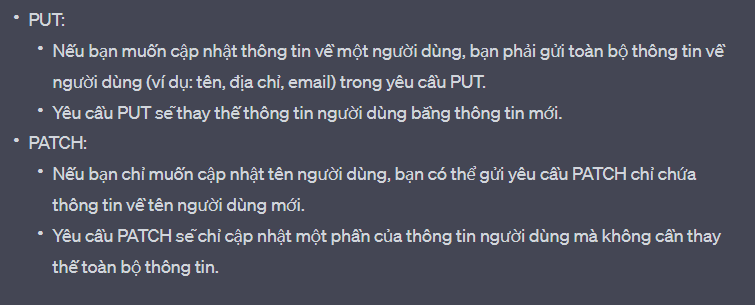
- ở đây mình sẽ dùng `method patch`

- vào `users.routes.ts` tạo route

  ```ts
  /*
  des: update profile của user
  path: '/me'
  method: patch
  Header: {Authorization: Bearer <access_token>}
  body: {
    name?: string
    date_of_birth?: Date
    bio?: string // optional
    location?: string // optional
    website?: string // optional
    username?: string // optional
    avatar?: string // optional
    cover_photo?: string // optional}
  */

  usersRouter.patch(
    "/me",
    accessTokenValidator,
    verifiedUserValidator,
    updateMeValidator,
    wrapAsync(updateMeController)
  );
  ```

  - `accessTokenValidator` kiểm tra client đã đăng nhập chưa, vì đăng nhập r mới đc quyền update profile đồng thời tạo ra `decoded_authorization` và lưu vào req
  - verifiedUserValidator là middleware sẽ vào `req.decoded_authorization` thu đc từ middleware `accessTokenValidator`
    và kiểm tra account có verify hay chưa
  - updateMeValidator kiểm tra xem người dùng truyền các property mà họ muốn cập nhật là gì, có validator không
    - ta sẽ quy định lại body cho request của route này để giới hạn client được phép truyền lên prop nào
    - vào `User.request.ts`
    ```ts
    export interface UpdateMeReqBody {
      name?: string;
      date_of_birth?: string; //vì ngta truyền lên string dạng ISO8601, k phải date
      bio?: string;
      location?: string;
      website?: string;
      username?: string;
      avatar?: string;
      cover_photo?: string;
    }
    //vì đây là route patch nên ngta truyền thiếu 1 trong các prop trên cũng k sao
    ```
  - nếu giá trị truyền lên hợp lệ thì mới cho cập nhật thông qua `updateMeController`

- phân tích về `accessTokenValidator`:

  - middleware này sẽ `verify AccessToken` và tạo ra `decoded_authorization{user_id, token_type}` lưu thông tin của `user`
  - để biết ai muốn cập nhật thông tin thì ta cần `user_id` của người đó

- vào `users.middleware.ts` tạo `updateMeValidator` kiểm tra các property người dùng truyền lên để cập nhật trong `body` có `validator` không ?

  - ta thấy rằng trong `registerValidator` cũng có check name, date_of_birth mà trong `updateMeValidator` cũng có, nên ta sẽ kế thừa lại 2 thằng này, khác là bên `updateMeValidator` thì 2 prop này là optional, ta làm như sau

  ```ts
  //tạo 2 ParamSchema
  const nameSchema: ParamSchema = {
    notEmpty: {
      errorMessage: USERS_MESSAGES.NAME_IS_REQUIRED
    },
    isString: {
      errorMessage: USERS_MESSAGES.NAME_MUST_BE_A_STRING
    },
    trim: true, //nên đặt trim dưới này thay vì ở đầu
    isLength: {
      options: {
        min: 1,
        max: 100
      },
      errorMessage: USERS_MESSAGES.NAME_LENGTH_MUST_BE_FROM_1_TO_100
    }
  }

  const dateOfBirthSchema: ParamSchema = {
    isISO8601: {
      options: {
        strict: true,
        strictSeparator: true
      },
      errorMessage: USERS_MESSAGES.DATE_OF_BIRTH_BE_ISO8601
    }
  }
    //tí xài cho property avatar và cover_photo
  const imageSchema: ParamSchema = {
    optional: true,
    isString: {
        errorMessage: USERS_MESSAGES.IMAGE_URL_MUST_BE_A_STRING ////messages.ts thêm IMAGE_URL_MUST_BE_A_STRING: 'Image url must be a string'
    },
    trim: true,//nên đặt trim dưới này thay vì ở đầu
    isLength: {
        options: {
        min: 1,
        max: 400
        },
        errorMessage: USERS_MESSAGES.IMAGE_URL_LENGTH_MUST_BE_LESS_THAN_400 //messages.ts thêm IMAGE_URL_LENGTH_MUST_BE_LESS_THAN_400: 'Image url length must be less than 400'
    }
  }

  //fix lại registerValidator
  export const registerValidator = validate(
    checkSchema(
        {
        name: nameSchema,
        ...
        date_of_birth: dateOfBirthSchema,
        ...
  )

  //updateMeValidator sẽ có

    export const updateMeValidator = validate(
        checkSchema(
            {
            name: {
                optional: true, //đc phép có hoặc k
                ...nameSchema, //phân rã nameSchema ra
                notEmpty: undefined //ghi đè lên notEmpty của nameSchema
            },
            date_of_birth: {
                optional: true, //đc phép có hoặc k
                ...dateOfBirthSchema, //phân rã nameSchema ra
                notEmpty: undefined //ghi đè lên notEmpty của nameSchema
            },
            bio: {
                optional: true,
                isString: {
                errorMessage: USERS_MESSAGES.BIO_MUST_BE_A_STRING ////messages.ts thêm BIO_MUST_BE_A_STRING: 'Bio must be a string'
                },
                trim: true, //trim phát đặt cuối, nếu k thì nó sẽ lỗi validatior
                isLength: {
                options: {
                    min: 1,
                    max: 200
                },
                errorMessage: USERS_MESSAGES.BIO_LENGTH_MUST_BE_LESS_THAN_200 //messages.ts thêm BIO_LENGTH_MUST_BE_LESS_THAN_200: 'Bio length must be less than 200'
                }
            },
            //giống bio
            location: {
                optional: true,
                isString: {
                errorMessage: USERS_MESSAGES.LOCATION_MUST_BE_A_STRING ////messages.ts thêm LOCATION_MUST_BE_A_STRING: 'Location must be a string'
                },
                trim: true,
                isLength: {
                options: {
                    min: 1,
                    max: 200
                },
                errorMessage: USERS_MESSAGES.LOCATION_LENGTH_MUST_BE_LESS_THAN_200 //messages.ts thêm LOCATION_LENGTH_MUST_BE_LESS_THAN_200: 'Location length must be less than 200'
                }
            },
            //giống location
            website: {
                optional: true,
                isString: {
                errorMessage: USERS_MESSAGES.WEBSITE_MUST_BE_A_STRING ////messages.ts thêm WEBSITE_MUST_BE_A_STRING: 'Website must be a string'
                },
                trim: true,
                isLength: {
                options: {
                    min: 1,
                    max: 200
                },

                errorMessage: USERS_MESSAGES.WEBSITE_LENGTH_MUST_BE_LESS_THAN_200 //messages.ts thêm WEBSITE_LENGTH_MUST_BE_LESS_THAN_200: 'Website length must be less than 200'
                }
            },
            username: {
                optional: true,
                isString: {
                errorMessage: USERS_MESSAGES.USERNAME_MUST_BE_A_STRING ////messages.ts thêm USERNAME_MUST_BE_A_STRING: 'Username must be a string'
                },
                trim: true,
                isLength: {
                options: {
                    min: 1,
                    max: 50
                },
                errorMessage: USERS_MESSAGES.USERNAME_LENGTH_MUST_BE_LESS_THAN_50 //messages.ts thêm USERNAME_LENGTH_MUST_BE_LESS_THAN_50: 'Username length must be less than 50'
                }
            },
            avatar: imageSchema,
            cover_photo: imageSchema
            },
            ['body']
        )
    )

  ```

- vào message.ts thêm các message mới

  ```
  BIO_MUST_BE_A_STRING : "Bio must be a string",
  BIO_LENGTH_MUST_BE_LESS_THAN_200 : "Bio length must be less than 200",
  LOCATION_MUST_BE_A_STRING : "Location must be a string",
  LOCATION_LENGTH_MUST_BE_LESS_THAN_200 : "Location length must be less than 200",
  WEBSITE_MUST_BE_A_STRING : "Website must be a string",
  WEBSITE_LENGTH_MUST_BE_LESS_THAN_200 : "Website length must be less than 200",
  USERNAME_MUST_BE_A_STRING : "Username must be a string",
  USERNAME_LENGTH_MUST_BE_LESS_THAN_50 : "Username length must be less than 50",
  IMAGE_URL_MUST_BE_A_STRING : "Image url must be a string",
  IMAGE_URL_LENGTH_MUST_BE_LESS_THAN_400 : "Image url length must be less than 400",
  UPDATE_PROFILE_SUCCESS : "Update profile success",
  USER_NOT_VERIFIED: 'User not verified',
  USERNAME_ALREADY_EXISTS: 'Username already exists',
  USERNAME_IS_INVALID: 'Username is invalid'
  ```

- vào `users.controller.ts` tạo `updateMeController` giúp cập nhất tất cả prop đã validator lên database

  ```ts
  export const updateMeController = async (
    req: Request<ParamsDictionary, any, UpdateMeReqBody>,
    res: Response,
    next: NextFunction
  ) => {
    //middleware accessTokenValidator đã chạy rồi, nên ta có thể lấy đc user_id từ decoded_authorization
    const { user_id } = req.decoded_authorization as TokenPayload;
    //user_id để biết phải cập nhật ai
    const user = await usersService.findUserById(user_id);
    //kiểm tra user đã verify email chưa, nếu chưa thì không cho cập nhật
    if (user.verify === UserVerifyStatus.Unverified) {
      throw new ErrorWithStatus({
        message: USERS_MESSAGES.USER_NOT_VERIFIED,
        status: HTTP_STATUS.UNAUTHORIZED,
      });
    }
    //bị banned thì cũng không cho cập nhật
    if (user.verify === UserVerifyStatus.Banned) {
      throw new ErrorWithStatus({
        message: USERS_MESSAGES.ACCOUNT_HAS_BEEN_BANNED,
        status: HTTP_STATUS.UNAUTHORIZED,
      });
    }
    //lấy thông tin mới từ req.body
    const { body } = req;
    //lấy các property mà client muốn cập nhật
    //ta sẽ viết hàm updateMe trong user.services
    //nhận vào user_id và body để cập nhật
    const result = await usersService.updateMe(user_id, body);
    return res.json({
      message: USERS_MESSAGES.UPDATE_PROFILE_SUCCESS, //meesage.ts thêm  UPDATE_ME_SUCCESS: 'Update me success'
      result,
    });
  };
  ```

- ta chưa kiểm tra `username có phải unique` không
  nếu vậy thì `update profile` với `username` có thể dẫn đến việc 2 account trùng username

  - ta sẽ dùng regex `/^(?![0-9]+$)[A-Za-z0-9_]{4,15}$/` để xử lý username
    `(?![0-9]+$)` : không được toàn là số, phải có chữ cái
    `[A-Za-z0-9_]`: những ký tự được cho phép
    `{4,15}` :giới hạn từ 4-15 ký tự

  - trong folder `constants` tạo file `regex.ts`
    ```ts
    export const REGEX_USERNAME = /^(?![0-9]+$)[A-Za-z0-9_]{4,15}$/;
    ```

- vào `users.services.ts` tạo thêm `updateMe`

  ```ts
    async updateMe(user_id: string, payload: UpdateMeReqBody) {
      //payload là những gì người dùng đã gữi lên ở body request
      //có vấn đề là người dùng gữi date_of_birth lên dưới dạng string iso8601
      //nhưng ta cần gữi lên mongodb dưới dạng date
      //nên ta phải làm lại payload để có date_of_birth là date
      const _payload = payload.date_of_birth ? { ...payload, date_of_birth: new Date(payload.date_of_birth) } : payload
      //kiểm tra xem người dùng có truyền username không, nếu có thì có bị trùng không
      if (_payload.username) {
        //nếu có truyền username
        //tìm user có username này chưa,
        const user = await databaseService.users.findOne({ username: _payload.username })
        if (user) {
          //có là đã có người dùng
          throw new ErrorWithStatus({
            message: USERS_MESSAGES.USERNAME_ALREADY_EXISTS,
            status: HTTP_STATUS.UNPROCESSABLE_ENTITY
          })
        }
        //nếu chưa có. kiểm tra khớp regex không
        if (REGEX_USERNAME.test(_payload.username) === false) {
          throw new ErrorWithStatus({
            message: USERS_MESSAGES.USERNAME_IS_INVALID,
            status: HTTP_STATUS.UNPROCESSABLE_ENTITY
          }) //trong message USERNAME_IS_INVALID: 'Username must be a string and length must be 4 - 15, and contain only letters, numbers, and underscores, not only numbers'
        }
      }

      //mongo cho ta 2 lựa chọn update là updateOne và findOneAndUpdate
      //findOneAndUpdate thì ngoài update nó còn return về document đã update
      const user = await databaseService.users.findOneAndUpdate(
        { _id: new ObjectId(user_id) },
        [
          {
            $set: {
              ..._payload,
              updated_at: '$$NOW'
            }
          }
        ],
        {
          returnDocument: 'after', //trả về document sau khi update, nếu k thì nó trả về document cũ
          projection: {
            //chặn các property k cần thiết
            password: 0,
            email_verify_token: 0,
            forgot_password_token: 0
          }
        }
      )
      return user //đây là document sau khi update
    }

  ```

- test code như sau
  - đăng nhập 1 tài khoản | hoặc tạo mới để test thử nếu account chứa verify: nếu chưa verify thì phải verify
    
  - thử truyền vào body sai username
    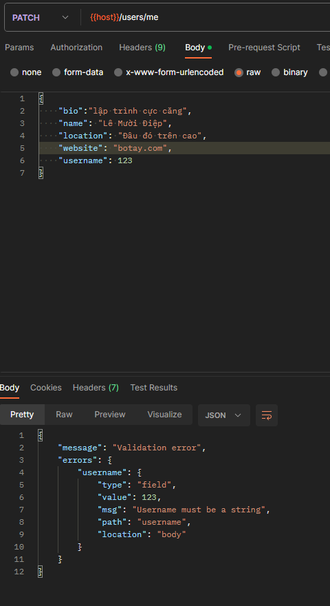
  - truyền đúng đầy đủ thông tin
    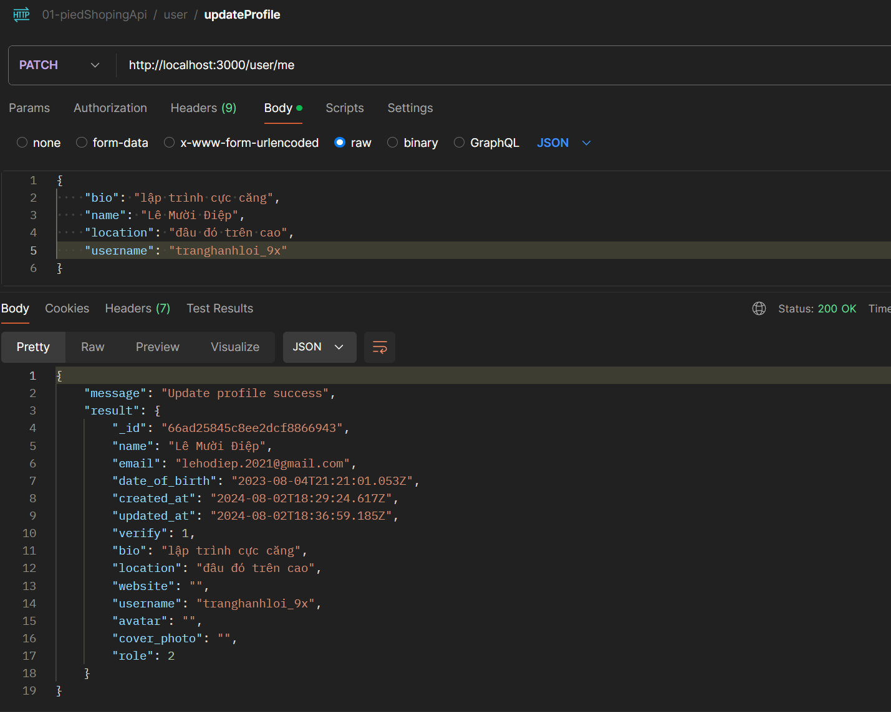
  - kiểm tra xem mongo đã cập nhật chưa
    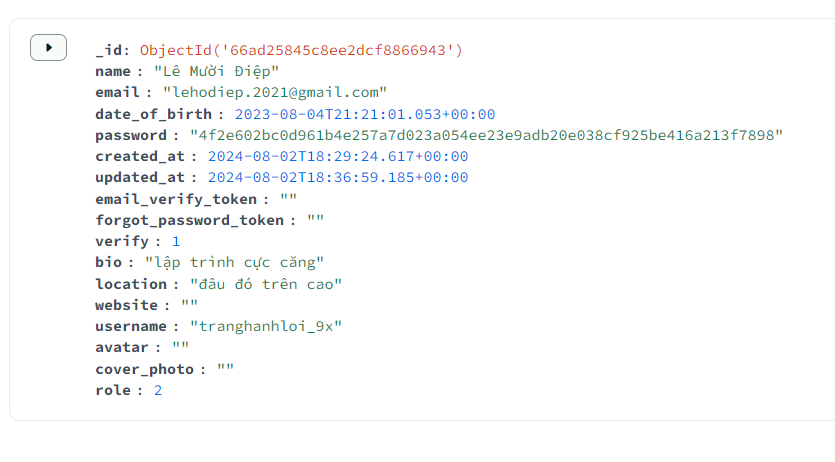

## bàn về khuyết điểm của check verify

- việc liên tục kiểm phải tìm kiếm use thông qua user_id để kiểm tra verify và banned sau đó lại tìm kiếm user để cập nhật là rất phiền phức nhưng hiện tại nó là cách an toàn nhất
- ta có thể lưu trạng thái verify vào access_token, nhưng nó sẽ tạo ra 1 vấn đề khác
  - việc này nhanh, tiện nhưng cũng chứa rất nhiều rũi ro
    - 1. người dùng đăng nhập bằng máy tính và họ muốn verify tài khoản
    - 2. sau đó họ lấy điện thoại ra để verify bằng link trong gmail
    - 3. khi xong việc họ vào máy tính và bấm F5 để reset trang
    - 4. không có gì xảy ra cả
  - database đã cập nhật verify, nhưng access_token trên máy tính của họ vẫn là đồ cũ
    nên khi decode nó vẫn chứa trạng thái verify cũ, người dùng chỉ có thể chờ refresh_token để có đc access_token mới
- hoặc ta dùng socket.io để bắn 1 event về client yêu cầu nó refresh_token để lấy về access_token mới

# filterMiddleware để lọc data body

<!-- soạn đến đây rồi -->

- ở phần trên chúng ta có mỗi lỗi rất thú vị như sau, đó là nếu như người dùng
  truyền dư property, hay cố tình ghi đè, thì ta sẽ bị tấn công dữ liệu.
  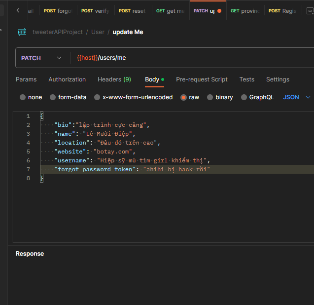
- đó là vì ta chưa xử lý body mà client truyền lên, để rồi client thích truyền gì thì truyền
- giải pháp: ta sẽ dùng function `.pick` của lodash, nó sẽ lấy ra những prop
  nào mà ta muốn thôi
- vậy ta vào `updateMeController` và xử lý `body` trước khi đến `services` như sau:

  ```ts
  export const updateMeController = async (
  req: Request<ParamsDictionary, any, UpdateMeReqBody>,
  res: Response,
  next: NextFunction
  ) => {
    //middleware accessTokenValidator đã chạy rồi, nên ta có thể lấy đc user_id từ decoded_authorization
    const { user_id } = req.decoded_authorization as TokenPayload
    //user_id để biết phải cập nhật ai
    //lấy thông tin mới từ req.body
    const body = pick(req.body, [
      'name',
      'date_of_birth',
      'bio',
      'location',
      'website',
      'avatar',
      'username',
      'cover_photo'
    ])
    ...
  )
  ```

- **nhưng mình sẽ k làm thế**, mình sẽ tách tách riêng đoạn trên ra một `middleware`

  - vào folder `middleware` tạo `common.middlewares.ts` (file lưu những middleware dùng đc cho nhiều nơi)

  ```ts
  import { Response, Request, NextFunction } from "express";
  import { pick } from "lodash";
  //ta đang dùng generic để khi dùng hàm filterMiddleware nó sẽ nhắc ta nên bỏ property nào vào mảng
  //FilterKeys là mảng các key của object T nào đó
  type FilterKeys<T> = Array<keyof T>;

  export const filterMiddleware =
    <T>(filterKey: FilterKeys<T>) =>
    (req: Request, res: Response, next: NextFunction) => {
      req.body = pick(req.body, filterKey);
      next();
    };
  ```

  - vào route patch `/me` thêm `filterMiddleware` là xong

  ```ts
  usersRouter.patch(
    "/me",
    accessTokenValidator,
    verifiedUserValidator,
    filterMiddleware<UpdateMeReqBody>([
      "name",
      "date_of_birth",
      "bio",
      "location",
      "website",
      "avatar",
      "username",
      "cover_photo",
    ]),
    updateMeValidator,
    wrapAsync(updateMeController)
  );
  //truyền khác key là nó báo lỗi ngay
  ```

  kết quả là dù ta có update body như thế nào thì nó cũng chỉ lấy những prop mà ta muốn thôi, password sẽ không được truyền lên database
  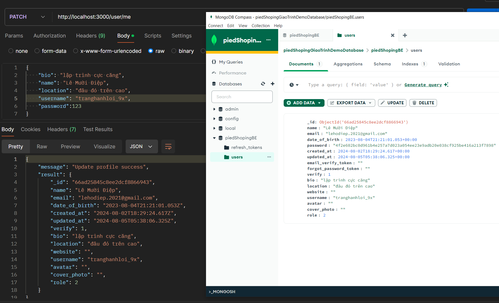

# initital username

- khi mà ta muốn xem profile của một người ta thường truy cập vào
  `api/:username` để xem thông tin của người đó
- nhưng với ứng dụng của ta thì khi tạo account sẽ không cần phải cung cấp `username`
- tức là có những account không có `username`, nên trước tiên là sẽ fix lại `users.service.ts > register`
  đoạn tạo user mới, ta sẽ cho thêm prop username cấu thành từ `user+id`
  ```ts
  async register(payload: RegisterReqBody) {
    ...
    const result = await databaseService.users.insertOne(
      new User({
        ...payload,
        _id: user_id,
        username: `user${user_id.toString()}`,//thêm prop này
        email_verify_token,
      ...
  }
  ```

# Get User Profile [video optional]

- giờ ta tạo route giúp ta get profile bằng username
  ```ts
  /*
  des: get profile của user khác bằng unsername
  path: '/:username'
  method: get
  không cần header vì, chưa đăng nhập cũng có thể xem
  */
  usersRouter.get("/:username", wrapAsync(getProfileController));
  //chưa có controller getProfileController, nên bây giờ ta làm
  ```
- ở đây ta dùng query string param nên lúc cần lấy giá trị truyền lên ta sẽ `req.param` là đc
- vào `users.controller.ts` tạo controller `getProfileController`

  ```ts
  export const getProfileController = async (
    req: Request,
    res: Response,
    next: NextFunction
  ) => {
    const { username } = req.params; //lấy username từ query params
    const result = await usersService.getProfile(username);
    return res.json({
      message: USERS_MESSAGES.GET_PROFILE_SUCCESS, //message.ts thêm  GET_PROFILE_SUCCESS: 'Get profile success',
      result,
    });
  };
  //usersService.getProfile(username) nhận vào username tìm và return ra ngoài, hàm này chưa viết
  //giờ ta sẽ viết
  ```

- trong `user.servers.ts` tạo `getProfile` tìm thông tin user

```ts
  async getProfile(username: string) {
    const user = await databaseService.users.findOne(
      { username: username },
      {
        projection: {
          password: 0,
          email_verify_token: 0,
          forgot_password_token: 0,
          verify: 0,
          create_at: 0,
          update_at: 0
        }
      }
    )
    if (user == null) {
      throw new ErrorWithStatus({
        message: USERS_MESSAGES.USER_NOT_FOUND,
        status: HTTP_STATUS.NOT_FOUND
      })
    }
    return user
  }
```

- định nghĩa params cho `getProfile` trong `User.Requests.ts`

```ts
export interface GetProfileReqParams extends ParamsDictionary {
  username: string;
}
```

khi xài trong `getProfileController`

```ts
export const getProfileController = async (req: Request<GetProfileReqParams>, res: Response, next: NextFunction) => {
  ...
}
```

- test code:
- tạo tài khoản với email là: lehodiep.2032@gmail.com
  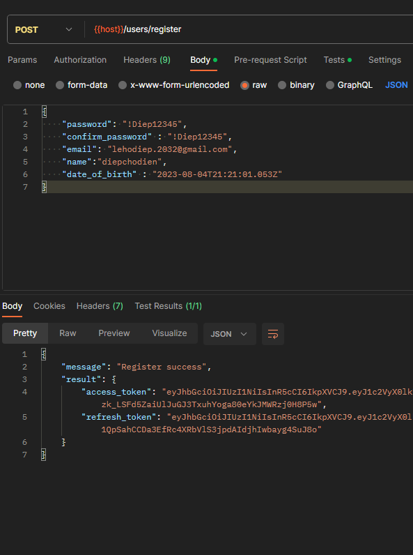
  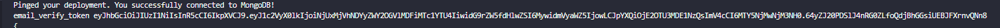
- tìm trên mongo để xem username: user65125a462ef68ee01b175a58
  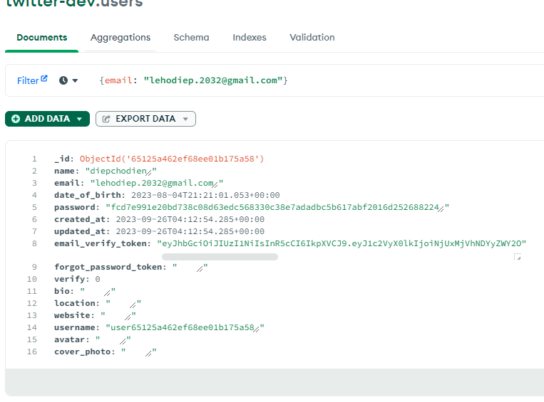
- tạo request mới
  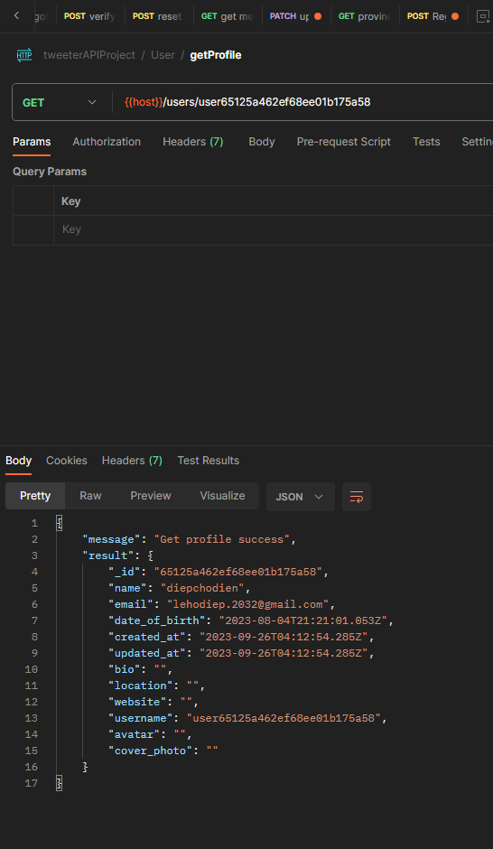

# Follow User [video optional]

- khi ta follow ai đó ta sẽ thêm 1 document vào trong collection `Followers` có dạng

  ```ts
  interface Follower {
    _id: ObjectId;
    user_id: ObjectId;
    followed_user_id: ObjectId;
    created_at: Date;
  }
  ```

- ta sẽ tạo route `/follow`

  ```ts
  /*
  des: Follow someone
  path: '/follow'
  method: post
  headers: {Authorization: Bearer <access_token>}
  body: {followed_user_id: string}
  */
  usersRouter.get(
    "/follow",
    accessTokenValidator,
    verifiedUserValidator,
    followValidator,
    wrapAsync(followController)
  );
  export default usersRouter;
  //accessTokenValidator dùng dể kiểm tra xem ngta có đăng nhập hay chưa, và có đc user_id của người dùng từ req.decoded_authorization
  //verifiedUserValidator dùng để kiễm tra xem ngta đã verify email hay chưa, rồi thì mới cho follow người khác
  //trong req.body có followed_user_id  là mã của người mà ngta muốn follow
  //followValidator: kiểm tra followed_user_id truyền lên có đúng định dạng objectId hay không
  //  account đó có tồn tại hay không
  //followController: tiến hành thao tác tạo document vào collection followers
  ```

- trong `User.requests.ts` thêm định nghĩa cho req.body của route Follow

  ```ts
  export interface FollowReqBody {
    followed_user_id: string;
  }
  ```

- tạo collections `followers` trong database mongodb, ta vào

  - tạo schema cho collection `followers`: vào folder `models > schemas` tạo file `Followers.schema.ts`

    ```ts
    import { ObjectId } from "mongodb";

    interface FollowersType {
      _id?: ObjectId;
      user_id: ObjectId;
      followed_user_id: ObjectId;
      created_at?: Date;
    }

    export class Follower {
      _id?: ObjectId;
      user_id: ObjectId;
      followed_user_id: ObjectId;
      created_at?: Date;
      constructor({
        _id,
        user_id,
        followed_user_id,
        created_at,
      }: FollowersType) {
        this._id = _id;
        this.user_id = user_id;
        this.followed_user_id = followed_user_id;
        this.created_at = created_at || new Date();
      }
    }
    ```

  - vào `database.services.ts` tạo collection tên followers với class Follower

    ```ts
    get followers(): Collection<Follower> {
      return this.db.collection(process.env.DB_FOLLOWERS_COLLECTION as string)
    }
    //trong file .env thêm DB_FOLLOWERS_COLLECTION = 'followers'
    ```

- trong `users.middlewares.ts` tạo `followValidator`: kiểm tra `followed_user_id` truyền lên có đúng định dạng objectId hay không, account mà mình muốn follow có tồn tại hay không

  ```ts
  export const followValidator = validate(
    checkSchema(
      {
        followed_user_id: {
          custom: {
            options: async (value: string, { req }) => {
              //check value có phải objectId hay không?
              if (!ObjectId.isValid(value)) {
                throw new ErrorWithStatus({
                  message: USERS_MESSAGES.INVALID_FOLLOWED_USER_ID, //trong message.ts thêm INVALID_FOLLOWED_USER_ID: 'Invalid followed user id'
                  status: HTTP_STATUS.NOT_FOUND,
                });
              }
              //vào database tìm user đó xem có không ?
              const followed_user = await databaseService.users.findOne({
                _id: new ObjectId(value),
              });
              if (followed_user === null) {
                throw new ErrorWithStatus({
                  message: USERS_MESSAGES.FOLLOWED_USER_NOT_FOUND, //trong message.ts thêm FOLLOWED_USER_NOT_FOUND: 'Followed user not found'
                  status: HTTP_STATUS.NOT_FOUND,
                });
              }
              //nếu vướt qua hết if thì return true
              return true;
            },
          },
        },
      },
      ["body"]
    )
  );
  ```

- trong `users.controllers.ts` tạo `followController`

  ```ts
  export const followController = async (
    req: Request<ParamsDictionary, any, FollowReqBody>,
    res: Response,
    next: NextFunction
  ) => {
    const { user_id } = req.decoded_authorization as TokenPayload; //lấy user_id từ decoded_authorization của access_token
    const { followed_user_id } = req.body; //lấy followed_user_id từ req.body
    const result = await usersService.follow(user_id, followed_user_id); //chưa có method này
    return res.json(result);
  };
  ```

- vào `users.services.ts` tạo method `follow`

  ```ts
  async follow(user_id: string, followed_user_id: string) {
    //kiểm tra xem đã follow hay chưa
    const isFollowed = await databaseService.followers.findOne({
      user_id: new ObjectId(user_id),
      followed_user_id: new ObjectId(followed_user_id)
    })
    //nếu đã follow thì return message là đã follow
    if (isFollowed != null) {
      return {
        message: USERS_MESSAGES.FOLLOWED // trong message.ts thêm FOLLOWED: 'Followed'
      }
    }
    //chưa thì thêm 1 document vào collection followers
    await databaseService.followers.insertOne(
      new Follower({
        user_id: new ObjectId(user_id),
        followed_user_id: new ObjectId(followed_user_id)
      })
    )
    return {
      message: USERS_MESSAGES.FOLLOW_SUCCESS //trong message.ts thêm   FOLLOW_SUCCESS: 'Follow success'
    }
  }
  ```

# test code

- tạo tài khoản `lehodiep.2040@gmail.com`
  

  - verify tài khoản này
  - sau đó kiểm tra trong mongo cái username của account đó
    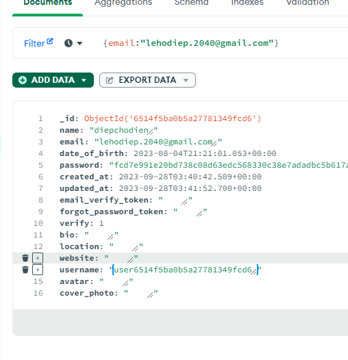
    `user6514f5ba0b5a27781349fcd6`

- tạo tài khoản `lehodiep.2044@gmail.com`
  

  - verify tài khoản này
  - sau đó kiểm tra trong mongo cái username của account đó
    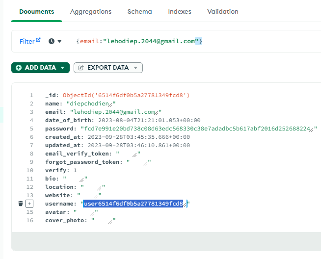
  - `user6514f6df0b5a27781349fcd8`

- đăng nhập `lehodiep.2040@gmail.com`
  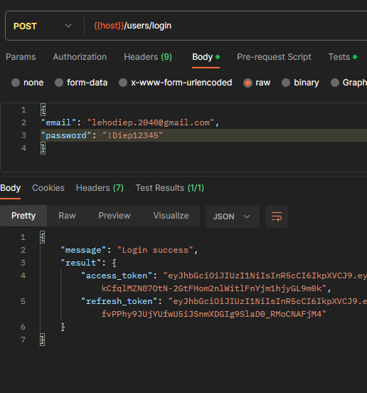

- tạo request mới để follow account có followed_user_id: `6514f6df0b5a27781349fcd8`
  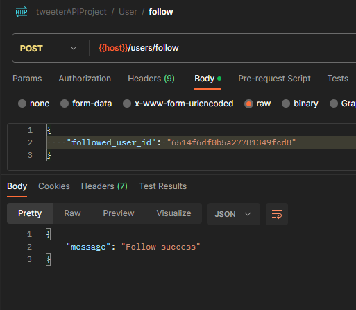
  thứ bấm follow nhiều lần 1 người xem có lỗi không ?
  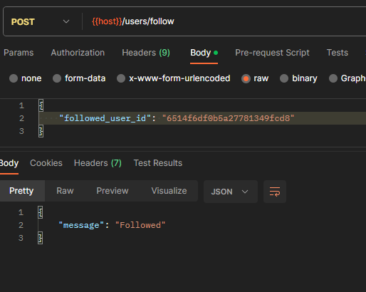

  - thử follow sai người
    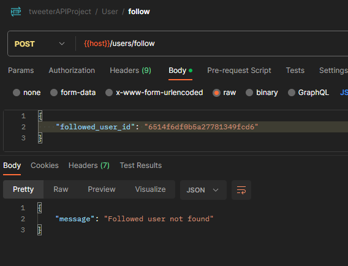

- kiểm tra lại mongoDB
  **đã kiểm tra document đến đây**

# Unfollow user[videos optional]

khi ai đó muốn unfollow thì ta sẽ xóa đi document tương ứng tronng collection `followers` là xong

- tạo route

```ts
/*
    des: unfollow someone
    path: '/follow/:user_id'
    method: delete
    headers: {Authorization: Bearer <access_token>}
  g}
    */
usersRouter.delete(
  "/follow/:user_id",
  accessTokenValidator,
  verifiedUserValidator,
  unfollowValidator,
  wrapAsync(unfollowController)
);

//unfollowValidator: kiểm tra user_id truyền qua params có hợp lệ hay k?
```

- ta thấy rằng việc kiểm tra `userId` có hợp lệ và tồn tại hay không đã được làm trong
  followValidator rồi, giờ ta muốn dùng lại nên ta sẽ tách nó thành `userSchema`

  - vào `users.middlewares.ts` tạo `userSchema`

  ```ts
  //
  const userIdSchema: ParamSchema = {
    custom: {
      options: async (value: string, { req }) => {
        //check value có phải objectId hay không?
        if (!ObjectId.isValid(value)) {
          throw new ErrorWithStatus({
            message: USERS_MESSAGES.INVALID_user_id, //trong message.ts thêm INVALID_user_id: 'Invalid user id'followed user id'
            status: HTTP_STATUS.NOT_FOUND,
          });
        }
        //đổi tên biến thành user luôn cho phù hợp
        const user = await databaseService.users.findOne({
          _id: new ObjectId(value),
        });
        if (user === null) {
          throw new ErrorWithStatus({
            message: USERS_MESSAGES.USER_NOT_FOUND, //fix lại cho nó thông báo chung
            status: HTTP_STATUS.NOT_FOUND,
          });
        }
        //nếu vướt qua hết if thì return true
        return true;
      },
    },
  };
  //fix lại followValidator
  export const followValidator = validate(
    checkSchema(
      {
        followed_user_id: userIdSchema,
      },
      ["body"]
    )
  );
  //và thêm unfollowValidator
  export const unfollowValidator = validate(
    checkSchema(
      {
        user_id: userIdSchema,
      },
      ["params"]
    )
  );
  ```

- định nghĩa params của request này trong file `User.requests.ts`

  ```ts
  export interface UnfollowReqParams extends ParamsDictionary {
    user_id: string;
  }
  ```

- vào `users.controller.ts` làm controller `unfollowController`

  ```ts
  export const unfollowController = async (
    req: Request<UnfollowReqParams>,
    res: Response,
    next: NextFunction
  ) => {
    const { user_id } = req.decoded_authorization as TokenPayload; //lấy user_id từ decoded_authorization của access_token
    const { user_id: followed_user_id } = req.params; //lấy user_id từ req.params là user_id của người mà ngta muốn unfollow
    const result = await usersService.unfollow(user_id, followed_user_id); //unfollow chưa làm
    return res.json(result);
  };
  ```

- vào `users.services.ts` làm method `unfollow`

  ```ts
    async unfollow(user_id: string, followed_user_id: string) {
      //kiểm tra xem đã follow hay chưa
      const isFollowed = await databaseService.followers.findOne({
        user_id: new ObjectId(user_id),
        followed_user_id: new ObjectId(followed_user_id)
      })

      //nếu chưa follow thì return message là "đã unfollow trước đó" luôn
      if (isFollowed == null) {
        return {
          message: USERS_MESSAGES.ALREADY_UNFOLLOWED // trong message.ts thêm ALREADY_UNFOLLOWED: 'Already unfollowed'
        }
      }

      //nếu đang follow thì tìm và xóa document đó
      const result = await databaseService.followers.deleteOne({
        user_id: new ObjectId(user_id),
        followed_user_id: new ObjectId(followed_user_id)
      })

      //nếu xóa thành công thì return message là unfollow success
      return {
        message: USERS_MESSAGES.UNFOLLOW_SUCCESS // trong message.ts thêm UNFOLLOW_SUCCESS: 'Unfollow success'
      }
    }
  ```

- test code:
  - tạo request mới và unfollow ông vừa follow
    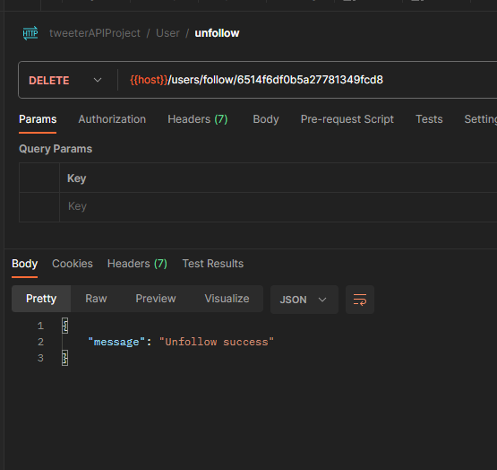
  - xem thử trong mongodb ta đã xóa document của followers chưa
    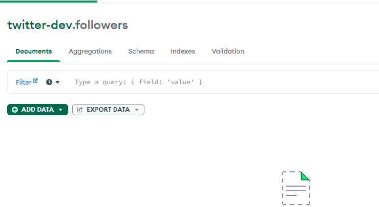
  - bấm cái nữa
    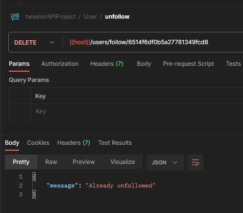

# Change password

- tạo route `/change-password`

```ts
/*
  des: change password
  path: '/change-password'
  method: PUT
  headers: {Authorization: Bearer <access_token>}
  Body: {old_password: string, password: string, confirm_password: string}
g}
*/
usersRouter.put(
  "/change-password",
  accessTokenValidator,
  changePasswordValidator,
  wrapAsync(changePasswordController)
);
//changePasswordValidator kiểm tra các giá trị truyền lên trên body cớ valid k ?
```

- vào `user.requests.ts` định nghĩa req.body cho changePassword

```ts
export interface ChangePasswordReqBody {
  old_password: string;
  password: string;
  confirm_password: string;
}
```

- vào `users.middlewares.ts` tạo `changePasswordValidator`

```ts
export const changePasswordValidator = validate(
  checkSchema(
    {
      old_password: passwordSchema,
      password: passwordSchema,
      confirm_password: confirmPasswordSchema,
    },
    ["body"]
  )
);
```

- tạo controller

```ts
export const changePasswordController = async (
  req: Request<ParamsDictionary, any, ChangePasswordReqBody>,
  res: Response,
  next: NextFunction
) => {
  const { user_id } = req.decoded_authorization as TokenPayload; //lấy user_id từ decoded_authorization của access_token
  const { password, old_password } = req.body; //lấy old_password và password từ req.body
  //kiểm tra xem old_password có đúng với password có trong database không trong db không
  //vừa tìm vừa update nếu có
  const result = await usersService.changePassword({
    user_id,
    old_password,
    password,
  }); //chưa code changePassword
  return res.json(result);
};
```

- `changePassword`

```ts
  async changePassword({
    user_id,
    password,
    old_password
  }: {
    user_id: string
    password: string
    old_password: string
  }) {
    //tìm user bằng username và old_password
    const user = await databaseService.users.findOne({
      _id: new ObjectId(user_id),
      password: hashPassword(old_password)
    })
    //nếu không có user thì throw error
    if (!user) {
      throw new ErrorWithStatus({
        message: USERS_MESSAGES.USER_NOT_FOUND,
        status: HTTP_STATUS.UNAUTHORIZED //401
      })
    }
    //nếu có thì cập nhật lại password
    //cập nhật lại password và forgot_password_token
    //tất nhiên là lưu password đã hash rồi
    databaseService.users.updateOne({ _id: new ObjectId(user_id) }, [
      {
        $set: {
          password: hashPassword(password),
          forgot_password_token: '',
          updated_at: '$$NOW'
        }
      }
    ])
    //nếu bạn muốn ngta đổi mk xong tự động đăng nhập luôn thì trả về access_token và refresh_token
    //ở đây mình chỉ cho ngta đổi mk thôi, nên trả về message
    return {
      message: USERS_MESSAGES.CHANGE_PASSWORD_SUCCESS // trong message.ts thêm CHANGE_PASSWORD_SUCCESS: 'Change password success'
    }
  }
```

test
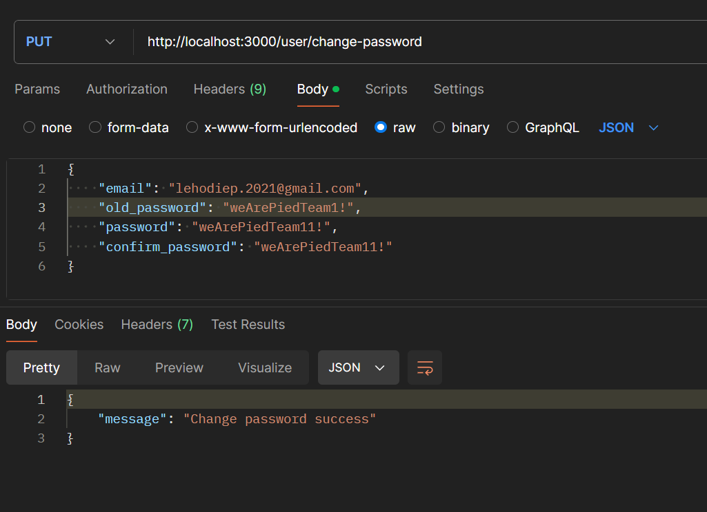

# chức năng RefreshToken

- khi mà `accesstoken` của `client` hết hạn thì `client` sẽ gữi `request` lên `route refreshtoken`
- ta sẽ tạo `route` cho `refreshtoken`

  ```ts
  /*
    des: refreshtoken
    path: '/refresh-token'
    method: POST
    Body: {refresh_token: string}
  g}
    */
  usersRouter.post(
    "/refresh-token",
    refreshTokenValidator,
    wrapAsync(refreshTokenController)
  );
  //khỏi kiểm tra accesstoken, tại nó hết hạn rồi mà
  //refreshTokenController chưa làm
  ```

- vào `user.requests.ts` định nghĩa body cho `/refresh-token`

```ts
export interface RefreshTokenReqBody {
  refresh_token: string;
}
```

- vào `users.controllers.ts` tạo `refreshController`

```ts
export const refreshTokenController = async (
  req: Request<ParamsDictionary, any, RefreshTokenReqBody>,
  res: Response,
  next: NextFunction
) => {
  // khi qua middleware refreshTokenValidator thì ta đã có decoded_refresh_token
  //chứa user_id và token_type
  //ta sẽ lấy user_id để tạo ra access_token và refresh_token mới
  const { user_id } = req.decoded_refresh_token as TokenPayload; //lấy refresh_token từ req.body
  const { refresh_token } = req.body;
  const isRefreshTokenValid = await usersService.checkRefreshToken({
    user_id,
    refresh_token,
  });
  if (!isRefreshTokenValid) {
    throw new ErrorWithStatus({
      message: USERS_MESSAGES.REFRESH_TOKEN_IS_INVALID,
      status: HTTP_STATUS.UNAUTHORIZED,
    });
  }
  const result = await usersService.refreshToken(user_id, refresh_token); //refreshToken chưa code
  return res.json({
    message: USERS_MESSAGES.REFRESH_TOKEN_SUCCESS, //message.ts thêm  REFRESH_TOKEN_SUCCESS: 'Refresh token success',
    result,
  });
};
```

- vào `user.services.ts` code `refreshToken`

```ts
  async refreshToken(user_id: string, refresh_token: string) {
    //tạo mới
    const [new_access_token, new_refresh_token] = await Promise.all([
      this.signAccessToken(user_id),
      this.signRefreshToken(user_id)
    ])
    //vì một người đăng nhập ở nhiều nơi khác nhau, nên họ sẽ có rất nhiều document trong collection refreshTokens
    //ta không thể dùng user_id để tìm document cần update, mà phải dùng token, đọc trong RefreshToken.schema.ts
    await databaseService.refreshTokens.deleteOne({ token: refresh_token }) //xóa refresh
    //insert lại document mới
    await databaseService.refreshTokens.insertOne(
      new RefreshToken({ user_id: new ObjectId(user_id), token: new_refresh_token })
    )
    return { access_token: new_access_token, refresh_token: new_refresh_token }
  }
```

- test code

  - login để thu về refresh_token
    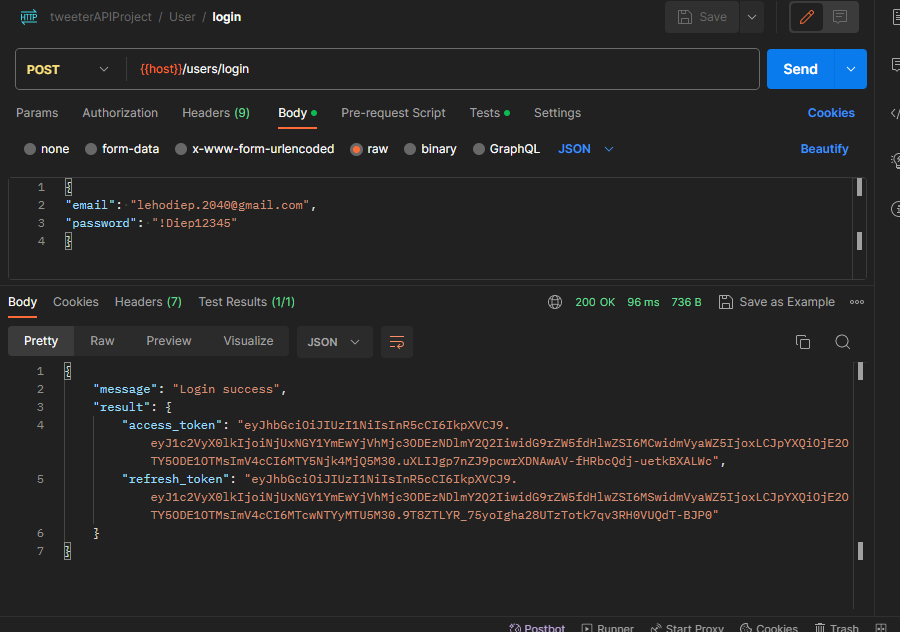
  - kiểm tra refresh_token vừa thu được có trong collection refresh_tokens không ?
    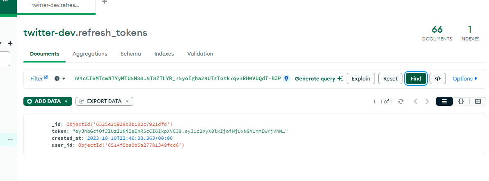
  - giờ tiến hánh refresh để xem user_id đó có đổi refresh-token mới không?
    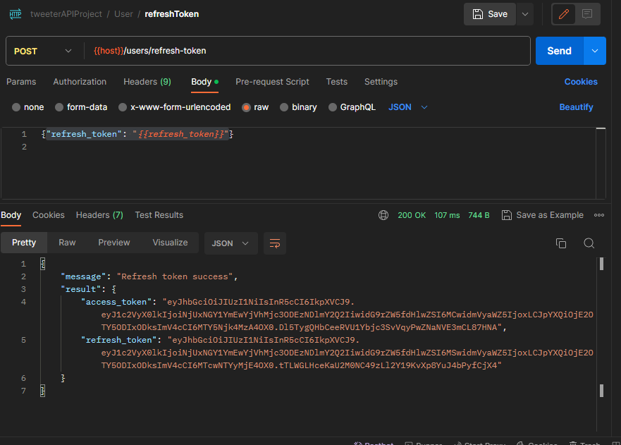
  - doc đã mất
    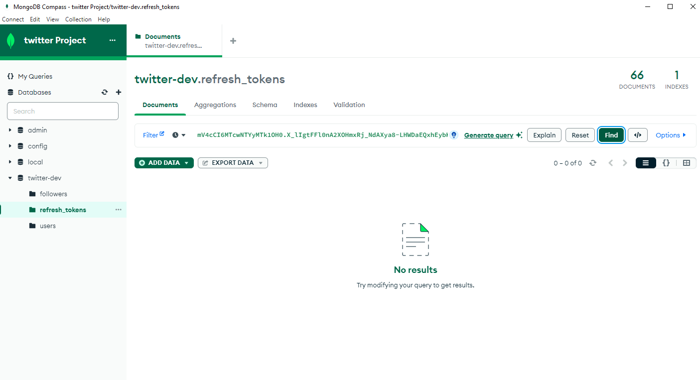
  - tìm lại bằng refresh-token mới thu được
    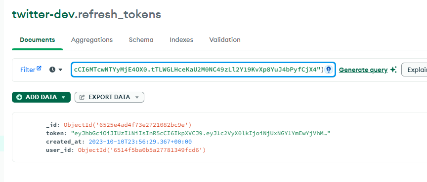
    nếu đúng user_id trước đó là thành công

- ` ta sẽ làm sau phần : đồng bộ thời gian hết hạn của refresh_token cũ và refresh_token mới với nhau_`
