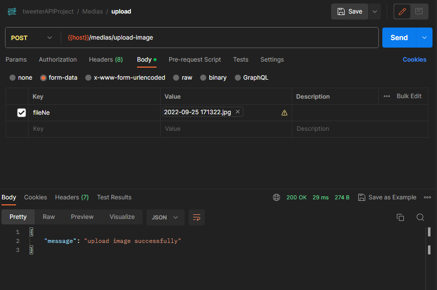
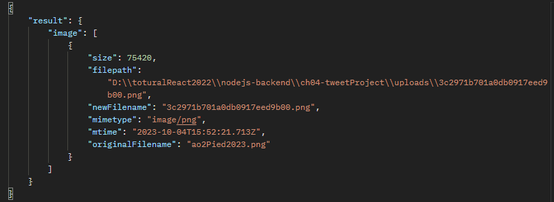
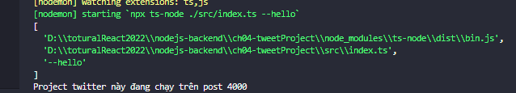
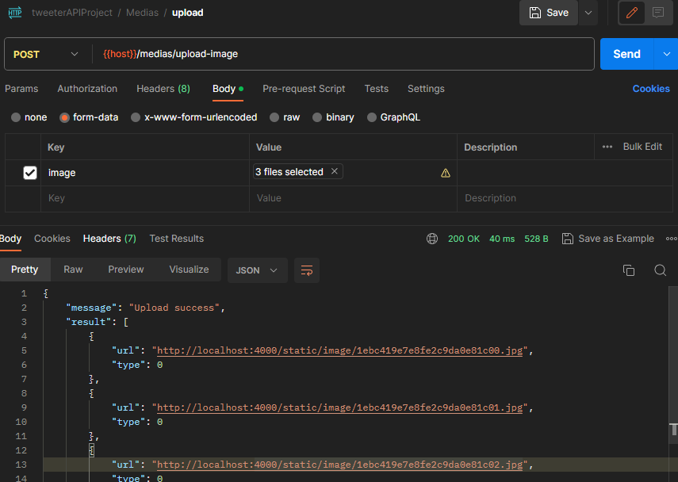

# I - Upload file bằng formidable

- chứng năng upload hình ảnh
- nodejs cung các thư viện giúp upload hình ảnh như :
  - `formidable` : nodejs, fastify, burn đều dùng được
  - `Busboy` : khó cấu hình
  - `Multer` : có sẵn trong `expressjs`
  - `Multiparty`
- trong dự án này ta dùng `formidable`
- formidable có 3 phiên bản:
  - V1: đã ngưng cung cấp dịch vụ
  - V2(`commonjs`) và V3(`ESModules`)
    
  - dù rằng trong dự án chúng ta dùng cú pháp import module như `ESModules` nhưng khi biên dịch vẫn sẽ thành `commonjs` nên V2 là phù hợp nhưng vẫn có cách dùng V3, và
    **ở dự án này ta sẽ dùng V3**

## I.1 cài đặt vào dự án

- ta có thể tham khảo cài đặt formidable cho expressjs ở [doc](https://github.com/node-formidable/formidable#with-expressjs)
- cài đặt `formidable` vào dự án `TwitterProject`

```bash
//cài đặt core
npm i formidable
//cài đặt phiên bản cho typescript nếu k sẽ k xài đc typescript
npm i @types/formidable -D
```

- vào folder `routes` tạo `medias.routes.ts` để tách riêng với các routes users

  ```ts
  import { Router } from 'express'
  import { uploadSingleImageController } from '~/controllers/medias.controllers'
  const mediasRouter = Router()

  mediasRouter.post('/upload-image', uploadSingleImageController)

  export default mediasRouter

  //uploadSingleImageController chưa làm
  ```

- vào `index.ts` khai báo `route`

  ```ts
  ...
  app.use('/users', usersRouter) //route handler
  app.use('/medias', mediasRouter) //route handler
  ...
  ```

- vào folder `controllers` tạo `medias.controllers.ts`

  ```ts
  import { Request, Response, NextFunction } from 'express'

  export const uploadSingleImageController = async (req: Request, res: Response, next: NextFunction) => {
    return res.json({ message: 'upload single image successfully' }) //để đại vậy, code sau
  }
  ```

- test thử route mới có hoạt động hay không trước khi tiếp tục

  - tạo folder và request
    
    

- viết logic cho `medias.controllers.ts`

  ```ts
  import { Request, Response, NextFunction } from 'express'
  import formidable from 'formidable'

  export const uploadSingleImageController = async (req: Request, res: Response, next: NextFunction) => {
    //const formidable = (await import('formidable')).default //nếu bị lỗi như hình dưới thì dùng dòng này và vào tsconfig.json đổi "moduleResolution": "NodeNext"
    const form = formidable({}) // có rất nhiều option để truyền vào {}
    return res.json({ message: 'upload single image successfully' })
  }
  ```

  

  **đọc thêm các option của formidable tại [đây](https://github.com/node-formidable/formidable#options)**

  - ta sẽ dùng 1 vài cái trong đó nên code sẽ thành

  ```ts
  import { Request, Response, NextFunction } from 'express'
  import formidable from 'formidable'
  import path from 'path'
  // console.log(__dirname) //log thử để xem
  // console.log(path.resolve()) //D:\toturalReact2022\nodejs-backend\ch04-tweetProject
  // console.log(path.resolve('uploads')) //D:\toturalReact2022\nodejs-backend\ch04-tweetProject\uploads

  export const uploadSingleImageController = async (req: Request, res: Response, next: NextFunction) => {
    //const formidable = (await import('formidable')).default
    //ta có các biến sau
    //__dirname : chứa đường dẫn tuyệt đối đến thư mục chứa file đang chạy
    //path.resolve('uploads') đây là đường dẫn mà mình muốn làm chỗ lưu file
    //setup cấu hình form mà mình muốn nhận
    const form = formidable({
      uploadDir: path.resolve('uploads'), //lưu ở đâu
      maxFiles: 1, //tối đa bao nhiêu
      keepExtensions: true, //có lấy đuôi mở rộng không .png, .jpg
      maxFileSize: 300 * 1024 //tối đa bao nhiêu byte, 300kb
    })
    //đoạn này là xử lý khi có lỗi: lụm từ doc của formidable
    //tiến hành dùng cấu hình để parse(ép kiểu) req thành file để lưu vào server
    form.parse(req, (err, fields, files) => {
      //files là object chứa các file tải lên
      //nếu k upload file thì object rỗng {}
      if (err) {
        throw err
      }
      res.json({
        message: 'upload image successfully'
      })
    })
  }
  ```

- test code
  - **trong folder `TwitterProject` tạo `uploads` cùng cấp `src`**
  - config request như sau
    
  - trong folder `uploads` sẽ có file đó nhưng dưới dạng unique name để tránh trùng tên
    
  - vậy là những gì client up lên sẽ đc lưu ở folder `uploads`
  - **nếu ta chưa tạo folder `uploads` mà lại tiến hành uploads thì nó cũng thành công, nhưng file không được lưu đi đâu cả**
- đối với form giao diện thì ta cần lưu ý
  

  - `action` là lưu api của mình
  - `enctype` và `method` là bắt buộc

- **ta tiến hành tạo logic rằng, khi server chạy nếu thiếu folder `uploads` thì nó sẽ tự tạo**

  - trong folder `utils` tạo `file.ts`

  ```ts
  import fs from 'fs' //thư viện giúp handle các đường dẫn
  import path from 'path'
  export const initFolder = () => {
    //lấy đường dẫn từ project đến thư mục uploads
    const uploadsFolderPath = path.resolve('uploads')
    //kiểm tra xem nếu theo đường dẫn trên có đến được folder uploads không
    if (!fs.existsSync(uploadsFolderPath)) {
      fs.mkdirSync(uploadsFolderPath, {
        //nếu không tồn tại thì tạo ra
        recursive: true //cho phép tạo folder nested vào nhau
        //uploads/image/bla bla bla
      }) //mkdirSync: giúp tạo thư mục
    }
  }
  ```

  - vào `index.ts` để chạy hàm này mỗi khi dự án start

  ```ts
  ...
  const port = 4000

  //thêm
  // tạo folder uploads
  initFolder()

  app.use(express.json()) //app handler
  ...
  ```

- vậy là khi app chúng ta `npm run dev` lên thì nó sẽ tự động tạo folder nếu chưa có

# II - filter upload ảnh

### trong phần này ta sẽ bổ sung một vài vấn đề sau:

- 1. ngoài image thì formidable còn cho phép upload các dạng khác như json, pdf, ...
  - nhưng ta muốn `chỉ cho phép upload image thôi`
  - formidable có option này ở [đây](https://github.com/node-formidable/formidable#optionsfilter--function-function-name-originalfilename-mimetype---boolean)
    `options.filter {function} function ({name, originalFilename, mimetype}) -> boolean` - hàm nhận vào callback nếu trả ra false nghĩa là ignore file đã tải lên, nếu true thì chập nhận - mặc định sẽ không xuất lỗi , ta phải dùng `form.emit('error')`
- 2. khi xài `uploadSingleImageController` ta chưa bọc nó vào
     `wrapAsync(uploadSingleImageController)`
- 3. **như hình dưới** đây `nếu throw trong một callback` như vậy thì nó `wrapAsync - hay try catch` `sẽ không catch đc` mà nó sẽ `làm crash chương trình nếu lỗi`, thử upload file trên 3XXkb để thấy bug này
  - **phải throw ở ngoài thì mới catch và server sẽ reject được**
    

### khắc phục:

- lỗi 2: thêm hàm bọc là xong

  ```ts
  mediasRouter.post('/upload-image', wrapAsync(uploadSingleImageController))
  ```

- lỗi 3 và lỗi 1:

  - vào `file.ts` tạo `handleUploadSingleImage`:
    đem hết code trong `uploadSingleImageController` bỏ vào và
    ta sẽ chuyển `form.parse` trên thành promise thay vì `callback`

    ```ts
    import fs from 'fs' //thư viện giúp handle các đường dẫn
    import path from 'path'
    import formidable, { Files } from 'formidable'
    import { Request } from 'express'
    export const handleUploadSingleImage = async (req: Request) => {
      const form = formidable({
        uploadDir: path.resolve('uploads'),
        maxFiles: 1,
        keepExtensions: true,
        maxFileSize: 300 * 1024,
        //xài option filter để kiểm tra file có phải là image không
        filter: function ({ name, originalFilename, mimetype }) {
          //name: name|key truyền vào của <input name = bla bla>
          //originalFilename: tên file gốc
          //mimetype: kiểu file vd: image/png
          console.log(name, originalFilename, mimetype) //log để xem, nhớ comment

          const valid = name === 'image' && Boolean(mimetype?.includes('image/'))
          //mimetype? nếu là string thì check, k thì thôi
          //ép Boolean luôn, nếu k thì valid sẽ là boolean | undefined

          //nếu sai valid thì dùng form.emit để gữi lỗi
          if (!valid) {
            form.emit('error' as any, new Error('File type is not valid') as any)
            //as any vì bug này formidable chưa fix, khi nào hết thì bỏ as any
          }
          //nếu đúng thì return valid
          return valid
        }
      })
      //form.parse về thành promise
      //files là object có dạng giống hình test code cuối cùng
      return new Promise<Files<string>>((resolve, reject) => {
        form.parse(req, (err, fields, files) => {
          if (err) return reject(err) //để ý dòng này
          //nếu files từ req gữi lên không có key image thì reject
          if (!files.image) {
            return reject(new Error('Image is empty'))
          }
          resolve(files)
        })
      })
    }
    ```

  - `uploadSingleImageController` sẽ thành

    ```ts
    export const uploadSingleImageController = async (req: Request, res: Response, next: NextFunction) => {
      const data = await handleUploadSingleImage(req)
      return res.json({
        result: data
      })
    }
    ```

- test
  - gữi file sai định dạng
    
  - không gữi gì lên
    
  - truyền sai key
    
  - gữi bình thường
    

# III Xử lý ảnh với Sharp

## giới thiệu Sharp

- client up load ảnh lên cho chúng ta có rất nhiều kích thước khác nha
- hiện tại ta đang lưu kích thước gốc của client
- trên thực tế thì ta sẽ resize hoặc giảm độ phân giải của ảnh gốc để tiết kiệm
- trong một bức hình sẽ có `EXIF` và `Metadata`, chúng chiếm rất nhiều dung lượng của tấm hình, và ta bỏ đi sẽ không làm ảnh hưởng đến chất lượng hình ảnh
- `Sharp` là một thư viện của `nodejs` hổ trợ ta xử lý ảnh
- đây là thư viện được xem là hiệu năng cao nhất hiện nay về xử lý ảnh của `nodejs`

## cài đặt

- cài đặt vào dự án `TwitterProject`

  ```bash
  npm i sharp
  ```

- ta sẽ chuyển các tấm ảnh sang định dạng `jpeg` vì nó có thể nén tốt hơn
- bạn có thể tham khảo ở [doc](https://sharp.pixelplumbing.com/api-output#jpeg)

- trong `handleUploadSingleImage` hàm sẽ return ra data có dạng
  
  và vì là `singleImage` nên ta biết rỏ prop `image` chỉ có thể là 1 mảng 1 phần tử mà thôi nên ta return luôn `image[0]`, vậy nên trong hàm `handleUploadSingleImage` ta sẽ chỉnh lại resolve cuối thành

  ```ts
  import formidable, { File, Files } from 'formidable'

  return new Promise<File>((resolve, reject) => {
    //đầu ra là object File
    form.parse(req, (err, fields, files) => {
      if (err) return reject(err)
      if (!files.image) {
        return reject(new Error('Image is empty'))
      }
      resolve((files.image as File[])[0]) //files.image là array, lấy phần tử đầu tiên
    })
  })
  //File nhớ import từ formidable
  ```

- trong `uploadSingleImageController` ta quan sát thấy rằng

  ```ts
  export const uploadSingleImageController = async (req: Request, res: Response, next: NextFunction) => {
    const data = await handleUploadSingleImage(req) //dòng này nên tách ra service riêng
    return res.json({
      result: data
    })
  }
  ```

- vào folder `services` tạo `medias.services.ts`

  ```ts
  import { Request } from 'express'
  import sharp from 'sharp'
  import { handleUploadSingleImage } from '~/utils/file'

  class MediasService {
    async handleUploadSingleImage(req: Request) {
      //chuyển req thành file (nên xem lại file có dạng gì ở hình trên)
      const file = await handleUploadSingleImage(req) //đem từ uploadSingleImageController qua
      //xử lý file bằng sharp
      //sharp sẽ nhận vào đường dẫn của file cần xử lý và xử lý
      const info = await sharp(file.filepath) //filepath là đường dẫn đến thư mục uploads
      return info
    }
  }

  const mediasService = new MediasService()

  export default mediasService
  ```

- khi ta dùng sharp thì nó sẽ tạo ra file ảnh mới, vậy là lúc này luồng xử lý sẽ là

  1. client upload ảnh lên
  2. ta phải lưu tạm vào `uploads/temp` thay vì `uploads`
  3. dùng `sharp` để xử lý ảnh
  4. lưu ảnh trả ra vào `uploads`

- trong `constants` tạo file lưu các đường dẫn `dir.ts`

  ```ts
  import path from 'path'

  export const UPLOAD_TEMP_DIR = path.resolve('uploads/temp')
  export const UPLOAD_DIR = path.resolve('uploads')
  ```

- vậy nên ta sẽ đổi chỗ lưu ảnh ở `file.ts` thành

  ```ts
  //mình sẽ lưu tạm file nhận đc của clinent vào uploads/temp
  export const initFolder = () => {
    if (!fs.existsSync(UPLOAD_TEMP_DIR)) {
      fs.mkdirSync(UPLOAD_TEMP_DIR, {
        ...
  }

  export const handleUploadSingleImage = async (req: Request) => {
    const form = formidable({
      uploadDir: UPLOAD_TEMP_DIR, //lưu ở đâu
      ...
  }

  //viết thêm hàm khi nhận filename : abv.png thì chỉ lấy abv để sau này ta gán thêm đuôi .jpeg
  export const getNameFromFullname = (filename: string) => {
    const nameArr = filename.split('.')
    nameArr.pop() //xóa phần tử cuối cùng, tức là xóa đuôi .png
    return nameArr.join('') //nối lại thành chuỗi
  }

  ```

- quay lại xử lý tiếp `MediasService`

  ```ts
  class MediasService {
    async handleUploadSingleImage(req: Request) {
      const file = await handleUploadSingleImage(req)
      ////filepath là đường của file cần xử lý đang nằm trong uploads/temp
      //file.newFilename: là tên unique mới của file sau khi upload lên, ta xóa đuôi và thêm jpg
      const newFilename = getNameFromFullname(file.newFilename) + '.jpg'
      const newPath = UPLOAD_DIR + '/' + newFilename //đường dẫn mới của file sau khi xử lý
      //sharp xử lý file từ filepath(upload/temp) thành hình .jpeg và lưu vào newPath(upload)
      const info = await sharp(file.filepath).jpeg().toFile(newPath)
      return info
    }
  }
  ```

- file lại cách xài của `uploadSingleImageController`

  ```ts
  export const uploadSingleImageController = async (req: Request, res: Response, next: NextFunction) => {
    const data = await mediasService.handleUploadSingleImage(req) //vì giờ đã nằm trong mediasService rồi
    return res.json({
      result: data
    })
  }
  ```

- test code
  
  
- ta có thể kiểm tra metadata trước và sau của 2 ảnh bằng https://exifmeta.com/

- mình không cần nhận đc thông tin ảnh, mình cần nhận được url của ảnh để sử dụng
- nên ta sẽ fix lại `MediasService > handleUploadSingleImage`, thay vì return info, ta sẽ return url

  ```ts
  import fs from 'fs'
  //
  class MediasService {
    async handleUploadSingleImage(req: Request) {
      const file = await handleUploadSingleImage(req)
      ...
      //return info
      fs.unlinkSync(file.filepath) //xóa file tạm đi
      return `http://localhost:3000/uploads/${newFilename}`
    }
  }
  ```

- kết quả thu được
  
  
- ta vào link sẽ không được, và ta sẽ tiến hành làm tiếp route uploads/... để xem ảnh đã upload

## các vấn đề cần xử lý

1. folder `uploads` rất nặng, ta không nên đưa uploads này lên git, ta vào file `.gitignore` và thêm 1 dòng `uploads` là xong
2. để `uploads` ở máy tính sẽ không share file được, ta cần bỏ nó lên nền tảng thứ 3(`firebase`, `google drive`), hoặc lên chính server mongo của mình(ta sẽ giải quyết sau)

## xử lý tham số truyền từ command

- như ta thấy nếu `http://localhost:3000/uploads/${newFilename}` như thế này thì không ồn, vì sau này khi ta
  tiến hành dùng domain thì nó k còn là `localhost:3000` nữa.
- vậy chúng ta phải check được:

  - đâu là môi trường dev xài localhost: chạy bằng `npm run dev`
  - đâu là môi trường ở trên server để ta trả ra kết quả có đường dẫn tương ứng: chạy bằng `build` và `npm run start`

- ta test thử việc truyền dữ liệu qua command

  - vào file `package.json` thêm vào `script` chỗ `dev` giá trị `ahihi` xem thử mình có nhận được giá trị đó không

    ```json
      "dev": "npx nodemon --ahihi",
    ```

  - vào `index.ts` log thử

    ```ts
    console.log(process.argv)
    ```

  - chạy `npm run dev` để xem thử
    
  - vậy là ta có thể truyền được qua cách này

- giờ ta sẽ cấu hình lại

  - vào file `package.json`

    ```json
    //nếu ta npm run dev thì ta sẽ nhận đc development từ đó ta biết rằng ta nên chạy url localhost
    "dev": "npx nodemon development",
    //nếu ta npm run build (tạo ra thư mục dist) và npm run start thì ta sẽ nhận đc production
    //từ đó sẽ return kết quả là url domain của mình
    "start": "node dist/index.js production",
    ```

  - lưu vào `.env`

    ```json
    PORT = 3000
    HOST = 'http://my-app.com'
    ```

  - vào `index.ts` fix port thành
    ```ts
    import { config } from 'dotenv'
    config()
    const port = process.env.PORT || 3000
    ```
  - có rất nhiều thư viện để xử lý argv từ `process.argv` thay vì xử lý mảng như thông thường
    
  - ta chọn và cài đặt `minimist`

    ```bash
      npm i minimist @types/minimist -D
    ```

  - ta dùng nó trong `index.ts`

    ```ts
    import argv from 'minimist'
    const options = argv(process.argv.slice(2))
    console.log(options)
    ```

    - chạy lại `npm run dev` ta sẽ thấy kết quả được hiển thị
      
      vì cấu trúc sử dụng trong doc là thế này:

      - `--` là chuỗi
      - `-` là ký tự

      
      nên ta sẽ truyền thành vì ta muốn có dạng true | false để dể viết if else

      ```json
        "dev": "npx nodemon --development",
        //ta sẽ có {_: [], development: true } vậy option.development == true
        "start": "node dist/index.js --production",
        //ta sẽ có {_: [], production: true } vậy option.production == true
      ```

- vào folder `constant` tạo `config.ts`

  ```ts
  import argv from 'minimist'
  const options = argv(process.argv.slice(2))
  //đoạn code trên đem từ index qua ,xóa bên index và xóa log của option luôn
  export const isProduction = Boolean(options.production)
  ```

- xài `isProduction` này ở chỗ return của `MediasService > handleUploadSingleImage`

```ts

import { config } from 'dotenv'
config()

class MediasService {
  async handleUploadSingleImage(req: Request) {
    ...
    //fix thành
    return isProduction
      ? `${process.env.HOST}/medias/${newFilename}`
      : `http://localhost:${process.env.PORT}/medias/${newFilename}`
  }
}

```

- test code bằng cách
  `npm run dev` và test
  

- `npm run build` và `npm run start` và test
  

- vậy là xong

# IV Serving static file

- _Serving static file_ : là hành động cung cấp các tệp tỉnh cho `client` bằng `server`
- ta sẽ chia sẽ folder '`uploads`' của `server` cho `client` truy cập và sử dụng hình ảnh

## Cách 1:

- ta có thể tham khảo [doc](https://expressjs.com/en/starter/static-files.html)

### cài đặt

- vào `index.ts`

  ```ts
  ...
  app.use('/medias', mediasRouter)
  // app.use(express.static(UPLOAD_DIR)) //static file handler
  //nếu viết như vậy thì link dẫn sẽ là localhost:4000/blablabla.jpg
  app.use('/static', express.static(UPLOAD_DIR))//nếu muốn thêm tiền tố, ta sẽ làm thế này
  //vậy thì nghĩa là vào localhost:4000/static/blablabla.jpg

  databaseService.connect()
  ...
  ```

- trong `medias.services.ts > MediasService` làm lại return để trả ra link phù hợp

  ```ts
  return isProduction
    ? `${process.env.HOST}/static/${newFilename}`
    : `http://localhost:${process.env.PORT}/static/${newFilename}` //thay medias thành static
  ```

- `uploadSingleImageController` thêm `message`

  ```ts
  export const uploadSingleImageController = async (req: Request, res: Response, next: NextFunction) => {
    const url = await mediasService.handleUploadSingleImage(req)
    return res.json({
      message: USERS_MESSAGES.UPLOAD_SUCCESS,
      result: url
    })
  }
  ```

- test thành quả

## cách 2: dùng route get

- ta có thể tạo `route với method get` để lấy ảnh

  - trong folder `routes` tạo file `static.routes.ts`

    ```ts
    //static.routes.ts
    import { Router } from 'express'

    const staticRouter = Router()
    staticRouter.get('/', (req, res) => {})
    export default staticRouter
    ```

  - trong `index.ts`

    ```ts
    app.use('/static', staticRouter)
    // app.use('/static', express.static(UPLOAD_DIR)) //k dùng cách 1 nữa nên cmt
    ```

  - fix tiếp `static.routes.ts`

    ```ts
    import { Router } from 'express'
    import { serveImageController } from '~/controllers/medias.controllers'

    const staticRouter = Router()
    staticRouter.get('/image/:namefile', serveImageController) //chưa code
    //vậy route sẽ là localhost:4000/static/image/:namefile
    export default staticRouter
    ```

  - code `serveImageController` trong file `medias.controllers.ts` luôn

    ```ts
    //khỏi async vì có đợi gì đâu
    export const serveImageController = (req: Request, res: Response, next: NextFunction) => {
      const { namefile } = req.params //lấy namefile từ param string
      res.sendFile(path.resolve(UPLOAD_DIR, namefile), (error) => {
        console.log(error) //xem lỗi trong như nào, nếu ta bỏ sai tên file / xem xong nhớ cmt lại cho đở rối terminal
        if (error) {
          return res.status((error as any).status).send('File not found')
        }
      }) //trả về file
    }
    ```

- trong `medias.services.ts > MediasService` làm lại return để trả ra link phù hợp

  ```ts
  return isProduction
    ? `${process.env.HOST}/static/image/${newFilename}`
    : `http://localhost:${process.env.PORT}/static/image/${newFilename}` //thay medias thành static
  ```

  - test bằng chorme luôn, ta truy cập vào api dưới đây
    http://localhost:3000/static/image/namefile
    
  - link sai sẽ có kết quả như thế này
    
  - cách 2 tuy khó setup hơn nhưng nó mang lại khả năng tùy chỉnh và cấu hình sâu hơn, có thể thấy rõ nhất ở phần xử lý lỗi

# V - Upload multiple image

- giờ ta sẽ fix lại thành upload nhiều hình ảnh, thay vì 1 hình ảnh mà thôi
- giờ trong `medias.routes.ts`

  ```ts
  // cmt dòng này và fix thành
  // mediasRouter.post('/upload-image', wrapAsync(uploadSingleImageController))
  //từ dòng này ta xóa chữ Single trong tên của controller
  import { uploadImageController } from '~/controllers/medias.controllers'

  mediasRouter.post('/upload-image', accessTokenValidator, wrapAsync(uploadImageController))
  //thêm middlewares  accessTokenValidator để đảm bảo rằng, phải đăng nhập mới đc đăng ảnh
  ```

- vào `medias.controllders.ts`

  ```ts
  export const uploadImageController = async (req: Request, res: Response, next: NextFunction) => {
    //middleware accessTokenValidator đã chạy rồi, nên ta có thể lấy đc user_id từ decoded_authorization
    const { user_id } = req.decoded_authorization as TokenPayload
    //user_id để biết phải cập nhật ai
    const user = await usersService.findUserById(user_id)
    //kiểm tra user đã verify email chưa, nếu chưa thì không cho cập nhật
    if (user.verify === UserVerifyStatus.Unverified) {
      throw new ErrorWithStatus({
        message: USERS_MESSAGES.USER_NOT_VERIFIED,
        status: HTTP_STATUS.UNAUTHORIZED
      })
    }
    //bị banned thì cũng không cho cập nhật
    if (user.verify === UserVerifyStatus.Banned) {
      throw new ErrorWithStatus({
        message: USERS_MESSAGES.ACCOUNT_HAS_BEEN_BANNED,
        status: HTTP_STATUS.UNAUTHORIZED
      })
    }
    //sữa data thành url cho hợp với ngữ cảnh
    const url = await mediasService.handleUploadSingleImage(req)
    return res.json({
      result: url
    })
  }
  ```

- vào `medias.services.ts > MediasService` đổi tên `handleUploadSingleImage` thành `handleUploadImage`

  ```ts
  class MediasService {
    async uploadImage(req: Request) {
      const file = await handleUploadImage(req) // nhớ cập nhật lại hàm trong file.ts
      ...
    }
  }
  ```

- vào `file.ts` fix `handleUploadSingleImage` thành `handleUploadImage`

  - fix số lượng file tối đa, đầu ra promise thành file[], và chổ return

  ```ts
  export const handleUploadImage = async (req: Request) => {
    const form = formidable({
      uploadDir: UPLOAD_TEMP_DIR,
      maxFiles: 4, //tăng lên
      keepExtensions: true,
      maxFileSize: 300 * 1024,
      maxTotalFileSize: 300 * 1024 * 4, //tổng dung lượng của tất cả các file
      filter: function ({ name, originalFilename, mimetype }) {
        const valid = name === 'image' && Boolean(mimetype?.includes('image/'))
        if (!valid) {
          form.emit('error' as any, new Error('File type is not valid') as any)
        }
        return valid
      }
    })

    //chỉnh lại return của Promise từ File thành File[]
    return new Promise<File[]>((resolve, reject) => {
      form.parse(req, (err, fields, files) => {
        if (err) return reject(err)
        if (!files.image) {
          return reject(new Error('Image is empty'))
        }
        resolve(files.image as File[]) //return về mảng các file luôn
      })
    })
  }
  ```

- từ đó quay lại fix lỗi cách xài hàm trên ở `medias.services.ts` và chỉnh lại để return mảng các object chứa thông tin file

  - nhưng trước tiên: vì ban đầu ta thiết kế media là như thế này
    
    nên ta cần khai báo và định nghĩa 1 số thứ

    - trong `enums.ts`
      ```ts
      export enum MediaType {
        Image, //0
        Video //1
      }
      ```
    - trong folder `models` tạo `Other.ts`

      ```ts
      import { MediaType } from '~/constants/enums'

      export interface Media {
        url: string
        type: MediaType
      }
      ```

  - giờ ta fix trong `medias.services.ts > uploadImage`

    ```ts
    class MediasService {
      async uploadImage(req: Request) {
        const files = await handleUploadImage(req) //handleUploadImage giờ trả ra mảng các file

        const result: Media[] = await Promise.all(
          files.map(async (file) => {
            //files.map return về mảng các promise
            //xử lý từng file một, mà có Promisea.all sẽ xử lý song song=> nhanh hơn
            //xử lý file bằng sharp
            ////filepath là đường của file cần xử lý đang nằm trong uploads/temp
            //file.newFilename: là tên unique mới của file sau khi upload lên, ta xóa đuôi và thêm jpg
            const newFilename = getNameFromFullname(file.newFilename) + '.jpg'
            const newPath = UPLOAD_DIR + '/' + newFilename //đường dẫn mới của file sau khi xử lý
            const info = await sharp(file.filepath).jpeg().toFile(newPath)
            fs.unlinkSync(file.filepath) //xóa file cũ đi
            //cữ mỗi file sẽ biến thành object chứa thông tin của file
            //để ý url, vì ta đã thêm /image/ để đúng với route đã viết ở Serving static file
            return {
              url: isProduction
                ? `${process.env.HOST}/static/image/${newFilename}`
                : `http://localhost:${process.env.PORT}/static/image/${newFilename}`,
              type: MediaType.Image
            }
          })
        )
        return result
      }
    }
    ```

- test code
  

# VI - upload video

## VI-1 xử lý dir

- chỉnh lại các đường dẫn trong file `dir.ts` vì lúc này ta không phải chỉ có `upload image` mà còn `video` nữa

  ```ts
  //trong dir.ts
  export const UPLOAD_IMAGE_TEMP_DIR = path.resolve('uploads/images/temp')
  export const UPLOAD_IMAGE_DIR = path.resolve('uploads/images')

  //trong file.ts
  import { UPLOAD_IMAGE_TEMP_DIR } from '~/constants/dir'

  export const initFolder = () => {
    ...
    if (!fs.existsSync(UPLOAD_IMAGE_TEMP_DIR)) {
      fs.mkdirSync(UPLOAD_IMAGE_TEMP_DIR, {
    ...
  }

  export const handleUploadImage = async (req: Request) => {
    const form = formidable({
      uploadDir: UPLOAD_IMAGE_TEMP_DIR,
      ...
  //trong index.ts
  import { UPLOAD_IMAGE_DIR } from './constants/dir' //import không xài xóa đi cũng đc
  //trong medias.controller.ts
  import { UPLOAD_IMAGE_DIR } from '~/constants/dir'
  ...
  export const serveImageController = (req: Request, res: Response, next: NextFunction) => {
    const { namefile } = req.params //lấy namefile từ param string
    res.sendFile(path.resolve(UPLOAD_IMAGE_DIR, namefile), (error) => {
  ...

  //trong medias.services.ts
  import { UPLOAD_IMAGE_DIR } from '~/constants/dir'
    class MediasService {
      async uploadImage(req: Request) {
        ...
        const newPath = UPLOAD_IMAGE_DIR + '/' + newFilename
        ...
  }

  ```

## VI-2 dir cho video

- trong `dir.ts` ta `thêm`

  ```ts
  export const UPLOAD_VIDEO_TEMP_DIR = path.resolve('uploads/videos/temp')
  export const UPLOAD_VIDEO_DIR = path.resolve('uploads/videos')
  ```

- vào `file.ts` fix lại `initFolder` để nó tạo thư mục temp cho video và image luôn

  ```ts
  //chỉnh để initFolder tạo temp cho video và image nữa
  export const initFolder = () => {
    ;[UPLOAD_IMAGE_TEMP_DIR, UPLOAD_VIDEO_TEMP_DIR].forEach((dir) => {
      if (!fs.existsSync(dir)) {
        fs.mkdirSync(dir, {
          recursive: true //cho phép tạo folder nested vào nhau
          //uploads/image/bla bla bla
        }) //mkdirSync: giúp tạo thư mục
      }
    })
  }
  ```

- giờ ta sẽ làm `route upload video`

  ```ts
  mediasRouter.post('/upload-video', accessTokenValidator, verifiedUserValidator, wrapAsync(uploadVideoController)) // uploadVideoController chưa làm
  ```

- vào `medias.controllers.ts` tạo `uploadVideoController`

  ```ts
  export const uploadVideoController = async (req: Request, res: Response, next: NextFunction) => {
    //middleware accessTokenValidator đã chạy rồi, nên ta có thể lấy đc user_id từ decoded_authorization
    const { user_id } = req.decoded_authorization as TokenPayload
    //user_id để biết phải cập nhật ai
    const user = await usersService.findUserById(user_id)
    //kiểm tra user đã verify email chưa, nếu chưa thì không cho cập nhật
    if (user.verify === UserVerifyStatus.Unverified) {
      throw new ErrorWithStatus({
        message: USERS_MESSAGES.USER_NOT_VERIFIED,
        status: HTTP_STATUS.UNAUTHORIZED
      })
    }
    //bị banned thì cũng không cho cập nhật
    if (user.verify === UserVerifyStatus.Banned) {
      throw new ErrorWithStatus({
        message: USERS_MESSAGES.ACCOUNT_HAS_BEEN_BANNED,
        status: HTTP_STATUS.UNAUTHORIZED
      })
    }
    //xuất ra url của video
    const url = await mediasService.uploadVideo(req) //uploadVideo chưa làm
    return res.json({
      message: USERS_MESSAGES.UPLOAD_SUCCESS,
      result: url
    })
  }
  ```

- vào `file.ts` tạo hàm `handleUploadVideo`:hàm nhận video từ request và kiểm tra và xử lí video, giống `handleUploadImage`

  ```ts
  //làm lấy đuôi mở rộng của file
  export const getExtension = (filename: string) => {
    const nameArr = filename.split('.')
    return nameArr[nameArr.length - 1]
  }

  export const handleUploadVideo = async (req: Request) => {
    const form = formidable({
      uploadDir: UPLOAD_VIDEO_DIR, //vì video nên mình không đi qua bước xử lý trung gian nên mình sẽ k bỏ video vào temp
      maxFiles: 1, //tối đa bao nhiêu
      // keepExtensions: true, //có lấy đuôi mở rộng không .png, .jpg "nếu file có dạng asdasd.app.mp4 thì lỗi, nên mình sẽ xử lý riêng
      maxFileSize: 50 * 1024 * 1024, //tối đa bao nhiêu byte, 50MB
      //xài option filter để kiểm tra file có phải là video không
      filter: function ({ name, originalFilename, mimetype }) {
        const valid = name === 'video' && Boolean(mimetype?.includes('video/'))
        //nếu sai valid thì dùng form.emit để gữi lỗi
        if (!valid) {
          form.emit('error' as any, new Error('File type is not valid') as any)
          //as any vì bug này formidable chưa fix, khi nào hết thì bỏ as any
        }
        return valid
      }
    })

    return new Promise<File[]>((resolve, reject) => {
      form.parse(req, (err, fields, files) => {
        if (err) return reject(err)
        //files.video k phải image nha
        if (!files.video) {
          return reject(new Error('video is empty'))
        }
        //vì k xài keepExtensions nên file sau khi xử lý xong
        // của mình sẽ k có đuôi mở rộng, mình sẽ rename nó để lắp đuôi cho nó
        const videos = files.video as File[]
        videos.forEach((video) => {
          const ext = getExtension(video.originalFilename as string) //lấy đuôi mở rộng của file cũ
          //filepath là đường dẫn đến tên file mới đã mất đuôi mở rộng do k dùng keepExtensions
          fs.renameSync(video.filepath, video.filepath + '.' + ext) //rename lại đường dẫn tên file để thêm đuôi
          video.newFilename = video.newFilename + '.' + ext //newFilename là tên file mới đã mất đuôi mở rộng do k dùng keepExtensions
          //lưu lại tên file mới để return ra bên ngoài, thì method uploadVideo khỏi cần thêm đuôi nữa
        })
        resolve(files.video as File[])
      })
    })
  }
  ```

- vào `medias.services.ts` tạo method `uploadVideo` và xài `handleUploadVideo`

```ts
  async uploadVideo(req: Request) {
    const files = await handleUploadVideo(req)

    const result: Media[] = await Promise.all(
      files.map(async (video) => {
        const { newFilename } = video
        return {
          url: isProduction
            ? `${process.env.HOST}/static/video/${newFilename}`
            : `http://localhost:${process.env.PORT}/static/video/${newFilename}`,
          type: MediaType.Video
        }
      })
    )
    return result
  }
```

### Serving static file cho video

- vào `static.routes.ts` tạo route để xem video theo tên

  ```ts
  staticRouter.get('/video/:namefile', serveVideoController) //chưa code
  ```

- vào `medias.controllers.ts` tạo `serveVideoController` giống `serveImageController`

```ts
//khỏi async vì có đợi gì đâu
export const serveVideoController = (req: Request, res: Response, next: NextFunction) => {
  const { namefile } = req.params //lấy namefile từ param string
  res.sendFile(path.resolve(UPLOAD_VIDEO_DIR, namefile), (error) => {
    if (error) {
      return res.status((error as any).status).send('File not found')
    }
  })
}
```

- test code
  - file video trong thư mục doc của bài này
  - xóa thư mục `uploads` trước khi test
  - xài api `/login` để lấy access-token
  - setting lại folder medias trong postman
    
  - tạo request mới là
    tải file bình thường lên
    
    và tải lên 1 file có tên `ahihi.appsdasd.mp4`
    
  - upload image sẽ bị sai liền
    

### Streaming video

- giờ ta sẽ tạo mẫu một Frontend để xem video
- tạo thư mục `piedShopingFE`
  

  - tạo `piedShopingFE> index.html` và thêm tag video,với src là link video đã upload

    ```html
    <!doctype html>
    <html lang="vi">
      <head>
        <meta charset="UTF-8" />
        <meta name="viewport" content="width=device-width, initial-scale=1.0" />
        <title>Document</title>
      </head>
      <body>
        <video controls src="http://localhost:3000/static/video/96ca0c7bb643b68458d896d01.mp4"></video>
      </body>
    </html>
    ```

  - kết quả là ta bị lỗi, dù trước đó ta đã xem video bình thương, nhưng khi bỏ vào tag video thì lỗi
    

  - lỗi này diễn ra do `serveVideoController` của ta hoạt động dưới dạng streaming video
  - `streaming video`: khi load trang chỉ load 1 đoạn nhỏ video để tăng tốc độ load nội dung, rồi coi đến đâu load liền liền tới đó

- vậy nếu ta dùng `serving của express js` thì k lỗi, demo :
  - vào `static.routes.ts` cmt `route` xem video này
    ```ts
    // staticRouter.get('/video/:namefile', serveVideoController)
    ```
  - vào `index.ts` thêm
    ```ts
    app.use('/static/video', express.static(UPLOAD_VIDEO_DIR))
    ```
  - kiểm tra lại `client` sẽ thấy hoạt động bình thường, và nó có hiện tượng, load từ từ thay vì cả video
    
- ta vẫn có thể làm `streaming video` bằng cách đang bị lỗi vừa rồi

  - ta để ý request mà ta gữi lên khi xem video có thuộc tính `Content-Range` trong `Headers`
    
    lưu ý chỗ này, tý ta sẽ dùng
    
  - sữa lại tên route cho nó hợp lý hơn

    ```ts
    //từ
    staticRouter.get('/video/:namefile', serveVideoController)
    //thành
    staticRouter.get('/video-stream/:namefile', serveVideoStreamController)
    ```

  - cài thư viện `mime`: giúp ta lấy đc kiểu file từ path của nó

    ```bash
      npm i mime-types
      npm i @types/mime-types -D
    ```

  - vào `medias.controllers.ts` fix `serveVideoController` thành `serveVideoStreamController` và code

    ```ts
    import fs from 'fs'
    import mime from 'mime-types'
    export const serveVideoStreamController = async (req: Request, res: Response, next: NextFunction) => {
      const { namefile } = req.params //lấy namefile từ param string
      const range = req.headers.range //lấy cái range trong headers
      console.log(range)

      const videoPath = path.resolve(UPLOAD_VIDEO_DIR, namefile) //đường dẫn tới file video
      //nếu k có range thì báo lỗi, đòi liền
      if (!range) {
        return res.status(HTTP_STATUS.BAD_REQUEST).send('Require range header')
      }
      //1MB = 10^6 byte (tính theo hệ 10, đây là mình thấy trên đt,UI)
      //tính theo hệ nhị là 2^20 byte (1024*1024)
      //giờ ta lấy dung lượng của video
      const videoSize = fs.statSync(videoPath).size //ở đây tính theo byte
      //dung lượng cho mỗi phân đoạn muốn stream
      const CHUNK_SIZE = 10 ** 6 //10^6 = 1MB
      //lấy giá trị byte bắt đầu từ header range (vd: bytes=8257536-29377173/29377174)
      //8257536 là cái cần lấy
      const start = Number(range.replace(/\D/g, '')) //lấy số đầu tiên từ còn lại thay bằng ''
      console.log('start: ', start)

      //lấy giá trị byte kết thúc-tức là khúc cần load đến
      const end = Math.min(start + CHUNK_SIZE, videoSize - 1) //nếu (start + CHUNK_SIZE) > videoSize thì lấy videoSize
      //dung lượng sẽ load thực tế
      const contentLength = end - start + 1 //thường thì nó luôn bằng CHUNK_SIZE, nhưng nếu là phần cuối thì sẽ nhỏ hơn

      const contentType = mime.lookup(videoPath) || 'video/*' //lấy kiểu file, nếu k đc thì mặc định là video/*
      const headers = {
        'Content-Range': `bytes ${start}-${end}/${videoSize}`, //end-1 vì nó tính từ 0
        'Accept-Ranges': 'bytes',
        'Content-Length': contentLength,
        'Content-Type': contentType
      }
      res.writeHead(HTTP_STATUS.PARTIAL_CONTENT, headers) //trả về phần nội dung
      //khai báo trong httpStatus.ts PARTIAL_CONTENT = 206: nội dung bị chia cắt nhiều đoạn
      const videoStreams = fs.createReadStream(videoPath, { start, end }) //đọc file từ start đến end
      videoStreams.pipe(res)
      //pipe: đọc file từ start đến end, sau đó ghi vào res để gữi cho client
    }
    ```

- fix lại link video trả ra trong `medias.services.ts > uploadVideo`

  ```ts
  return isProduction
    ? `${process.env.HOST}/static/video-stream/${newFilename}`
    : `http://localhost:${process.env.PORT}/static/video-stream/${newFilename}`
  ```

- test code lại
  - vào client thay lại `src` cho `video tag` của `client`
  ```html
  <video controls src="http://localhost:3000/static/video-stream/626a443e392a4c95506068000.mp4"></video>
  ```

# HLS Streaming (phần này là optional mình sẽ làm video sau này)
